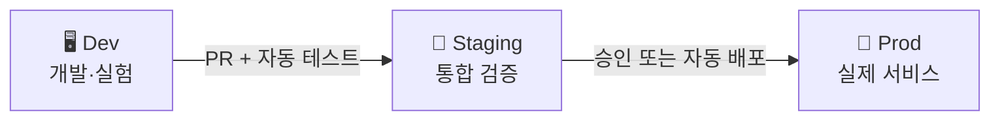

> 문서 기준: 2026년 6월

## 개요

온프레미스에서는 코드를 빌드하고 서버에 배포하는 과정이 수동이거나, Jenkins 같은 도구를 직접 설치·운영해야 합니다. **CI/CD** (Continuous Integration / Continuous Delivery)는 코드 변경 시 자동으로 빌드, 테스트, 배포까지 수행하는 파이프라인입니다.

클라우드 벤더는 관리형 CI/CD 서비스를 제공하여, 빌드 서버 운영 부담 없이 파이프라인을 구성할 수 있습니다. 또한 GitHub Actions, GitLab CI 등 3rd party 도구와의 연동도 잘 지원됩니다.

### CI vs CD

- **CI (Continuous Integration)** — 코드 커밋 시 자동 빌드 + 테스트. 문제를 빨리 발견.
- **CD (Continuous Delivery)** — 빌드된 아티팩트를 스테이징/프로덕션에 자동 배포.

### 자주 배포하면 뭐가 좋은가

| 항목 | 월 1회 배포 | 일 수회 배포 |
| --- | --- | --- |
| **변경 크기** | 크고 위험 | 작고 안전 |
| **장애 원인 파악** | 수백 개 변경 중 어디? | 직전 커밋 확인 |
| **롤백** | 복잡 (의존성 많음) | 간단 (작은 변경 되돌리기) |
| **사용자 피드백** | 수 주 후 | 당일 |
| **시장 대응** | 느림 | 경쟁사보다 빠르게 기능 출시 |

배포 빈도가 높을수록 각 배포의 위험이 줄고, 사용자 피드백을 빠르게 반영할 수 있습니다. 이는 곧 비즈니스 민첩성으로 이어집니다. DORA 연구에 따르면, 배포 빈도가 높은 팀이 장애 복구 시간도 짧고 변경 실패율도 낮습니다.

### 환경 구분이 왜 중요한가

CI/CD 파이프라인은 코드가 프로덕션에 도달하기 전에 여러 환경을 거치도록 합니다.



- **Dev** — 개발자가 자유롭게 실험. 깨져도 괜찮음.
- **Staging** — 프로덕션과 동일한 구성. 배포 전 최종 검증.
- **Prod** — 실제 사용자가 접근하는 환경.

온프레미스에서는 환경을 하나 더 만들려면 서버를 추가 구매해야 했지만, 클라우드에서는 IaC로 동일한 환경을 몇 분 안에 복제할 수 있습니다. 테스트가 끝나면 삭제하여 비용도 절감됩니다.

환경이 분리되면:
- 개발 중인 코드가 실수로 프로덕션에 영향을 주지 않습니다.
- 스테이징에서 발견한 버그는 사용자에게 도달하지 않습니다.
- 각 환경에 다른 권한을 부여하여 보안을 강화할 수 있습니다.

## 제품 비교

### 빌드 (CI)

| 벤더 | 제품 | 비고 |
| --- | --- | --- |
| AWS | CodeBuild | 완전 관리형. 분 단위 과금. Docker 이미지 빌드 지원 |
| Azure | Azure Pipelines | GitHub/Azure Repos 연동. 무료 티어 (월 1,800분) |
| Google Cloud | Cloud Build | 컨테이너 기반. 120분/일 무료 |
| OCI | OCI DevOps Build Pipelines | 관리형 빌드. OCI 서비스 네이티브 연동 |

### 배포 (CD)

| 벤더 | 제품 | 비고 |
| --- | --- | --- |
| AWS | CodeDeploy | EC2, ECS, Lambda 배포. Blue/Green, Rolling 지원 |
| AWS | CodePipeline | 빌드→테스트→배포 파이프라인 오케스트레이션 |
| Azure | Azure Pipelines (Release) | 멀티 스테이지 파이프라인. 승인 게이트 |
| Google Cloud | Cloud Deploy | GKE, Cloud Run 배포. 프로모션 기반 |
| OCI | OCI DevOps Deployment Pipelines | OKE, Compute, Functions 배포. 승인 단계 지원 |

### 소스 저장소

| 벤더 | 제품 | 비고 |
| --- | --- | --- |
| AWS | CodeCommit | 2024년 신규 생성 중단. GitHub/GitLab 사용 권장 |
| Azure | Azure Repos | Git 기반. Azure DevOps에 포함 |
| Google Cloud | Cloud Source Repositories | 미러링 지원. GitHub/GitLab 연동 |
| OCI | OCI DevOps Code Repositories | Git 기반. OCI DevOps에 포함 |

### 아티팩트 저장소

| 벤더 | 제품 | 비고 |
| --- | --- | --- |
| AWS | CodeArtifact | Maven, npm, PyPI, NuGet 패키지 |
| Azure | Azure Artifacts | Azure DevOps에 포함 |
| Google Cloud | Artifact Registry | 컨테이너 이미지 + 언어별 패키지 통합 |
| OCI | OCI Artifact Registry | 컨테이너 이미지 + 일반 아티팩트 |

## 핵심 차이점

**AWS** — CodeBuild/CodeDeploy/CodePipeline으로 풀 파이프라인을 구성할 수 있지만, 실무에서는 GitHub Actions + CodeDeploy 조합이 많이 사용됩니다. CodeCommit은 신규 생성이 중단되었습니다.

**Azure** — Azure DevOps가 소스 관리, CI/CD, 보드(이슈 트래킹), 테스트를 하나의 플랫폼으로 통합합니다. GitHub Actions와도 긴밀히 연동됩니다.

**Google Cloud** — Cloud Build가 빌드와 배포를 모두 처리할 수 있어 단순합니다. Cloud Deploy는 GKE/Cloud Run에 특화된 CD 도구입니다.

**OCI** — OCI DevOps가 빌드/배포 파이프라인을 통합 제공하며, OKE, Compute, Functions 배포와 승인 단계를 네이티브로 지원합니다.

## 실무 가이드

### 저장소 분리

| 전략 | 설명 | 적합한 경우 |
| --- | --- | --- |
| **모노레포** | 앱 코드 + 인프라 코드 한 저장소 | 소규모 팀, 빠른 이터레이션 |
| **앱/배포 분리** | 앱 코드 저장소 + 배포 매니페스트 저장소 분리 | GitOps, 멀티 환경, 권한 분리 필요 시 |

배포 저장소를 분리하면 앱 개발자는 코드에만 집중하고, 배포 설정(Helm chart, Kustomize 등)은 플랫폼 팀이 관리할 수 있습니다. GitOps에서는 배포 저장소 분리가 일반적입니다.

### 롤백 vs 빠른 재배포

장애 발생 시 두 가지 선택지가 있습니다.

- **롤백** — 이전 버전으로 되돌리기. 안전하지만 데이터 마이그레이션이 있었다면 복잡해짐.
- **롤포워드(빠른 수정 배포)** — 문제를 수정한 새 버전을 빠르게 배포. CI/CD가 빠르면 롤백보다 나을 수 있음.

파이프라인이 충분히 빠르면(커밋→프로덕션 10분 이내) 롤포워드가 더 실용적입니다. 하지만 롤백 경로는 항상 준비해 두어야 합니다.

### 파이프라인에서 수행할 테스트

| 단계 | 테스트 | 목적 |
| --- | --- | --- |
| **빌드 시** | 단위 테스트 (Unit) | 개별 함수/모듈 정상 동작 확인 |
| **빌드 시** | 정적 분석 (Lint, [SAST](../../devops/devsecops/)) | 코드 품질, 보안 취약점 조기 발견 |
| **스테이징** | 통합 테스트 (Integration) | 서비스 간 연동 확인 |
| **스테이징** | E2E 테스트 | 사용자 시나리오 전체 흐름 검증 |
| **프로덕션** | 카나리/블루그린 | 일부 트래픽으로 실제 환경 검증 후 전체 전환 |

### 승인(Approval) 프로세스

| 승인 유형 | 언제 필요 | 왜 |
| --- | --- | --- |
| **코드 리뷰 (PR)** | 모든 변경 | 동료가 코드 품질/보안을 검증. 가장 중요한 게이트 |
| **자동 테스트 통과** | 모든 변경 | 사람 판단 없이 객관적 품질 보장 |
| **수동 승인** | 프로덕션 배포 (선택) | 규제 요건 또는 고위험 변경 시에만 |

:::note
**매니저의 수동 승인이 불필요한 이유** — 코드 리뷰 + 자동 테스트가 품질을 보장하면, 수동 승인은 병목만 만듭니다. 매니저는 코드를 읽지 않고 "승인" 버튼만 누르게 되어 실질적 검증이 아닙니다. 대신 자동화된 품질 게이트(테스트 커버리지, 보안 스캔, 성능 기준)가 객관적으로 판단하는 것이 더 안전합니다.
:::

## 자주 하는 실수

- **테스트 없이 배포** — 자동 테스트 없이 빌드만 통과하면 배포하는 파이프라인은 프로덕션 장애를 유발합니다. 최소한 단위 테스트와 정적 분석을 게이트로 설정하세요.
- **시크릿 하드코딩** — 파이프라인 설정 파일에 API 키나 비밀번호를 직접 작성하면 저장소 접근 권한이 있는 모든 사람에게 노출됩니다.
- **main 직접 푸시** — 코드 리뷰와 자동 테스트를 우회하여 main 브랜치에 직접 푸시하면 품질 게이트가 무력화됩니다.

## 체크리스트

- [ ] 빌드-테스트-배포 단계를 명확히 분리했는가
- [ ] 시크릿을 파이프라인 시크릿 관리 기능(GitHub Secrets, Azure Key Vault 등)으로 관리하고 있는가
- [ ] 롤백 전략(이전 버전 재배포 또는 롤포워드)을 수립했는가
- [ ] 파이프라인 실행 시간을 모니터링하고 병목을 관리하고 있는가

## 지속적으로 해야 할 것

파이프라인은 한 번 구축하면 끝이 아닙니다. 파이프라인 자체도 유지보수 대상입니다.

- **의존성 업데이트** — 빌드 도구, 플러그인, 베이스 이미지를 정기적으로 업데이트합니다.
- **실행 시간 최적화** — 파이프라인이 느려지면 개발 생산성이 떨어집니다. 캐시, 병렬화를 점검합니다.
- **Flaky Test 관리** — 간헐적으로 실패하는 테스트는 신뢰를 떨어뜨립니다. 격리하거나 수정합니다.

## AI 에이전트와 CI/CD — GitHub Agentic Workflows

2026년, CI/CD 파이프라인에 **AI 코딩 에이전트**를 통합하는 패턴이 등장했습니다. [GitHub Agentic Workflows](https://github.github.com/gh-aw/)(2026.02 Technical Preview → 2026.06 Public Preview)는 기존의 결정론적 CI/CD에 "Continuous AI" 능력을 추가합니다.

### 개념

| 기존 CI/CD | + Agentic Workflows |
| --- | --- |
| 이벤트 → 빌드 → 테스트 → 배포 | 이벤트 → **에이전트 분석/수정** → 빌드 → 테스트 → 배포 |
| 사람이 코드 작성, 파이프라인 실행 | 에이전트가 이슈 분류, CI 실패 분석, 문서 유지, 테스트 개선 |

### 동작 방식

GitHub Actions 워크플로에서 AI 에이전트(Copilot, Claude Code, OpenAI Codex)를 **이벤트 트리거** 또는 **스케줄**로 실행합니다. 에이전트는 전용 임시 환경(GitHub Actions runner)에서 코드를 분석·수정하고 PR을 생성합니다.

```yaml
# 예시: 매일 아침 에이전트가 이슈를 분류하고 테스트를 개선
on:
  schedule:
    - cron: '0 9 * * *'
  issues:
    types: [opened]
```

### 사용 사례

- **이슈 자동 분류** — 새 이슈가 열리면 에이전트가 라벨링·우선순위 지정
- **CI 실패 자동 분석** — 빌드 실패 시 에이전트가 원인을 분석하고 수정 PR 생성
- **문서 자동 유지** — 코드 변경 시 관련 문서를 자동 업데이트
- **Copilot Code Review** — PR에 대해 에이전트가 자동 리뷰 (6/1부터 Actions minutes 소비)

:::caution
**보안 주의:** AI 에이전트가 CI/CD에서 비신뢰 입력(이슈 본문, PR 설명)을 처리하면 **간접 프롬프트 인젝션**으로 시크릿이 유출될 수 있습니다. 에이전트에 최소 권한만 부여하고, 비신뢰 입력을 정화(Sanitize)하세요. 상세는 [AI 보안 — CI/CD 에이전트 보안](../../security/ai-security/)을 참고하세요.
:::

## 관련 문서

- [코드로 관리하는 인프라 (IaC)](../../devops/iac/)
- [SLI/SLO와 에러 버짓](../../devops/slo/)

## 참고하기

### AWS

- [AWS CodeBuild 문서](https://docs.aws.amazon.com/ko_kr/codebuild/)
- [AWS CodeDeploy 문서](https://docs.aws.amazon.com/ko_kr/codedeploy/)
- [AWS CodePipeline 문서](https://docs.aws.amazon.com/ko_kr/codepipeline/)

### Azure

- [Azure Pipelines 문서](https://learn.microsoft.com/ko-kr/azure/devops/pipelines/)
- [Azure DevOps 문서](https://learn.microsoft.com/ko-kr/azure/devops/)

### Google Cloud

- [Cloud Build 문서](https://cloud.google.com/build/docs)
- [Cloud Deploy 문서](https://cloud.google.com/deploy/docs)
- [Artifact Registry 문서](https://cloud.google.com/artifact-registry/docs)

### OCI

- [OCI DevOps 문서](https://docs.oracle.com/en-us/iaas/Content/devops/using/home.htm)
