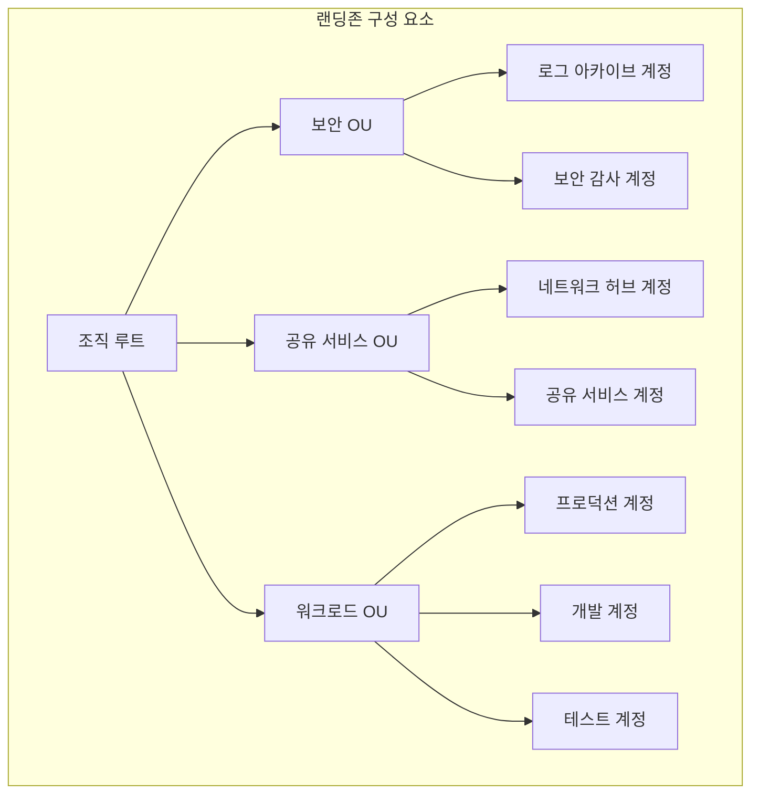

> 문서 기준: 2026년 7월

## 랜딩존이란

랜딩존(Landing Zone)은 멀티 계정 클라우드 환경을 안전하고 일관되게 운영하기 위한 기반 설정입니다. 일반적으로 다음 요소를 포함합니다:

:::note
계정/조직의 기본 개념, 빌링 구조, 쿼타 관리는 [계정과 조직 구조](../../about-cloud/accounts-and-organizations/)를 참고하세요. 이 문서는 그 위에 구축하는 **구현 가이드**입니다.
:::

- **네트워크**: 표준화된 VPC/VNet 구조, 허브-스포크 토폴로지, 연결 정책
- **보안**: 계정 간 보안 경계, 암호화 정책, 위협 탐지
- **로깅**: 중앙 집중식 로그 수집, 감사 추적, 규정 준수 증적
- **가드레일**: 예방적/탐지적 정책으로 조직 전체에 일관된 거버넌스 적용

랜딩존을 통해 새로운 워크로드 계정을 빠르고 안전하게 프로비저닝할 수 있으며, 조직의 보안·규정 준수 요구사항을 자동으로 적용할 수 있습니다.

:::note
랜딩존은 특정 제품 하나가 아니라 계정 구조, 네트워크, 보안, 로깅, 정책을 함께 설계한 운영 기반입니다.
:::

## 주요 CSP 랜딩존 비교

| 항목 | AWS | Azure | Google Cloud | OCI |
| --- | --- | --- | --- | --- |
| 서비스명 | [AWS Control Tower](https://aws.amazon.com/controltower/) | [Azure Landing Zone](https://learn.microsoft.com/en-us/azure/cloud-adoption-framework/ready/landing-zone/) | [Google Cloud Foundation Toolkit](https://cloud.google.com/foundation-toolkit) | [OCI Landing Zone](https://docs.oracle.com/en/solutions/cis-oci-benchmark/) |
| 계정 구조 | AWS Organizations + OU | Management Group + Subscription | Organization + Folder + Project | Tenancy + Compartment |
| 가드레일 | Controls (예방적/탐지적/사전 예방적) | Azure Policy + Deployment Stacks | Organization Policy | CIS Benchmark 기반 정책 |
| 네트워크 기본 구조 | VPC + Transit Gateway | Hub-Spoke VNet + Azure Firewall | Shared VPC + Cloud Interconnect | Hub-Spoke VCN + DRG |
| IaC 제공 | AWS CloudFormation (기본 내장) | Bicep / Terraform 모듈 | Terraform 모듈 | Terraform 모듈 |
| 로깅 | AWS CloudTrail + Config | Activity Log + Defender for Cloud | Cloud Audit Logs + Security Command Center | Audit + Cloud Guard |

## 설계 체크리스트

랜딩존을 설계할 때는 다음 항목을 먼저 정리합니다.

- **조직 구조** — 계정, 구독, 프로젝트, 컴파트먼트를 어떤 기준으로 나눌지 결정합니다.
- **환경 분리** — 운영, 개발, 테스트, 보안, 공유 서비스 계정을 분리합니다.
- **네트워크 경계** — 허브-스포크, 인터넷 진입점, 온프레미스 연결 방식을 정합니다.
- **ID 연동** — 사내 IdP, SSO, MFA, 관리자 권한 부여 방식을 표준화합니다.
- **로깅과 감사** — 모든 계정의 감사 로그를 중앙 저장소로 수집합니다.
- **가드레일** — 금지 리전, 공개 스토리지 차단, 암호화 강제 같은 정책을 자동 적용합니다.

## 도입 순서

| 단계 | 설명 |
| --- | --- |
| 1 | 최소 계정 구조와 중앙 로그 저장소를 먼저 만듭니다. |
| 2 | 네트워크, 보안, IAM 표준을 IaC로 템플릿화합니다. |
| 3 | 신규 워크로드 계정 생성 절차를 자동화합니다. |
| 4 | 정책 위반 탐지와 예외 승인 프로세스를 운영합니다. |

:::caution
랜딩존을 한 번에 완벽하게 만들려고 하면 도입이 지연될 수 있습니다. 중앙 로깅, 관리자 권한 통제, 필수 보안 가드레일부터 시작하고 반복적으로 확장하는 것이 현실적입니다.
:::

## 멀티 계정 VPC 분리 패턴

랜딩존에서 VPC 설계는 핵심 요소입니다. 워크로드별 VPC를 분리하여 보안 경계를 만들고, 공유 서비스는 중앙 VPC에 배치합니다.

### 워크로드별 분리

| 분리 기준 | 예시 | 이유 |
| --- | --- | --- |
| 환경별 | dev / staging / prod VPC | 프로덕션 격리, 실수 방지 |
| 팀/서비스별 | 팀A VPC / 팀B VPC | 보안 경계, 독립적 운영 |
| 규제별 | PCI VPC / 일반 VPC | 규정 준수 범위 최소화 |

### 공유 서비스 VPC

로깅, 보안 도구, DNS, 프록시 등을 중앙 VPC에 배치하고 다른 VPC에서 접근하는 패턴입니다.

### 벤더별 구현

| 벤더 | 계정/프로젝트 분리 | VPC 공유 | 허브 연결 |
| --- | --- | --- | --- |
| AWS | Organizations + OU | RAM으로 서브넷 공유 | Transit Gateway |
| Azure | 구독별 분리 | Hub-Spoke VNet | Virtual WAN |
| Google Cloud | Shared VPC (호스트+서비스 프로젝트) | 호스트 프로젝트에서 서브넷 공유 | VPC Peering / NCC |
| OCI | Compartment 분리 | — | DRG 허브 |

### CIDR 계획

계정/프로젝트 간 IP 대역 충돌을 방지하기 위해 사전에 CIDR 블록을 할당합니다.

- 전체 조직에 `/8` 또는 `/10` 대역을 예약하고, 계정/환경별로 `/16`~`/20` 단위로 분배
- VPC 피어링/Transit Gateway 연결 시 CIDR 중복이 있으면 라우팅 불가
- 향후 확장을 고려하여 여유 있게 할당 (서브넷 추가, 새 계정 생성)

네트워크 설계 상세는 [VPC와 서브넷](../../networking/vpc-subnet/)을 참고하세요.

## 랜딩존 도입 체크리스트

- [ ] 조직 구조(OU/폴더/컴파트먼트) 설계를 완료했는가
- [ ] 환경 분리 전략을 결정했는가 (프로덕션/스테이징/개발/보안/공유서비스)
- [ ] 네트워크 토폴로지를 결정했는가 (Hub-Spoke, 중앙 이그레스)
- [ ] 가드레일(예방적/탐지적 정책)을 정의했는가
- [ ] 중앙 로깅 계정을 구성했는가 (CloudTrail/Activity Log 집중)
- [ ] 보안 감사 계정을 분리했는가
- [ ] ID 제공자(IdP)를 연동했는가 (SSO/SAML)
- [ ] 비용 할당 태그 정책을 정의했는가
- [ ] 새 계정 자동 프로비저닝 파이프라인을 구성했는가 (IaC)
- [ ] Break-glass(비상 접근) 절차를 문서화했는가

## 자주 하는 실수

- **CIDR 계획 없이 VPC를 생성** — 나중에 VPC 피어링/Transit Gateway 연결 시 IP 대역 충돌로 라우팅이 불가능해짐
- **중앙 로깅 없이 워크로드 계정부터 생성** — 감사 로그가 각 계정에 분산되어 보안 사고 시 통합 조사가 불가능
- **가드레일 없이 계정을 배포** — 개발자가 실수로 퍼블릭 S3 버킷을 만들거나 금지 리전에 리소스를 생성하는 사고 발생

## 관련 문서

- [IAM 실무 설계와 보안 운영](../../security/iam/)
- [VPC와 서브넷](../../networking/vpc-subnet/)
- [FinOps](../../governance/finops/)

## 2025-2026 랜딩존 진화

### 모듈화: 컨트롤 전용 모델

**AWS Control Tower Landing Zone 4.0** (2025.11)은 "하나의 강제된 청사진" 접근에서 벗어나, **컨트롤만 적용하고 나머지는 선택**할 수 있는 모듈형으로 전환했습니다.

| 이전 | LZ 4.0 이후 |
| --- | --- |
| Control Tower 설정 시 고정된 OU/계정 구조 생성 | 기존 조직 구조를 유지하면서 컨트롤만 적용 가능 |
| 모든 서비스 통합이 패키지로 제공 | 서비스 통합(Config, CloudTrail 등)을 선택적으로 활성화 |
| 대규모 조직에서 커스터마이징 어려움 | 기존 IaC 파이프라인과 병행 가능 |

Azure의 Cloud Adoption Framework(CAF)도 모듈식 랜딩존 아키텍처를 지속 확장하고 있으며, Google Cloud Foundation Toolkit은 Terraform 모듈 기반으로 유사한 선택적 적용을 지원합니다.

### 소버린 랜딩존 (Sovereign Landing Zone)

데이터 주권(Data Sovereignty) 요구가 강화되면서, 데이터 저장뿐 아니라 **처리까지 관할권 내에서 수행**하는 랜딩존이 등장했습니다.

| 벤더 | 솔루션 | 주요 기능 | 시기 |
| --- | --- | --- | --- |
| Microsoft | [Cloud for Sovereignty — SLZ + Sovereign Public Cloud](https://learn.microsoft.com/en-us/industry/sovereignty/slz-overview) | 데이터 레지던시 가드레일, 기밀 컴퓨팅, EU Data Boundary, Data Guardian, IaC 정책 | 2025-2026 |
| Google Cloud | [Sovereign Cloud Controls](https://cloud.google.com/blog/products/identity-security/delivering-a-secure-open-sovereign-digital-world) | 관할권 내 처리, 키 관리, 접근 투명성 | 2025-2026 |
| AWS | [Sovereign Controls (Control Tower + Nitro)](https://aws.amazon.com/compliance/digital-sovereignty/) | 리전 제한 가드레일, Nitro 기밀 컴퓨팅, 데이터 레지던시 정책 | 기존 (지속 강화) |
| OCI | EU Sovereign Cloud | 물리적으로 분리된 EU 전용 인프라 | 기존 |

:::note
소버린 랜딩존은 단순히 "EU 리전에 배포"하는 것이 아닙니다. 데이터 처리(compute), 키 관리, 관리 접근(personnel access)까지 관할권 내로 제한하는 것입니다. 2025년 11월 ESAs(EBA·EIOPA·ESMA)가 AWS, Azure, GCP를 **Critical ICT Third-Party Provider**로 지정하면서, 금융·공공 분야에서 소버린 요건이 더욱 강화될 것으로 예상됩니다.
:::

### EU 규제 연계

| 규제 | 랜딩존 영향 |
| --- | --- |
| **DORA** (2025.01.17 적용) | 금융기관의 ICT 서드파티 리스크 관리 의무 → 클라우드 벤더를 중요 ICT 공급자로 관리, 출구 전략 필수 |
| **NIS2** | 핵심 인프라 운영자의 보안 의무 강화 → 랜딩존 수준의 거버넌스 증적 필요 |
| **EU AI Act** (2026.08 일반 적용) | 고위험 AI 시스템의 데이터 거버넌스 → 랜딩존에 AI 워크로드별 데이터 분류/접근 제어 포함 |

## 참고하기

### AWS

- [AWS Control Tower 문서](https://docs.aws.amazon.com/controltower/)
- [AWS Organizations 문서](https://docs.aws.amazon.com/organizations/)

### Azure

- [Azure Landing Zone 아키텍처](https://learn.microsoft.com/en-us/azure/cloud-adoption-framework/ready/landing-zone/)
- [Cloud Adoption Framework](https://learn.microsoft.com/en-us/azure/cloud-adoption-framework/)

### Google Cloud

- [Foundation Toolkit 문서](https://cloud.google.com/foundation-toolkit)
- [Security Foundation Blueprint](https://cloud.google.com/architecture/security-foundations)

### OCI

- [OCI Landing Zone 문서](https://docs.oracle.com/en/solutions/cis-oci-benchmark/)
- [CIS OCI Benchmark](https://docs.oracle.com/en/solutions/cis-oci-benchmark/)
