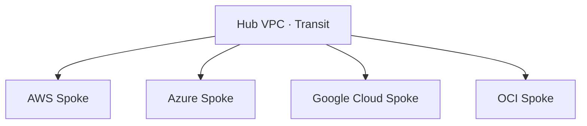

> 문서 기준: 2026년 8월

:::note[선행 지식 및 연결 문서]
연결 방식 개요와 CIDR 설계 등 기초는 [멀티클라우드 네트워크 설계 기초](../../networking/multicloud-networking/)를 먼저 참고하세요. 이 문서는 그 위에서 Hub-and-Spoke·트랜짓 아키텍처, Cross-Cloud Interconnect, 이그레스 비용 최적화 등 심화 설계에 초점을 둡니다.
:::

## 개요

여러 클라우드에 워크로드가 분산되면, 단순한 1:1 연결로는 관리·비용·보안이 급격히 복잡해집니다. 이 문서는 다수의 클라우드·계정·리전을 확장 가능하게 연결하는 트랜짓 아키텍처와, 그에 따르는 이그레스 비용·DNS 통합 전략을 다룹니다.

## 트랜짓 아키텍처 패턴

### Hub-and-Spoke

중앙 허브를 두고 각 클라우드를 스포크로 연결하는 패턴입니다.

- **허브 위치:** 가장 트래픽이 많은 벤더 또는 온프레미스
- **장점:** 보안 정책을 허브에서 중앙 관리, 라우팅 단순화
- **단점:** 허브가 병목/단일 장애점이 될 수 있음

### 클라우드 간 연결 방식별 서비스 매핑

| 벤더 | 내부 트랜짓 | 클라우드 간 직접 연결 |
| --- | --- | --- |
| AWS | Transit Gateway | AWS Interconnect – multicloud |
| Azure | Virtual WAN / VNet Peering | (파트너 연동: Google Cross-Cloud, Oracle Interconnect) |
| Google Cloud | Cloud Router / NCC | Google Cross-Cloud Interconnect |
| OCI | DRG (Dynamic Routing Gateway) | Oracle Interconnect (Azure, Google Cloud, AWS) |

## 벤더 간 직접 연결 (Cross-Cloud Interconnect)

주요 CSP는 경쟁 관계이면서도, 고객의 멀티클라우드 수요에 대응하여 벤더 간 전용 네트워크를 제공합니다. 인터넷을 거치지 않고 프라이빗하게 클라우드를 연결할 수 있습니다.

2025년 12월 AWS re:Invent에서 AWS와 Google Cloud가 **오픈 상호운용 스펙** 기반의 공동 멀티클라우드 인터커넥트를 발표했습니다. Microsoft Azure도 이 스펙에 참여를 확인했으며, Oracle도 연동을 발표(2026.04)했습니다. 이 흐름은 단일 벤더의 이니셔티브가 아니라, 업계 전반의 멀티클라우드 상호운용 표준화 움직임입니다.

| 서비스 | 연결 구간 | 상태 (2026년 6월 기준) |
| --- | --- | --- |
| [**AWS Interconnect – multicloud**](https://aws.amazon.com/interconnect/multicloud/) | AWS ↔ Google Cloud | GA (2026.04). Azure, OCI는 2026년 내 추가 예정 |
| [**Google Cross-Cloud Interconnect**](https://cloud.google.com/network-connectivity/docs/interconnect/concepts/cross-cloud-overview) | Google Cloud ↔ AWS/Azure/OCI | GA. 오픈 상호운용 스펙 기반 |
| [**Oracle Interconnect for Azure**](https://docs.oracle.com/iaas/Content/multicloud/interconnect-azure.htm) | OCI ↔ Azure | GA. 크로스 클라우드 데이터 전송 무료 |
| [**Oracle Interconnect for AWS**](https://docs.oracle.com/iaas/Content/multicloud/interconnect-aws.htm) | OCI ↔ AWS | LA (Limited Availability, 2026.05). us-east-1 단일 리전. GA 시 확장 예정 |
| [**Oracle Interconnect for Google Cloud**](https://docs.oracle.com/iaas/Content/Network/Concepts/access-to-google-cloud-platform.htm) | OCI ↔ Google Cloud | GA. 크로스 클라우드 데이터 전송 무료 |

### 가용 구간 매트릭스

> ✅ GA = 정식 출시, 🔶 LA = Limited Availability (제한 리전), 예정 = 미출시

| | AWS | Azure | Google Cloud | OCI |
| --- | --- | --- | --- | --- |
| **AWS** | — | 예정 (2026) | ✅ GA | 🔶 LA |
| **Azure** | 예정 (2026) | — | ✅ GA | ✅ GA |
| **Google Cloud** | ✅ GA | ✅ GA | — | ✅ GA |
| **OCI** | 🔶 LA | ✅ GA | ✅ GA | — |

### Cross-Cloud Interconnect vs 전용 연결 + IX

| 비교 항목 | Cross-Cloud Interconnect | 전용 연결 + IX (Direct Connect + ExpressRoute 등) |
| --- | --- | --- |
| **경유 지점** | 벤더 간 직접 연결 (단일 홉) | IX 또는 코로케이션 시설 경유 (2–3홉) |
| **설정 복잡도** | 콘솔에서 상대 벤더 선택 후 프로비저닝 | 양쪽 전용 연결 + IX 포트 + BGP 설정 |
| **레이턴시** | 최소 (같은 메트로 내 직접 연결) | IX 경유로 약간 높음 |
| **비용 구조** | 포트 비용 + 데이터 전송 (OCI는 전송 무료) | 양쪽 전용 연결 비용 + IX 포트 비용 |
| **가용 구간** | 벤더가 지원하는 구간만 | IX가 있는 모든 구간 |

**선택 기준:**

- 벤더 간 직접 연결이 지원되는 구간이면 Cross-Cloud Interconnect가 단순하고 레이턴시도 낮음
- 아직 지원되지 않는 구간(예: AWS ↔ Azure)이거나 온프레미스도 함께 연결해야 하면 IX 경유 방식 사용

## 이그레스 비용 비교

클라우드 간 데이터 이동의 가장 큰 비용 요소는 이그레스(아웃바운드) 요금입니다.

| 구간 | 단가 (대표 리전 예시, 리전마다 다름) | 비고 |
| --- | --- | --- |
| AWS → 인터넷 | $0.126/GB (처음 10TB) | 이후 체감 |
| Azure → 인터넷 | $0.12/GB | 처음 100GB/월 무료 ([Bandwidth 가격](https://azure.microsoft.com/pricing/details/bandwidth/)) |
| Google Cloud → 인터넷 | $0.12/GB | 처음 200GB/월 무료 |
| OCI → 인터넷 | 10TB/월 무료, 이후 –$0.0085/GB | 타사 대비 매우 저렴 |
| AWS → Direct Connect | ~$0.04/GB | 회선비 별도 |
| Azure → ExpressRoute | 포함 (Unlimited 플랜) | 회선비에 포함 |
| Google Cloud → Interconnect | ~$0.05/GB | 회선비 별도 |
| OCI → FastConnect | 10TB/월 무료에 포함 | 회선비 별도 |

> 위 수치는 문서 작성 시점 기준이며 변동될 수 있습니다. 최신 가격은 각 벤더 공식 가격표를 확인하세요.

### 비용 최적화 팁

- **데이터 지역성:** 자주 통신하는 워크로드는 같은 클라우드에 배치
- **전용 연결:** 월 1TB 이상 이동 시 VPN보다 전용 연결이 경제적
- **압축/캐싱:** 클라우드 경계를 넘는 데이터는 압축 후 전송
- **비동기 배치:** 실시간이 불필요한 데이터는 야간 배치로 이동

## DNS 통합 전략

멀티클라우드에서 서비스 디스커버리의 핵심은 DNS입니다. 각 벤더의 프라이빗 DNS가 분리되어 있으므로 통합 전략이 필요합니다.

### 각 벤더의 프라이빗 DNS

| 벤더 | 서비스 | 특징 |
| --- | --- | --- |
| AWS | Route 53 Private Hosted Zone | VPC 연결, 조건부 포워딩 |
| Azure | Azure Private DNS Zone | VNet 링크 |
| Google Cloud | Cloud DNS Private Zone | VPC 바인딩 |
| OCI | OCI DNS Private View | VCN 연결 |

### 통합 패턴: 조건부 포워딩

도메인 접미사 기반으로 각 클라우드의 프라이빗 DNS 엔드포인트로 포워딩합니다.

| 도메인 패턴 | 포워딩 대상 |
| --- | --- |
| `*.aws.internal` | Route 53 Inbound Endpoint |
| `*.azure.internal` | Azure DNS Private Resolver |
| `*.gcp.internal` | Cloud DNS Inbound Policy |
| `*.oci.internal` | OCI DNS Inbound Endpoint |
| `*.corp.internal` | 온프레미스 DNS |

**구현 방법:**
1. 각 클라우드에 인바운드 DNS 엔드포인트 생성
2. 조건부 포워딩 규칙 설정 (도메인 접미사 기반)
3. 온프레미스 DNS 서버 또는 허브 VPC의 DNS를 중앙 포워더로 사용

:::note
**팁:** Route 53 Resolver의 아웃바운드 엔드포인트를 허브로 사용하면, AWS에서 Azure/Google Cloud의 프라이빗 레코드를 조회할 수 있습니다.
:::

## 자주 하는 실수

- **이그레스 비용을 사전에 추정하지 않음** — 클라우드 간 데이터 이동이 월 수천 달러에 달할 수 있습니다. 아키텍처 설계 시 데이터 흐름과 비용을 함께 계산하세요.
- **DNS 조건부 포워딩을 설정하지 않아 크로스 클라우드 이름 해석 실패** — 각 클라우드의 프라이빗 DNS는 기본적으로 격리되어 있습니다. 인바운드 엔드포인트 + 포워딩 규칙을 반드시 구성하세요.
- **허브 네트워크의 이중화 없이 단일 VPN 터널만 구성** — 허브 장애 시 모든 클라우드 간 통신이 중단됩니다. Active-Active 또는 대체 경로를 확보하세요.

## 체크리스트

- [ ] 클라우드 간 월간 이그레스 비용이 추정되어 있고, 임계치 알림이 설정되어 있는가?
- [ ] DNS 조건부 포워딩으로 모든 클라우드의 프라이빗 레코드가 상호 해석 가능한가?
- [ ] 허브 장애 시 대체 경로(failover)가 테스트되어 있는가?

## 참고하기

### AWS

- [AWS — Hybrid Connectivity](https://docs.aws.amazon.com/whitepapers/latest/hybrid-connectivity/hybrid-connectivity.html)
- [AWS Direct Connect](https://aws.amazon.com/ko/directconnect/)
- [AWS Interconnect](https://aws.amazon.com/interconnect/)

### Azure

- [Azure — Hub-spoke Network Topology](https://learn.microsoft.com/azure/architecture/networking/architecture/hub-spoke)
- [Azure ExpressRoute](https://azure.microsoft.com/ko-kr/products/expressroute/)

### Google Cloud

- [Google Cloud — Hybrid and Multi-cloud Network Architectures](https://cloud.google.com/architecture/network-hybrid-multicloud)
- [Google Cloud Interconnect](https://cloud.google.com/network-connectivity/docs/interconnect)

### OCI

- [OCI FastConnect](https://docs.oracle.com/en-us/iaas/Content/Network/Concepts/fastconnect.htm)
- [Oracle Interconnect for Azure](https://docs.oracle.com/iaas/Content/multicloud/interconnect-azure.htm)

### 표준 및 커뮤니티

- [Megaport](https://www.megaport.com/) — 글로벌 Cloud Exchange
- [Equinix Fabric](https://www.equinix.com/interconnection-services/equinix-fabric) — 글로벌 Cloud Exchange. 국가별 IX는 국가 가이드 참고
- [NIST Multi-Cloud Security Public Working Group](https://www.nist.gov/publications/nist-cloud-computing-reference-architecture)
- [RFC 1918 — Address Allocation for Private Internets](https://www.rfc-editor.org/rfc/rfc1918)
