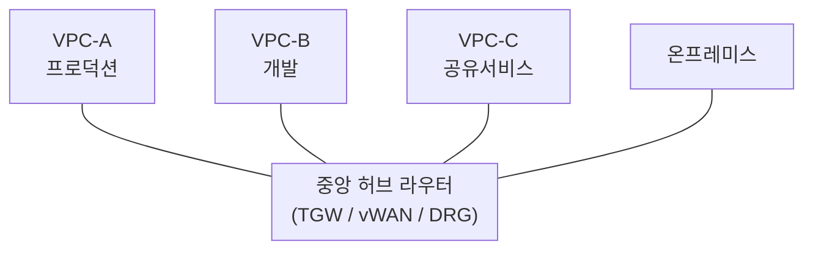

> 문서 기준: 2026년 8월

## 개요

온프레미스에서는 물리적인 네트워크 장비(스위치, 라우터, 방화벽)로 네트워크를 구성합니다. 클라우드에서는 이 모든 것을 소프트웨어로 정의합니다.

**VPC** (Virtual Private Cloud)는 클라우드 안에 만드는 논리적으로 격리된 가상 네트워크입니다. 각 VPC는 다른 고객의 VPC와 완전히 분리되어 있으며, **명시적으로 연결을 설정하지 않는 한 VPC 간 통신은 불가능**합니다. 온프레미스의 사내 네트워크에 해당하며, IP 대역, 서브넷, 라우팅, 방화벽 규칙을 사용자가 직접 설계합니다.

**서브넷**은 VPC 안에서 IP 대역을 더 작게 나눈 네트워크 영역입니다. 서브넷을 여러 가용영역(AZ)에 분산 배치하면 장애 도메인을 분리하여 고가용성을 확보할 수 있습니다. 리전과 가용영역의 개념은 [리전과 가용영역](../../about-cloud/regions-and-zones/)에서 다룹니다.

:::note
이 문서는 **단일 클라우드 내 VPC 설계**를 다룹니다. 규제 환경에서의 네트워크 격리 요건은 [망분리와 네트워크 격리](../../security/network-isolation/)를, 멀티클라우드 간 연결은 [멀티클라우드 네트워킹](../../networking/multicloud-networking/)을 참고하세요.
:::

## 벤더별 VPC 비교

| 벤더 | 제품 | VPC 범위 | 서브넷 단위 | 비고 |
| --- | --- | --- | --- | --- |
| AWS | VPC | 리전 | AZ | 리전 간은 피어링/TGW 필요 |
| Azure | VNet | 리전 | 리전 내 자유 배치 | 글로벌 피어링 가능 |
| Google Cloud | VPC | **글로벌** | 리전 | 하나의 VPC에 여러 리전 서브넷 배치 가능 |
| OCI | VCN | 리전 | 리전 또는 AD | Security Lists와 NSG 조합 |

:::caution
**Azure VNet 변경 (2026.03~):** API 버전 `2025-07-01` 이후 새로 생성하는 가상 네트워크의 서브넷이 **기본 프라이빗**으로 변경되었습니다(enforcement 시점: 2026년 3월 31일). 기존에는 서브넷의 VM에 공인 IP가 할당될 수 있었으나, 이제 명시적으로 NAT Gateway 또는 공인 IP를 설정해야 아웃바운드 인터넷 접근이 가능합니다. 기존 VNet은 영향 없으며 신규 생성 시에만 적용됩니다. [공식 안내](https://techcommunity.microsoft.com/blog/azurenetworkingblog/private-subnets-by-default-in-azure-virtual-networks-what-changed-and-how-to-use/4513778)
:::

## 서브넷 설계

### 3계층 분리

서브넷은 **퍼블릭**, **프라이빗**, **격리** 3계층으로 나누는 것이 일반적입니다.

| 계층 | 용도 | 인터넷 접근 | 배치 리소스 |
| --- | --- | --- | --- |
| **퍼블릭** | 외부 트래픽 수신 | 양방향 | 로드밸런서, NAT Gateway, Bastion |
| **프라이빗** | 애플리케이션 계층 | NAT 통해 아웃바운드만 | 앱 서버, 컨테이너 워커 노드 |
| **격리** | DB, 내부 시스템 | 인터넷 접근 불가 | 관리형 DB, 캐시 |

### 서브넷 사이징 원칙

VPC 크기는 특정 크기를 일률 처방할 수 없으며, **AZ 수 × 계층 수 × 서브넷당 필요 IP + 관리형 엔드포인트 + 장애 버퍼**의 합산 수요식으로 결정해야 합니다.

#### 1. 워크로드 규모별 VPC CIDR 출발점 가이드

| 워크로드 규모 | 권장 출발 CIDR (예시) | 가용 IP 수 | 아키텍처 배치 및 고려사항 |
| --- | --- | --- | --- |
| **소규모 Spoke / 샌드박스 / 검증** | `/22`–`/24` | 1,024–256 | 1–2개 AZ, 단순 2계층(웹/앱) 구성. IP 소진 위험이 낮은 독립 환경 |
| **표준 엔터프라이즈 앱 (3 AZ × 3계층)** | `/19`–`/20` | 8,192–4,096 | 3개 AZ × 3계층(퍼블릭/프라이빗/격리)에 `/24`(256 IP) 적용 시 최소 2,304 IP 필요 → `/20`(4,096) 또는 버퍼 확보를 위한 `/19` 적합 |
| **고밀도 컨테이너 / 대규모 Landing Zone** | `/16`–`/18` | 65,536–16,384 | EKS VPC CNI 등 Pod마다 실제 사설 IP를 부여하는 환경. 또는 보조(Secondary) CIDR 연계 권장 |

#### 2. 서브넷 세부 할당 원칙

| 고려사항 | 사이징 원칙 및 권장 | 설명 |
| --- | --- | --- |
| **일반 워크로드 서브넷** | `/24` (256 IP) 시작 | 웹/앱 티어 표준 크기. 컨테이너 밀도가 높다면 보조(Secondary) CIDR 연계를 검토합니다. |
| **전용 인프라 서브넷** | 목적별 최소 할당 (`/26`–`/28`) | • **AWS TGW Attachment**: `/28` (AZ당 1개 ENI만 소비하므로 IP 낭비 방지) • **PrivateLink / Endpoint**: 엔드포인트 수에 맞춰 `/27`–`/28` • **벤더 전용 요건**: Azure `GatewaySubnet`(최소 `/27`), `AzureFirewallSubnet`(최소 `/26`), GCP Proxy-only 서브넷(`/24`) 등 벤더별 필수 크기 준수 |
| **벤더 예약 IP** | 벤더별 3–5개 예약 | AWS/Azure는 서브넷당 5개, GCP는 4개(처음 2개와 마지막 2개), OCI는 3개 예약. 소형 서브넷(`/28`, 16개) 할당 시 실제 가용 IP를 고려해야 합니다. |
| **AZ 분산** | 최소 2개, 권장 3개 AZ에 배치 | 서브넷을 복수 AZ에 대칭 분산하여 가용영역 장애 격리(Fault Domain)를 확보합니다. |

### CIDR 계획

CIDR 설계는 나중에 바꾸기 가장 어려운 아키텍처 결정입니다.

| 전략 | 분할 예시 | 설명 |
| --- | --- | --- |
| **환경별 대역 분리** | `10.0.0.0/20` (prod), `10.0.16.0/20` (dev) | 운영 환경과 비운영 환경 간 라우팅 격리 및 충돌 방지 |
| **팀/서비스별 할당** | `10.1.0.0/21` (결제팀), `10.1.8.0/21` (물류팀) | 계정별 자율성을 보장하면서 경로 요약(Route Summarization) 가능 |
| **하이브리드 온프레미스 회피** | 사내가 `172.16.0.0/12` 사용 중이면 클라우드는 `10.0.0.0/8` 내 미사용 블록 배정 | 전용선(Direct Connect/ExpressRoute) 및 VPN 연결 시 충돌 방지 |

:::caution
`10.0.0.0/16`을 기본 템플릿으로 무분별하게 복제하면 계정 간 VPC 피어링이나 트랜짓 게이트웨이 연결 시 라우팅 충돌이 발생합니다. 전사 IPAM(IP Address Management) 도구나 중앙 레지스트리를 통해 CIDR 블록을 체계적으로 할당하세요.
:::

멀티클라우드 환경에서의 CIDR 분할 원칙은 [멀티클라우드 네트워크 설계 기초](../../networking/multicloud-networking/)를 참고하세요.

## 보안 (네트워크 방화벽)

| 계층 | AWS | Azure | Google Cloud | OCI | 역할 |
| --- | --- | --- | --- | --- | --- |
| **인스턴스** | Security Groups | NSG | Firewall Rules | Security Lists / NSG | 인바운드/아웃바운드 규칙 |
| **서브넷** | Network ACL | NSG (서브넷 연결) | — | Security Lists | 서브넷 경계 필터링 |
| **VPC (L7)** | Network Firewall | Azure Firewall | Cloud Firewall | OCI Network Firewall | IDS/IPS, 도메인 필터링 |
| **DDoS** | Shield | DDoS Protection | Cloud Armor | OCI WAF | L3/L4 자동 완화 |
| **WAF** | AWS WAF | Azure WAF | Cloud Armor WAF | OCI WAF | L7 공격 차단 |

### 원격 접근

프라이빗 서브넷의 리소스에 접근하려면 Bastion Host 또는 에이전트 기반 접근 서비스를 사용합니다. 상세는 [원격 접근 관리](../../devops/remote-access/)를 참고하세요.

## 라우팅

서브넷에서 나가는 트래픽이 어디로 전달될지 결정하는 규칙입니다.

### 공통 개념

- **VPC 내부 트래픽**은 자동으로 라우팅됩니다 (별도 설정 불필요)
- **외부로 나가는 트래픽**은 명시적 경로가 필요합니다
- **서브넷 계층별로 다른 라우팅**을 적용하여 격리 수준을 제어합니다

### 벤더별 라우팅 모델

| 항목 | AWS | Azure | Google Cloud | OCI |
| --- | --- | --- | --- | --- |
| **라우팅 단위** | 서브넷별 | 서브넷별 (UDR) | VPC 전체 (암묵적) + 커스텀 | 서브넷별 |
| **기본 인터넷 경로** | 명시적 추가 필요 | 기본 제공 (NSG로 제어) | 기본 제공 (방화벽으로 제어) | 명시적 추가 필요 |
| **NAT** | NAT Gateway (AZ별) | NAT Gateway (서브넷별) | Cloud NAT (리전별) | NAT Gateway (VCN별) |
| **특이점** | 서브넷별 세밀한 제어 | System Routes 자동 생성 | 글로벌 VPC라 리전 간 자동 | Security List가 별도 |

### 안티패턴

| 안티패턴 | 문제 | 올바른 접근 |
| --- | --- | --- |
| 모든 서브넷에 동일 라우팅 | 격리 계층 무의미 | 계층별 별도 라우팅 |
| DB 서브넷에 인터넷 경로 | 불필요한 노출 | 경로 없음 + 프라이빗 서비스 연결 |
| 온프레미스 경로를 모든 서브넷에 전파 | 불필요한 노출 | 필요한 서브넷에만 선택적 전파 |

## VPC 간 연결

### 피어링 vs 허브-스포크

| 구분 | VPC 피어링 | 허브-스포크 (TGW / vWAN / DRG) |
| --- | --- | --- |
| **연결 구조** | 1:1 (메시) | 허브-스포크 (스타) |
| **전이적 라우팅** | 불가 | 가능 (허브 경유) |
| **VPC 10개 연결 시** | 45개 피어링 | 10개 연결 |
| **온프레미스 연결** | VPC마다 VPN 필요 | 허브에 1개 |
| **비용** | 데이터 전송만 | 시간당 + 데이터 처리 (피어링보다 비쌀 수 있음) |
| **적합한 경우** | VPC 2–3개, 단순 구조 | VPC 4개 이상, 중앙 관리 필요 |

| 벤더 | 피어링 | 허브 서비스 |
| --- | --- | --- |
| AWS | VPC Peering | Transit Gateway |
| Azure | VNet Peering (글로벌) | Virtual WAN |
| Google Cloud | VPC Peering / Shared VPC | 글로벌 VPC로 대부분 불필요 |
| OCI | Local/Remote Peering Gateway | DRG v2 |

## 프라이빗 서비스 연결

클라우드 관리형 서비스(스토리지, DB 등)에 접근할 때, 기본적으로는 NAT Gateway를 경유합니다. **프라이빗 서비스 연결**을 사용하면 트래픽이 벤더 내부 네트워크를 벗어나지 않아 보안과 비용 모두 이점이 있습니다.

| 벤더 | 제품 | 비고 |
| --- | --- | --- |
| AWS | VPC Endpoint (Gateway/Interface) / PrivateLink | Gateway(S3, DynamoDB)는 무료 |
| Azure | Private Endpoint / Private Link | 서비스별 Private Endpoint 생성 |
| Google Cloud | Private Service Connect / Private Google Access | Private Google Access는 설정만으로 활성화 |
| OCI | Service Gateway / Private Endpoint | Service Gateway는 Oracle 서비스 접근용 |

:::caution
프라이빗 엔드포인트를 생성해도 DNS가 자동으로 해석되지 않을 수 있습니다. 프라이빗 DNS 영역 설정을 함께 확인하세요. DNS 상세는 [DNS](../../networking/dns/)를 참고합니다.
:::

## 온프레미스 연결 (전용선 / VPN)

| 구분 | 전용선 | VPN (IPSec) |
| --- | --- | --- |
| **경로** | 벤더 PoP까지 물리 회선 | 인터넷 경유 암호화 터널 |
| **대역폭** | 1–100 Gbps | 일반적으로 1–5 Gbps |
| **지연/안정성** | 낮고 일정 | 인터넷 상태에 따라 변동 |
| **비용** | 회선비 + 포트비 (월 고정) | 시간당 과금 (상대적 저렴) |
| **구축 기간** | 수 주–수 개월 | 수 분–수 시간 |
| **적합한 경우** | 프로덕션, 대용량 | PoC, 백업 경로 |

| 벤더 | 전용선 | VPN |
| --- | --- | --- |
| AWS | Direct Connect | Site-to-Site VPN |
| Azure | ExpressRoute | VPN Gateway |
| Google Cloud | Cloud Interconnect | Cloud VPN (HA VPN) |
| OCI | FastConnect | Site-to-Site VPN |

:::caution
전용선은 "벤더까지의 연결"만 제공합니다. 온프레미스 사이트에서 벤더 PoP까지의 물리 회선은 별도로 통신사와 계약해야 하며, 개통에 수 주–수 개월이 소요됩니다.
:::

:::note
벤더별 PoP 위치: [AWS](https://aws.amazon.com/directconnect/locations/) · [Azure](https://learn.microsoft.com/azure/expressroute/expressroute-locations) · [Google Cloud](https://cloud.google.com/network-connectivity/docs/interconnect/concepts/choosing-colocation-facilities) · [OCI](https://docs.oracle.com/en-us/iaas/Content/Network/Concepts/fastconnectprovider.htm)
:::

:::note
글로벌 네트워크 관리(Cloud WAN, Virtual WAN 등)와 멀티사이트 연결 상세는 [멀티클라우드 네트워킹](../../networking/multicloud-networking/)을 참고하세요.
:::

## 프로덕션 VPC 설계 체크리스트

- [ ] CIDR 범위를 향후 확장과 피어링을 고려하여 설계했는가
- [ ] 퍼블릭/프라이빗/격리 서브넷을 분리했는가
- [ ] 각 AZ에 서브넷을 배치하여 고가용성을 확보했는가
- [ ] NAT Gateway를 AZ별로 배치했는가 (단일 장애점 방지)
- [ ] 인스턴스/서브넷 방화벽을 최소 권한으로 설정했는가
- [ ] 네트워크 흐름 로그를 활성화했는가
- [ ] 프라이빗 DNS 영역을 구성했는가
- [ ] 관리형 서비스 접근에 프라이빗 서비스 연결을 사용하는가
- [ ] 태그 정책을 적용했는가 (env, owner, cost-center)
- [ ] 피어링/허브 연결을 위한 CIDR 충돌 여부를 확인했는가

## 자주 하는 실수

- **단일 VPC에 모든 워크로드** — 프로덕션, 개발, 테스트를 하나의 VPC에 배치하면 보안 경계가 없어지고, 개발 환경의 실수가 프로덕션에 영향을 줄 수 있습니다.
- **CIDR 너무 작게 설계** — VPC CIDR을 `/24`처럼 작게 설계하면 서브넷 분리, 피어링, 서비스 확장 시 IP가 부족해집니다. 나중에 CIDR을 변경하기는 매우 어렵습니다.
- **보안그룹 0.0.0.0/0 허용** — 인바운드 규칙에 모든 IP를 허용하면 공격 표면이 극대화됩니다. 필요한 소스 IP/보안그룹만 허용하세요.

## 체크리스트

- [ ] 환경별(prod/dev/staging) VPC를 분리했는가
- [ ] VPC CIDR을 향후 확장과 피어링을 고려하여 여유 있게 설계했는가
- [ ] 서브넷을 역할별(public/private/data)로 분리했는가
- [ ] VPC 플로우 로그를 활성화했는가

## 참고하기

### AWS

- [Amazon VPC 문서](https://docs.aws.amazon.com/ko_kr/vpc/)

### Azure

- [Azure Virtual Network 문서](https://learn.microsoft.com/ko-kr/azure/virtual-network/)

### Google Cloud

- [Google Cloud VPC 문서](https://cloud.google.com/vpc/docs)

### OCI

- [OCI VCN 문서](https://docs.oracle.com/en-us/iaas/Content/Network/Concepts/overview.htm)
