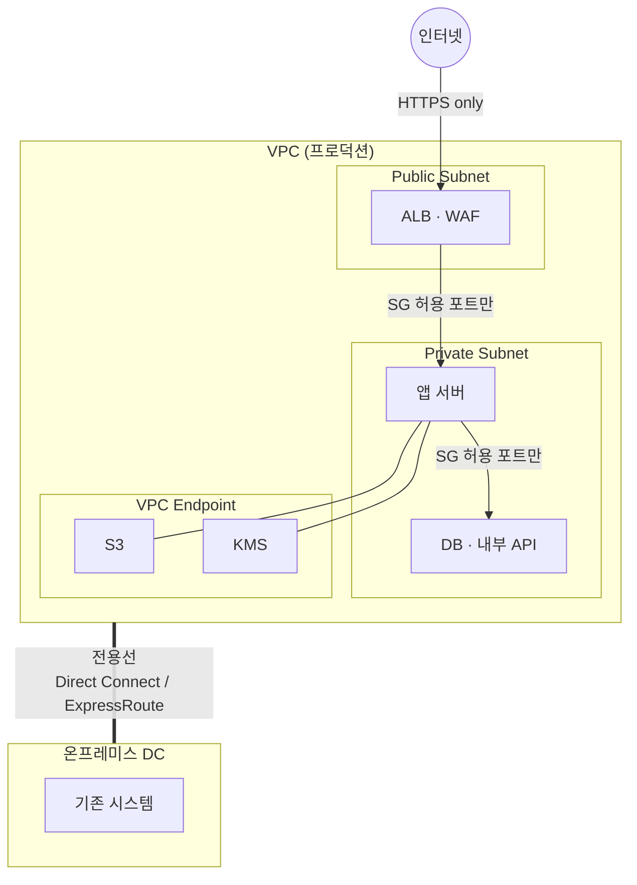

> 문서 기준: 2026년 8월

## 개요

:::note
이 문서는 물리적·논리적 격리의 **개념과 클라우드 패턴**을 다룹니다. 국가·관할별 규제 레이어는 다음을 참고하세요.
- 한국 금융·공공 망분리·N2SF·CSAP: [망분리와 네트워크 격리 (한국)](../../korea/security/network-isolation/)
- 미국 연방/방산 격리 맥락: [미국 개요](../../us/index/) · [FedRAMP](../../us/fedramp/) · [ITAR/EAR](../../us/itar/)
- EU 금융 ICT·주권: [EU 개요](../../eu/index/) · [DORA](../../eu/dora/)
- 일본: [일본 개요](../../japan/index/)
- 싱가포르: [싱가포르 개요](../../singapore/index/)
:::

**망분리**(Network Segregation)는 업무망과 인터넷망을 분리하여 외부 위협이 내부 시스템에 도달하지 못하도록 하는 통제입니다. 인터넷을 통한 악성코드 유입, 원격 침투, 데이터 유출을 네트워크 경계에서 차단한다는 점에서, 여러 나라의 금융·공공·의료 규제 시장에서 오랫동안 핵심 보안 요건으로 쓰여 왔습니다.

다만 API 연동, SaaS 활용, 원격 근무 등 시스템 간 연결이 불가피해진 현대 환경에서는 "분리"의 의미와 구현 방식이 함께 진화하고 있습니다.

온프레미스에서는 물리적으로 네트워크 장비를 분리하여 구현했습니다. 클라우드에서는 동일한 보안 목표를 **논리적 격리**로 달성할 수 있으며, 일부 규제 요건에서는 여전히 물리적 분리를 요구합니다.

:::caution
망분리는 보안의 **한 계층**이지 전부가 아닙니다. 물리적으로 분리된 망에서도 내부자 위협, USB를 통한 악성코드 유입, 패치 지연으로 인한 취약점 노출은 발생합니다. 망분리와 함께 [제로 트러스트](../../security/zero-trust/), [보안 태세 관리](../../security/security-posture/)를 병행해야 합니다.
:::

## 망분리의 의미 — 분리인가, 통제된 연결인가

망분리의 본래 목적은 **두 네트워크 사이에 데이터 이동 경로 자체가 없는 것**입니다. 그러나 현실에서는 업무 편의를 위해 분리된 망을 다시 연결하는 솔루션을 도입하는 경우가 많습니다.

| 솔루션 | 하는 일 | 본질 |
| --- | --- | --- |
| VDI (가상 데스크톱) | 인터넷망 단말에서 업무망 화면을 원격 표시 | 화면 전송 경로 = 연결 |
| 망간 자료전송 시스템 | 파일을 검사 후 반대편 망으로 전달 | 데이터 이동 경로 = 연결 |
| 클립보드/USB 통제 솔루션 | 복사·붙여넣기, 이동식 매체를 제한적 허용 | 제한된 데이터 경로 = 연결 |

이 솔루션들을 도입하는 순간, 그것은 "망분리"가 아니라 **망간 접근 통제**입니다. 경로가 존재하는 한 그 경로를 통한 데이터 유출·악성코드 유입 가능성도 존재합니다.

:::caution
"망분리를 했으니 안전하다"는 전제는 위험합니다. 망연계 솔루션이 하나라도 있다면 그 경로의 보안 수준이 곧 전체 보안 수준의 상한이 됩니다. 분리 자체가 목적이 아니라, **보호 대상 데이터가 허가 없이 이동하지 못하는 것**이 목적입니다.
:::

### 클라우드 관점에서의 시사점

클라우드의 논리적 격리(VPC, Private Subnet, Security Group)는 처음부터 **"통제된 연결"을 명시적으로 설계**하는 모델입니다. 어떤 트래픽이 어디로 갈 수 있는지를 코드로 정의하고, 모든 통신을 로깅하며, 정책 위반을 실시간 탐지합니다.

온프레미스 물리적 망분리 + VDI/망연계 솔루션 조합과 비교하면:

| 관점 | 물리적 망분리 + 망연계 솔루션 | 클라우드 논리적 격리 |
| --- | --- | --- |
| 경계 정의 | 물리 장비로 암묵적 분리, 솔루션으로 예외 생성 | 코드로 명시적 정의 (Security Group, NACL, IAM) |
| 가시성 | 망연계 솔루션 로그에 의존 | VPC Flow Logs, CloudTrail 등 전 구간 로깅 |
| 정책 변경 | 장비 설정 변경, 수 일~수 주 | 코드 변경 + CI/CD 배포, 수 분 |
| 드리프트 탐지 | 수동 점검 | 자동 탐지 (Config Rules, Policy, CSPM) |
| 감사 증적 | 솔루션별 개별 로그 수집 | 통합 감사 로그 |

핵심은 "분리냐 연결이냐"의 이분법이 아니라, **허용된 경로를 얼마나 명시적으로 정의하고, 그 외 모든 것을 차단하며, 위반을 실시간으로 탐지할 수 있는가**입니다.

## 물리적 망분리 vs 논리적 망분리

| 구분 | 물리적 망분리 | 논리적 망분리 |
| --- | --- | --- |
| **방식** | 별도의 네트워크 장비·회선·단말 사용 | 동일 인프라에서 가상화·암호화·접근 통제로 분리 |
| **보안 수준** | 네트워크 레벨에서 완전 차단 | 설정 오류 시 경계 침투 가능 |
| **비용** | 장비·회선 이중화로 높음 | 상대적으로 낮음 |
| **유연성** | 변경에 수 주~수 개월 | 정책 변경으로 수 분 내 조정 |
| **패치/업데이트** | 폐쇄망 내 수동 반입 필요 → 지연 발생 | 통제된 경로로 자동화 가능 |
| **규제 적용** | 가장 엄격한 규제(국가별 상 등급·핵심 금융 시스템 등) | 대부분의 클라우드 워크로드 |

### 운영 관점 1:1 대조

| 구분 | 온프레미스 (물리적 망분리) | 클라우드 (논리적 격리) | 트레이드오프 |
| --- | --- | --- | --- |
| **격리 방식** | 케이블·장비 물리 분리 | SDN(VPC) 기반 논리적 분리 | 물리적은 직관적이나 변경 어려움. 논리적은 유연하나 설정 오류 리스크 |
| **경계 보안** | 하드웨어 방화벽 | Security Group + NACL | 하드웨어는 성능 안정적. SG/NACL은 자동화·코드 관리 가능 |
| **가시성** | 물리 포트·패킷 캡처 | VPC Flow Logs, 실시간 모니터링 | 물리적은 전문 장비 필요. 클라우드는 기본 제공되나 로그 비용 발생 |
| **장애 복구** | 장비 교체 (수 시간~수 일) | Multi-AZ 자동 페일오버 (수 초~수 분) | 클라우드는 빠르나 벤더 의존. 물리적은 자체 통제 가능 |
| **변경 관리** | 장비 설정 변경, 작업 신청서 | 코드 변경 + CI/CD 배포 | 물리적은 승인 체계 명확. 클라우드는 빠르나 거버넌스 별도 필요 |
| **감사 증적** | 장비별 개별 로그 수집 | 통합 감사 로그 (CloudTrail 등) | 물리적은 로그 통합 어려움. 클라우드는 기본 통합되나 보존 정책 설정 필요 |

두 방식 모두 장단점이 있으며, 워크로드의 민감도와 규제 요건에 따라 적합한 방식이 다릅니다. 많은 조직이 핵심 시스템은 물리적 분리를 유지하면서, 비민감 워크로드부터 논리적 격리로 확장하는 하이브리드 접근을 채택합니다.

### 물리적 망분리의 현실적 한계

물리적 망분리가 "절대 안전"을 보장하지는 않습니다.

- **패치 지연**: 폐쇄망은 인터넷 접근이 불가하여 보안 패치 적용이 수 주~수 개월 지연됩니다. 이 기간 동안 알려진 취약점에 노출됩니다.
- **내부자 위협**: 물리적 분리는 외부 공격을 차단하지만, 내부 권한을 가진 사용자의 데이터 유출은 막지 못합니다.
- **운영 복잡성**: 이중 단말, 망간 자료전송 시스템, 별도 인증 체계 등 운영 부담이 큽니다.
- **DR 제약**: 폐쇄망 환경에서 원격지 DR 구성이 어렵습니다.

## 클라우드에서의 네트워크 격리 구현

클라우드는 소프트웨어 정의 네트워크(SDN)를 기반으로 하므로, 물리적 장비 없이도 강력한 격리를 구현할 수 있습니다.

### 격리 수준별 구현 패턴

| 격리 수준 | 구현 방법 | 적합한 경우 |
| --- | --- | --- |
| **VPC/VNet 분리** | 워크로드별 독립 VPC, 라우팅 차단 | 일반적인 환경 분리 (dev/prod) |
| **프라이빗 서브넷** | 인터넷 게이트웨이 없는 서브넷, NAT 경유만 허용 | DB, 내부 API 등 외부 노출 불필요 시스템 |
| **프라이빗 서비스 연결** | 관리형 서비스 접근을 벤더 내부 네트워크로 한정 | 스토리지, DB 등 접근 시 인터넷 우회 |
| **전용선** | 인터넷을 경유하지 않는 물리 전용 네트워크 연결 | 온프레미스↔클라우드 간 통신 |
| **에어갭** | 인터넷과 완전히 단절된 클라우드 환경 | 가장 엄격한 규제 |

### 벤더별 에어갭/전용 환경

인터넷과 완전히 분리된 클라우드 환경이 필요한 경우, 각 벤더는 다음 옵션을 제공합니다. 단, 대상 국가 규제 시장에서의 인증 여부는 별도로 확인해야 합니다.

| 벤더 | 서비스 | 설명 |
| --- | --- | --- |
| AWS | Outposts | 고객 데이터센터에 AWS 인프라 설치. 로컬 처리 |
| AWS | Snow Family (Snowball Edge) | 완전 오프라인 환경에서 컴퓨팅/스토리지 제공 |
| Azure | Azure Stack Hub / HCI | 고객 DC에서 Azure 서비스 운영. 연결/비연결 모드 |
| Azure | Azure Government (격리 리전) | 미국 정부 전용 물리적 분리 리전 |
| Google Cloud | Google Distributed Cloud (GDC) Air-gapped | 완전 오프라인 환경에서 Google Cloud 서비스 운영 |
| OCI | Dedicated Region | 고객 DC에 OCI 전체 리전 설치. 완전 격리 |
| OCI | Roving Edge Infrastructure | 오프라인 환경용 이동식 컴퓨팅 |

### 일반적인 규제 시장 아키텍처 패턴

대부분의 금융/공공 워크로드는 에어갭까지 필요하지 않으며, 다음 패턴으로 규제 요건을 충족합니다.

**핵심 원칙:**

- 인터넷 노출 최소화 — Public Subnet에는 로드밸런서/WAF만 배치
- 관리형 서비스 접근은 VPC Endpoint 경유 — NAT Gateway/인터넷 우회
- 온프레미스 연결은 전용선 — VPN은 백업 경로로만 사용
- 모든 통신 암호화 — TLS 1.2+ 필수

## 규제 요건 매핑

세계 여러 규제 시장의 망분리·격리 정책은 "모든 시스템을 동일 수준으로 분리"하는 일률적 접근에서, **데이터 등급에 따른 차등 보안**으로 바뀌고 있습니다. 정책 질문도 "분리 여부"의 이분법에서 "어떤 수준의 통제가 필요한가"로 이동합니다.

| 규제/기준 | 요구사항 | 클라우드 대응 |
| --- | --- | --- |
| **PCI DSS** (카드 결제, 글로벌) | CDE(카드 데이터 환경) 네트워크 격리 | 전용 VPC + 방화벽 + 로깅 |
| **국가별 공공·금융 규제** | 물리적/논리적 분리 요건과 등급 체계는 국가마다 다름 | 해당 국가 가이드에서 상세 매핑 |

국가별 규제 상세는 해당 국가 문서를 참고하세요.

- **한국** — 전자금융감독규정, CSAP 상·중·하, ISMS-P, N²SF C/S/O: [망분리와 네트워크 격리 (한국)](../../korea/security/network-isolation/)
- **미국** — FedRAMP, ITAR/EAR: [미국 개요](../../us/index/)
- **EU** — DORA, 데이터 주권: [EU 개요](../../eu/index/)
- **일본** — ISMAP, 가버먼트 클라우드: [일본 개요](../../japan/index/)
- **싱가포르** — MTCS, PDPA: [싱가포르 개요](../../singapore/index/)

:::note
규제 체계와 무관하게, 대부분의 기관은 모든 시스템이 같은 등급이 아닙니다. 시스템별로 등급을 분류하고 격리 수준을 차등 적용하는 것이 핵심입니다. 모든 시스템을 가장 높은 등급으로만 격리하는 것이 아니라, 현실적인 혼합 구성이 필요합니다.
:::

## 안티패턴

| 안티패턴 | 문제 | 올바른 접근 |
| --- | --- | --- |
| 모든 서브넷을 Public으로 구성 | 모든 리소스가 인터넷에 노출 | Private Subnet 기본, Public은 LB/Bastion만 |
| Security Group에 0.0.0.0/0 인바운드 허용 | 사실상 방화벽 없음 | 최소 권한 원칙, 필요한 포트/소스만 허용 |
| NAT Gateway로 모든 아웃바운드를 허용 | 데이터 유출 경로 존재 | VPC Endpoint 우선, 아웃바운드도 제한 |
| 망분리만 하고 내부 모니터링 없음 | 내부 횡이동 탐지 불가 | VPC Flow Logs + 이상 탐지 + Network Policy |
| 물리적 망분리 후 패치 방치 | 알려진 취약점에 장기 노출 | 통제된 패치 경로 확보, 정기 취약점 스캔 |

### 예방적 가드레일 — 실수가 사고로 확대되기 전에

온프레미스에서는 실수(잘못된 방화벽 규칙, 포트 개방)를 사후에 감사로 발견하는 경우가 많습니다. 클라우드에서는 **실수 자체를 차단하는 예방적 통제**를 자동화할 수 있습니다.

| 가드레일 | 동작 | 벤더 예시 |
| --- | --- | --- |
| **조직 정책으로 위험 행위 원천 차단** | 특정 리전 외 리소스 생성 금지, 퍼블릭 접근 차단 | AWS SCP, Azure Policy, Google Cloud Organization Policy |
| **설정 변경 시 자동 탐지·복구** | 규칙 위반 리소스를 즉시 알림 또는 자동 수정 | AWS Config Rules, Azure Policy (remediation), Google Cloud Security Command Center |
| **네트워크 변경 실시간 감시** | Security Group 변경, 새 인터넷 경로 생성 시 즉시 알림 | CloudTrail + EventBridge, Azure Monitor, Google Cloud Cloud Audit Logs |

단, 가드레일은 **설정해야 작동합니다.** 기본 상태에서는 대부분 비활성화되어 있으며, 조직의 보안 요건에 맞게 정책을 정의하고 유지하는 것은 사용자의 책임입니다.

## 자주 하는 실수

- **Security Group에 0.0.0.0/0 인바운드를 "임시로" 열고 방치** — 테스트 후 제거하지 않아 사실상 방화벽이 없는 상태로 운영됨
- **망분리만 하고 내부 모니터링을 하지 않음** — 외부 차단에만 집중하여 내부 횡이동(Lateral Movement)을 탐지하지 못함
- **NAT Gateway로 모든 아웃바운드를 허용** — VPC Endpoint를 사용하지 않아 데이터 유출 경로가 존재하고 불필요한 비용 발생

## 체크리스트

- [ ] 워크로드 등급에 따라 VPC/서브넷 분리 전략을 수립했는가
- [ ] 인터넷 노출이 필요한 리소스를 최소화했는가 (Public Subnet 최소화)
- [ ] 관리형 서비스 접근에 VPC Endpoint / Private Link를 사용하는가
- [ ] 온프레미스 연결에 전용선을 사용하는가 (VPN은 백업만)
- [ ] Security Group / NACL에 최소 권한 원칙을 적용했는가
- [ ] VPC Flow Logs를 활성화하고 이상 탐지를 구성했는가
- [ ] 아웃바운드 트래픽도 제한하고 있는가 (데이터 유출 방지)
- [ ] 규제 요건에 맞는 격리 수준을 선택했는가 (논리적 vs 물리적)
- [ ] 폐쇄망 환경에서도 패치 적용 경로를 확보했는가

## 관련 문서

- [제로 트러스트](../../security/zero-trust/)
- [VPC와 서브넷](../../networking/vpc-subnet/)
- [컴플라이언스](../../governance/compliance/)

## 참고하기

### 규제/표준

- [PCI DSS v4.0 (PCI SSC)](https://www.pcisecuritystandards.org/)
- 한국 법령·CSAP·N²SF 링크는 [망분리와 네트워크 격리 (한국)](../../korea/security/network-isolation/)을 참고하세요.

### AWS

- [VPC 보안 모범사례](https://docs.aws.amazon.com/ko_kr/vpc/latest/userguide/vpc-security-best-practices.html)
- [AWS PrivateLink 문서](https://docs.aws.amazon.com/ko_kr/vpc/latest/privatelink/)
- [AWS Outposts 문서](https://docs.aws.amazon.com/ko_kr/outposts/)

### Azure

- [Azure 네트워크 보안 모범사례](https://learn.microsoft.com/ko-kr/azure/security/fundamentals/network-best-practices)
- [Azure Private Link 문서](https://learn.microsoft.com/ko-kr/azure/private-link/)
- [Azure Stack Hub 문서](https://learn.microsoft.com/ko-kr/azure-stack/operator/)

### Google Cloud

- [VPC 보안 모범사례](https://cloud.google.com/architecture/framework/security/network-security)
- [Private Google Access 문서](https://cloud.google.com/vpc/docs/private-google-access)
- [Google Distributed Cloud 문서](https://cloud.google.com/distributed-cloud)

### OCI

- [OCI 네트워크 보안 모범사례](https://docs.oracle.com/en-us/iaas/Content/Security/Reference/networking_security.htm)
- [OCI Dedicated Region 문서](https://docs.oracle.com/iaas/Content/dedicated/dedicated-region/dedicated-region-overview.htm)
