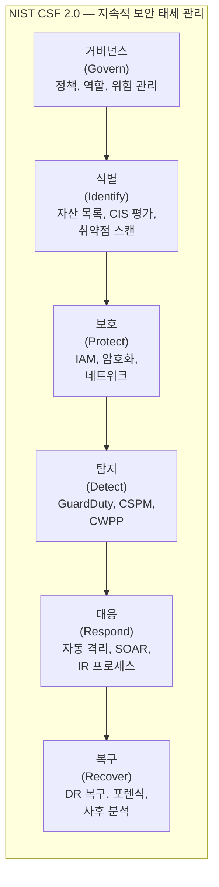

> 문서 기준: 2026년 8월

## 개요

클라우드 환경은 리소스가 빠르게 생성·변경되므로, **지속적으로 보안 상태를 평가하고 위협을 탐지·대응**하는 체계가 필요합니다. 이를 통칭하여 **보안 태세 관리** (Security Posture Management)라 합니다.

:::note
배포 전 보안 검증은 [DevSecOps](../../devops/devsecops/)를, OS/런타임 패치는 [패치 관리와 취약점 대응](../../devops/patch-and-vulnerability/)을 참고하세요.
:::

주요 영역:

| 영역 | 역할 | 예시 |
| --- | --- | --- |
| **CSPM** (Cloud Security Posture Management) | 클라우드 구성 오류 탐지 | S3 퍼블릭 노출, 암호화 미적용, 과도한 IAM 권한 |
| **CWPP** (Cloud Workload Protection Platform) | 워크로드(VM, 컨테이너, 서버리스) 런타임 보호 | 멀웨어 탐지, 파일 무결성 모니터링, 런타임 취약점 |
| **위협 탐지** (Threat Detection) | 비정상 활동·공격 징후 식별 | 비인가 API 호출, 암호화폐 채굴, 데이터 유출 시도 |
| **SIEM/SOAR** | 보안 이벤트 수집·분석·자동 대응 | 로그 상관 분석, 자동 격리, 티켓 생성 |

## 벤더별 보안 태세 서비스

| 영역 | AWS | Azure | Google Cloud | OCI |
| --- | --- | --- | --- | --- |
| **CSPM** | [Security Hub](https://docs.aws.amazon.com/securityhub/latest/userguide/what-is-securityhub.html) | [Defender for Cloud (CSPM)](https://learn.microsoft.com/azure/defender-for-cloud/concept-cloud-security-posture-management) | [Security Command Center Enterprise](https://cloud.google.com/security-command-center/docs) — Google Unified Security 포트폴리오의 CSPM 구성요소. Mandiant 위협 인텔리전스 통합 | [Cloud Guard](https://docs.oracle.com/en-us/iaas/cloud-guard/home.htm) |
| **CWPP** | [GuardDuty Runtime Monitoring](https://docs.aws.amazon.com/guardduty/latest/ug/runtime-monitoring.html) + [Inspector](https://docs.aws.amazon.com/inspector/latest/user/what-is-inspector.html) | [Defender for Servers/Containers](https://learn.microsoft.com/azure/defender-for-cloud/defender-for-servers-introduction) | [SCC Premium (VM Threat Detection)](https://cloud.google.com/security-command-center/docs/concepts-vm-threat-detection-overview) | [Cloud Guard (Threat Detector)](https://docs.oracle.com/en-us/iaas/cloud-guard/using/detect-recipes.htm) |
| **위협 탐지** | [GuardDuty](https://docs.aws.amazon.com/guardduty/latest/ug/what-is-guardduty.html) | [Defender for Cloud + Sentinel](https://learn.microsoft.com/azure/sentinel/overview) | [SCC Event Threat Detection](https://cloud.google.com/security-command-center/docs/concepts-event-threat-detection-overview) | [Cloud Guard (Activity Detector)](https://docs.oracle.com/en-us/iaas/cloud-guard/using/detect-recipes.htm) |
| **SIEM/SOAR** | [Security Lake](https://docs.aws.amazon.com/security-lake/latest/userguide/what-is-security-lake.html) + 서드파티 | [Microsoft Sentinel](https://learn.microsoft.com/azure/sentinel/) | [Chronicle SIEM](https://cloud.google.com/chronicle/docs) | [OCI Logging Analytics](https://docs.oracle.com/en-us/iaas/logging-analytics/home.htm) (로그 분석) + 서드파티 SIEM |
| **비용** | GuardDuty 종량제, Security Hub 검사당 과금 | Defender 플랜별 과금 | SCC Standard 무료 / Premium·Enterprise 과금 | Cloud Guard 무료 |

## CIS Benchmarks

### CIS Benchmark란

[CIS (Center for Internet Security)](https://www.cisecurity.org/cis-benchmarks) Benchmarks는 OS, 클라우드 플랫폼, 데이터베이스, 컨테이너 등에 대한 **보안 구성 기준선**입니다. 업계에서 가장 널리 사용되는 보안 구성 표준으로, 감사 및 규정 준수의 기본 프레임워크입니다.

주요 벤치마크:

| 대상 | 벤치마크 예시 |
| --- | --- |
| 클라우드 계정 | CIS AWS Foundations, CIS Azure Foundations, CIS Google Cloud Foundations, CIS OCI Foundations |
| OS | CIS Amazon Linux 2023, CIS Ubuntu, CIS Windows Server |
| 컨테이너 | CIS Docker, CIS Kubernetes |
| 데이터베이스 | CIS Oracle Database, CIS PostgreSQL, CIS MySQL |

### 벤더별 CIS 자동 평가

| 벤더 | 서비스 | CIS 지원 |
| --- | --- | --- |
| AWS | Security Hub | CIS AWS Foundations Benchmark v1.4/v3.0 자동 평가. 점수 대시보드 |
| Azure | Defender for Cloud | CIS Azure Foundations 기반 규정 준수 대시보드. 권장 사항 자동 생성 |
| Google Cloud | Security Command Center | CIS Google Cloud Foundations 기반 스캔. Security Health Analytics |
| OCI | Cloud Guard | CIS OCI Foundations Benchmark 기반 Detector 레시피 기본 제공 |

### CIS 리포트의 중요성

- **감사 대응** — 내·외부 감사 시 "보안 구성 기준을 충족하고 있음"을 증빙
- **기준선 설정** — 신규 계정/프로젝트 생성 시 최소 보안 수준 보장
- **지속적 모니터링** — 구성 드리프트(의도치 않은 변경)를 자동 탐지
- **경영진 보고** — 보안 점수(Score)로 현재 상태를 정량적으로 전달
- **규정 준수 매핑** — CIS 항목이 ISO 27001, SOC 2 및 국가별 인증 통제 항목과 매핑됨 ([규정 준수](../../governance/compliance/))

### CIS 운영 모범 사례

- **정기 스캔** — 최소 주 1회 자동 스캔. 변경이 잦은 환경은 실시간 모니터링
- **예외 관리** — 비즈니스 사유로 미준수 항목은 문서화 + 보상 통제 명시
- **점수 목표** — 조직 정책으로 최소 준수율 설정 (예: Critical 100%, High 95% 이상)
- **자동 교정** — 가능한 항목은 자동 수정 (예: 퍼블릭 S3 버킷 자동 차단)
- **트렌드 추적** — 월간 점수 추이를 추적하여 보안 태세 개선/악화 파악

## 위협 탐지 상세

AWS GuardDuty 탐지 유형

VPC Flow Logs, DNS 로그, CloudTrail, S3 데이터 이벤트, EKS 감사 로그, Lambda 네트워크 활동을 분석하여 위협을 탐지합니다.

| 카테고리 | 예시 |
| --- | --- |
| 비인가 접근 | 비정상 지역에서의 콘솔 로그인, 알려진 악성 IP에서의 API 호출 |
| 암호화폐 채굴 | EC2/EKS에서 마이닝 풀 통신 탐지 |
| 데이터 유출 | S3 버킷에서 비정상적 대량 다운로드, DNS를 통한 데이터 유출 |
| 권한 상승 | IAM 정책 변경 후 비정상 API 호출 패턴 |

Azure Defender + Sentinel

Defender for Cloud가 워크로드별 위협을 탐지하고, Sentinel이 SIEM으로서 로그를 수집·상관 분석합니다. Sentinel의 SOAR(자동 대응) 기능으로 Playbook을 통해 자동 격리, 알림, 티켓 생성이 가능합니다.

Google Cloud Security Command Center

Event Threat Detection이 Cloud Audit Logs, VPC Flow Logs를 분석하여 위협을 탐지합니다. Chronicle SIEM과 연동하면 대규모 로그 분석과 위협 헌팅이 가능합니다.

OCI Cloud Guard

**Detector** (탐지)와 **Responder** (대응)로 구성됩니다. 구성 문제와 활동 이상을 탐지하면 자동으로 대응 액션(리소스 비활성화, 태그 추가, 알림 등)을 실행합니다. 기본 제공되며 추가 비용이 없습니다.

## 자동 대응 (Auto-Remediation)

위협이나 구성 오류를 탐지한 후 사람의 개입 없이 자동으로 교정하는 패턴입니다.

| 벤더 | 자동 대응 방식 |
| --- | --- |
| AWS | Security Hub → EventBridge → Lambda/Step Functions (커스텀 교정) |
| AWS | GuardDuty → EventBridge → Lambda (자동 격리, SG 변경) |
| Azure | Defender 권장 사항 → Logic Apps / Azure Functions (자동 교정) |
| Azure | Sentinel Playbook (SOAR) → 자동 격리, 계정 비활성화 |
| Google Cloud | SCC Finding → Cloud Functions / Workflows (자동 교정) |
| OCI | Cloud Guard Responder → 자동 액션 (리소스 중지, 태그 추가, 알림) |

### 자동 대응 설계 원칙

- **단계적 적용** — 처음에는 알림만, 안정화 후 자동 교정으로 전환
- **화이트리스트** — 의도된 예외(개발 환경 퍼블릭 접근 등)는 사전 등록
- **롤백 가능** — 자동 교정 액션은 되돌릴 수 있어야 함
- **알림 병행** — 자동 교정 실행 시 담당자에게 알림 (사후 확인)
- **테스트 환경 우선** — 자동 대응 규칙을 비프로덕션에서 먼저 검증

## 보안 태세 운영 프레임워크

이 프레임워크는 [NIST Cybersecurity Framework 2.0](https://www.nist.gov/cyberframework)의 6가지 기능에 대응합니다.

## 자주 하는 실수

- **자동 대응을 검증 없이 프로덕션에 적용** — 오탐으로 정상 리소스가 자동 격리되어 서비스 장애 발생. 비프로덕션에서 먼저 검증해야 함
- **CIS Benchmark 미준수 항목을 문서화 없이 방치** — 비즈니스 사유가 있어도 예외 관리를 하지 않아 감사 시 지적됨
- **CSPM 알림을 켜놓고 대응 프로세스를 정의하지 않음** — 알림만 쌓이고 아무도 처리하지 않아 실제 위협을 놓침

## 체크리스트

- [ ] CSPM(Security Hub, Defender for Cloud, SCC, Cloud Guard)을 활성화하고 CIS Benchmark 자동 평가를 수행하는가
- [ ] 자동 대응 규칙을 비프로덕션에서 먼저 검증한 후 프로덕션에 적용하는가
- [ ] 보안 점수(Secure Score) 목표를 설정하고 월간 추이를 추적하는가

## 참고하기

### AWS

- [AWS Security Hub 문서](https://docs.aws.amazon.com/securityhub/latest/userguide/what-is-securityhub.html)
- [Amazon GuardDuty 문서](https://docs.aws.amazon.com/guardduty/latest/ug/what-is-guardduty.html)

### Azure

- [Microsoft Defender for Cloud 문서](https://learn.microsoft.com/azure/defender-for-cloud/)
- [Microsoft Sentinel 문서](https://learn.microsoft.com/azure/sentinel/)

### Google Cloud

- [Google Cloud Security Command Center 문서](https://cloud.google.com/security-command-center/docs)
- [Google Cloud Chronicle SIEM](https://cloud.google.com/chronicle/docs)

### OCI

- [OCI Cloud Guard 문서](https://docs.oracle.com/en-us/iaas/cloud-guard/home.htm)

### 표준 및 커뮤니티

- [CIS Benchmarks](https://www.cisecurity.org/cis-benchmarks)
- [NIST Cybersecurity Framework](https://www.nist.gov/cyberframework)
