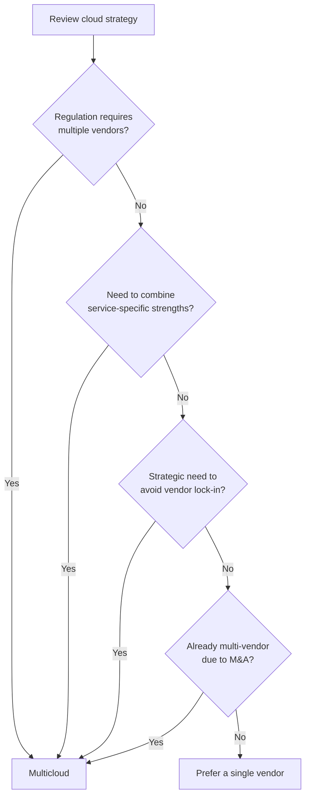

> Last reviewed: May 2026

## Why a Decision Framework Is Needed

There's **no single correct answer** to the question "which cloud is best?" The optimal choice depends on your organization's context, workload characteristics, and team capabilities.

Flawed approaches:

- Comparing price lists alone
- Deciding based on industry trends or marketing
- Choosing once and never revisiting the decision
- Forcing every workload onto the same vendor

The right approach is to **make your decision criteria explicit and re-evaluate per major workload**.

## Key Decision Factors

### 1. Data Gravity

The tendency for compute to follow wherever large volumes of data already reside.

- If your data already lives in a particular cloud, it's advantageous to place additional workloads there.
- Moving data between clouds gets progressively harder due to egress costs (see [Multicloud Connectivity](../../networking/multicloud-connectivity/)).

### 2. Geographic Proximity to Users

- For services aimed at Korean users, prioritize vendors with a Korea region
- For global services, review edge network and region coverage
- For DR, also consider nearby regions (see [Regions and Availability Zones](../../about-cloud/regions-and-zones/))

### 3. Regulatory and Compliance Requirements

- Public sector: CSAP certification required
- Financial services: Electronic Financial Supervision Regulations, ISMS-P
- For EU-facing services: GDPR
- See [Compliance](../../governance/compliance/) for details

### 4. Team Capability and Ecosystem

- If you already have a Microsoft stack (AD, Office 365), Azure is a natural fit
- If your team is familiar with AWS, initial productivity is higher
- Also consider official Korean-language documentation and community support for key services

### 5. Vendor Strength Areas

Each vendor has different strengths. See [Comparing Vendors](../../about-cloud/compare-clouds/) for a detailed comparison.

| Area | Typical strength |
| --- | --- |
| Portfolio diversity | AWS |
| Enterprise/Microsoft integration | Azure |
| AI/ML, data analytics | Google Cloud |
| Oracle DB, egress cost | OCI |

### 6. Cost Structure

- On-demand vs. committed pricing
- Egress cost (especially important in multicloud environments)
- Korea region pricing is typically 10–30% higher than US region pricing
- Managed-service premiums
- See [Understanding the Cost Structure](../../about-cloud/pricing-model/) for details

### 7. Exit Cost

The optional cost of being able to change vendors long-term. See [Exit Strategy](../../governance/exit-strategy/).

## Sample Decision Matrix

Evaluate multiple factors on a weighted basis. The table below is a **sample template** — actual weights and scores should be adjusted to fit your organization's context.

| Factor | Weight | AWS | Azure | Google Cloud | OCI |
| --- | --- | --- | --- | --- | --- |
| Team capability/experience | 20% | ? | ? | ? | ? |
| Data gravity | 15% | ? | ? | ? | ? |
| Cost (baseline) | 15% | ? | ? | ? | ? |
| Regulatory compliance | 15% | ? | ? | ? | ? |
| Strength-service fit | 15% | ? | ? | ? | ? |
| Ecosystem/integration | 10% | ? | ? | ? | ? |
| Exit cost | 10% | ? | ? | ? | ? |

Score each cell from 1–5, then rank by the sum of (weight × score).

## Placement Strategy by Workload

Rather than putting every workload on the same vendor, you can place workloads differently based on their characteristics.

### Representative Workload Types and Evaluation Axes

| Workload type | Key factors | Possible choices |
| --- | --- | --- |
| **Core operational systems** | Reliability, team capability, support SLA | Organization's primary vendor |
| **AI/ML training** | GPU availability, ML tooling, price | Google Cloud, AWS |
| **AI/ML inference** | Latency, model hosting cost | Region near users |
| **Data analytics** | Warehouse features, BI integration | Google Cloud BigQuery, Azure Synapse |
| **Microsoft workloads** | Entra ID integration, licensing benefits | Azure |
| **Oracle DB** | Licensing, performance optimization | OCI |
| **DR site** | Region diversity, cost | Different region/vendor from the primary |
| **Dev/test** | Cost, fast provisioning | Consider vendors with an Always Free tier |

## Multicloud vs. Single-Vendor Decision

Without a clear reason to choose multicloud, a single vendor is simpler.

The costs of multicloud (operational complexity, fragmented team capability, unified governance, egress) are substantial. See [Understanding Multicloud](../../about-cloud/why-multicloud/) for details.

## Anti-Patterns

Flawed decision-making patterns that occur frequently in practice.

### 1. Choosing Based on Price List Alone

- Catalog prices are on-demand rates; actual costs vary based on commitments, spot pricing, free tiers, and support plans.
- Egress costs, management tooling costs, and operations staffing costs are easy to overlook.
- Evaluation should be based on TCO (Total Cost of Ownership).

### 2. Never Re-Evaluating After Initial Placement

- Cloud services and pricing change significantly every year.
- As workloads grow, the initial choice may no longer fit.
- It's good practice to review the appropriateness of major workload placement at least once a year.

### 3. "Because Everyone Else Does It"

- Following conference and blog trends only increases cost and complexity.
- You must first answer "why does our organization need this?"

### 4. Ignoring Team Capability

- Even the best technology slows down incident response if the team doesn't know how to use it.
- Plan training/hiring alongside any new adoption.

### 5. Looking Only at Strengths, Ignoring Weaknesses

- Every vendor has weaknesses: lack of Korean documentation, unsupported services, support response speed, and so on.
- Confirm before adoption whether a weakness would be critical for your organization.

## Validation Steps

Steps you can actually verify before making a decision:

1. **PoC (Proof of Concept)** — Deploy one core workload in a real environment
2. **Cost simulation** — Estimate expected costs with vendor pricing calculators (has limitations)
3. **Benchmark** — Measure performance/response time for the same workload
4. **Support quality evaluation** — Actual ticket response speed, Korean-language support level
5. **Team survey** — Gather feedback from the engineers who will actually use it

## Common Mistakes

- **"Just pick the cheapest vendor"** — Catalog prices are on-demand rates; comparisons should be based on TCO, including egress, support plans, and operations staffing costs.
- **"Once decided, there's no need to change"** — Cloud services and pricing change every year. Workload placement appropriateness should be reviewed at least once a year.
- **"Every workload must use the same vendor"** — The optimal vendor can differ by workload characteristics. That said, also weigh the complexity cost of distribution.

## Checklist

- [ ] Have you defined weights and evaluation criteria in the decision matrix to fit your organization's context?
- [ ] Have you run a PoC with at least one vendor for your core workload?
- [ ] Have you included team capability (existing experience, training plan) in the vendor selection criteria?

## References

### AWS

- [AWS Well-Architected Framework](https://aws.amazon.com/architecture/well-architected/)

### Azure

- [Microsoft Cloud Adoption Framework](https://learn.microsoft.com/azure/cloud-adoption-framework/)

### Google Cloud

- [Google Cloud Adoption Framework](https://cloud.google.com/adoption-framework)

### OCI

- [Oracle Cloud Adoption Framework](https://docs.oracle.com/en-us/iaas/Content/cloud-adoption-framework/home.htm)

### Standards and Community

- [Gartner Magic Quadrant for Cloud Infrastructure](https://www.gartner.com/reviews/market/cloud-infrastructure-and-platform-services)
- [CNCF Annual Survey](https://www.cncf.io/reports/)
- [FinOps Foundation](https://www.finops.org/)
