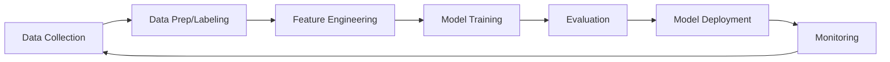

:::note
**New to AI?** Read [Getting Started with AI](getting-started.md) first. This document focuses on service comparison.
:::

## From Traditional ML to Generative AI

| Generation | Core Tech | Characteristics | Cloud Examples |
| --- | --- | --- | --- |
| **Traditional ML** | Regression, classification, clustering | Structured data, feature engineering required | SageMaker, Azure ML, Vertex AI |
| **Deep Learning** | CNN, RNN, Transformer | Unstructured data (image, text, speech). GPU required | GPU instances, managed training platforms |
| **Generative AI** | Foundation models (LLM, multimodal) | Text/image/code generation. Used via API | Bedrock, Microsoft Foundry, Gemini |
| **Agentic AI** | LLM + tool use + autonomous execution | Plans, executes, verifies given a goal | AgentCore, Foundry Agents, [details→](agents.md) |

## Generative AI Model Types

| Type | Input → Output | Representative Services | Use Cases |
| --- | --- | --- | --- |
| **Text (LLM)** | Text → Text | GPT-5.6, Claude Fable 5, Gemini 3.5 | Chatbots, summarization, code generation |
| **Image Generation** | Text → Image | DALL-E, MAI-Image, Imagen, Titan Image | Marketing, design |
| **Speech (TTS/STT)** | Text ↔ Speech | Polly, MAI-Voice, Azure Speech, Cloud TTS | Transcription, IVR, accessibility |
| **Video Generation** | Text → Video | Nova Reel, Veo 3.1, Gemini Omni | Ads, short-form content |
| **Multimodal** | Text+Image+Speech → Text | GPT-5.6, Gemini 3.5 Pro, Claude Fable 5 | Document understanding, image analysis |
| **Embeddings** | Text/Image → Vector | Titan Embeddings, Gemini Embedding, Cohere Embed | RAG, similarity search |

## Foundation Model APIs

| Provider | Key Models | 1P (Direct) | 3P (Cloud-hosted) |
| --- | --- | --- | --- |
| **OpenAI** | GPT-5.6, GPT-5.5, o-series | [api.openai.com](https://platform.openai.com/) | Azure Foundry, Bedrock |
| **Anthropic** | Claude Fable 5, Opus 4.8, Sonnet 5, Haiku | [api.anthropic.com](https://platform.claude.com/) | Bedrock, Vertex AI |
| **Google** | Gemini 3.5 Pro/Flash, 3.1 Pro, Gemini Omni | [Gemini API](https://ai.google.dev/) | Vertex AI (native) |
| **xAI** | Grok 4.3, Grok 4.1 Fast, Imagine | [x.ai/api](https://x.ai/api) | OCI, Vertex AI, Bedrock, Azure |
| **Meta** | Llama 4 (open-weight) | [llama.meta.com](https://llama.meta.com/) | Bedrock, Vertex, Azure, OCI |
| **Amazon** | Nova Premier/Pro/Lite/Micro/Sonic | — (Bedrock only) | Bedrock |
| **Microsoft** | MAI (Image/Voice/Transcribe) | — (Foundry only) | Azure Foundry |
| **Mistral** | Large, Small, Codestral | [api.mistral.ai](https://api.mistral.ai/) | Bedrock, Azure, Vertex |

:::note
**1P vs 3P difference** — The same model may differ in feature scope, quotas, and billing depending on channel. See [LLM Channel Selection Guide](1p-vs-3p.md).
:::

### Cloud Platform Strengths

| Platform | Strengths |
| --- | --- |
| [Amazon Bedrock](https://aws.amazon.com/bedrock/) | Multi-model single API, AgentCore, AWS IAM/VPC integration, EDP consumption |
| [Microsoft Foundry](https://azure.microsoft.com/products/ai-services/openai-service) | Primary OpenAI channel, M365/GitHub integration, Foundry Local (air-gapped), PTU |
| [Vertex AI / Gemini Platform](https://cloud.google.com/vertex-ai) | Native Gemini, 2M token context, Model Garden 200+ models, ADK |
| [OCI Enterprise AI](https://docs.oracle.com/iaas/Content/generative-ai/home.htm) | Oracle DB integration, dedicated GPU clusters (RDMA), 10TB egress free |

### AI Agents / RAG

| Vendor | Agent Platform | RAG |
| --- | --- | --- |
| AWS | [Bedrock AgentCore](https://aws.amazon.com/bedrock/agentcore/) | [Bedrock Knowledge Bases](https://aws.amazon.com/bedrock/knowledge-bases/) |
| Azure | [Microsoft Foundry Agents](https://learn.microsoft.com/azure/ai-foundry/agents/) | Azure AI Search |
| Google Cloud | [Gemini Enterprise Agent Platform](https://cloud.google.com/products/agent-builder) | Vertex AI RAG Engine |
| OCI | [OCI Enterprise AI Agents](https://docs.oracle.com/iaas/Content/generative-ai/agents.htm) | OCI Search integration |

## ML Platforms

For organizations that need to train and deploy their own models.

| Vendor | Product | Notes |
| --- | --- | --- |
| AWS | SageMaker AI | Training, tuning, deployment, MLOps |
| Azure | Azure Machine Learning | Notebooks, AutoML, pipelines, model registry |
| Google Cloud | Vertex AI | Training, deployment, pipelines, Feature Store |
| OCI | OCI Data Science | Notebooks, training/deployment, pipelines |

### GPU / AI Accelerators

| Vendor | Products | Notes |
| --- | --- | --- |
| AWS | P6 (B200), P6e (GB200 UltraServer), P5 (H100), Trn2 (Trainium), Inf2 (Inferentia) | Blackwell: P6-B200 (8×B200), P6e-GB200 (up to 72 GPU NVLink). Training: Trainium, Inference: Inferentia |
| Azure | ND GB200-v6, ND H200 v5, ND H100 v5 | GB200-v6: Blackwell flagship for DL training/GenAI/HPC |
| Google Cloud | A4X (GB200 NVL72), A4 (B200), A3 (H100), TPU v5p/v6e | A4X: first cloud GB200 NVL72. TPU: Google's custom AI accelerator |
| OCI | GPU Instances (B200, H100, A100) | NVIDIA Blackwell + Bare Metal + RDMA cluster support |

## Inference Cost Optimization

| Strategy | Description | Vendor Support |
| --- | --- | --- |
| **Flex/Batch Inference** | Process latency-tolerant workloads at lower priority | Bedrock Flex, Azure Batch API, Vertex Batch Predictions |
| **Model Routing** | Route simple queries to lightweight models, complex ones to frontier models | Bedrock IntelligentPromptRouter, custom |
| **Prompt Caching** | Cache repeated system prompts/context to reduce token costs | Anthropic Prompt Caching, OpenAI Cached Tokens, Gemini Context Caching |
| **Long Context vs RAG** | Extended context windows (1–2M+ tokens) may eliminate RAG need | Gemini 3.5 Pro, Claude Opus |
| **GPU Price Competition** | Hyperscaler GPU instance pricing trending downward | AWS, Azure, GCP competitive pricing |

:::note
Inference pricing changes frequently. Check each vendor's official pricing page for current rates. Cost tracking and budget management are detailed in [LLMOps](llmops.md).
:::

## ML Pipeline and MLOps

### ML Lifecycle

### Tools by Stage

| Stage | AWS | Azure | Google Cloud | OCI |
| --- | --- | --- | --- | --- |
| **Data Prep** | SageMaker Data Wrangler, Ground Truth | Azure ML Data Labeling | Vertex AI Data Labeling | OCI Data Labeling |
| **Feature Store** | SageMaker Feature Store | Azure ML Feature Store | Vertex AI Feature Store | OCI Feature Store |
| **Training** | SageMaker Training + Auto Tuning | Azure ML + AutoML | Vertex AI Training + HPT | OCI Data Science Training |
| **Model Registry** | SageMaker Model Registry | Azure ML Model Registry | Vertex AI Model Registry | OCI Model Catalog |
| **Deployment** | SageMaker Endpoints + Serverless | Azure ML Online/Batch Endpoints | Vertex AI Endpoints | OCI Model Deployment |
| **Monitoring** | SageMaker Model Monitor | Azure ML Data Drift Detection | Vertex AI Model Monitoring | OCI Model Monitoring |
| **Pipelines** | SageMaker Pipelines | Azure ML Pipelines | Vertex AI Pipelines (Kubeflow) | OCI Data Science Jobs + Pipelines |

## Multicloud Model Access (2025–2026)

| Event | Impact |
| --- | --- |
| **OpenAI-Microsoft exclusivity ended (2026.04)** | OpenAI models available on non-Azure platforms |
| **OpenAI → Bedrock (2026.04)** | GPT-5.x available on Bedrock post-exclusivity |
| **xAI Grok multicloud expansion** | Available on Azure, Vertex AI, OCI, Bedrock |
| **Anthropic Claude channel expansion** | Beyond Bedrock/Vertex to additional channels |

## Common Mistakes

- **Starting with fine-tuning** — RAG often suffices; fine-tuning wastes cost/time on problems RAG can solve.
- **Not pinning model versions** — Vendor model updates can silently degrade production prompt quality.
- **Single model for all workloads** — Using frontier models for simple classification tasks inflates costs. Route by task complexity.

## Checklist

- [ ] Selected models matching workload characteristics and compared cost/quality
- [ ] Pinned model ID/version in code; upgrades go through evaluation before rollout
- [ ] Following staged approach: RAG → Fine-tuning → Train from scratch

## References

### AWS
- [Amazon Bedrock](https://docs.aws.amazon.com/bedrock/)
- [Amazon SageMaker AI](https://docs.aws.amazon.com/sagemaker/)

### Azure
- [Microsoft Foundry](https://learn.microsoft.com/azure/ai-services/openai/)
- [Azure Machine Learning](https://learn.microsoft.com/azure/machine-learning/)

### Google Cloud
- [Vertex AI](https://cloud.google.com/vertex-ai/docs)
- [Gemini API](https://cloud.google.com/vertex-ai/generative-ai/docs)

### OCI
- [OCI AI Services](https://www.oracle.com/artificial-intelligence/ai-services/)
- [OCI Enterprise AI](https://docs.oracle.com/en-us/iaas/Content/generative-ai/home.htm)
