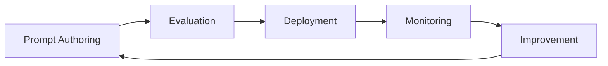

## Overview

After selecting a model ([AI Platforms](ai-ml.md)) and building a RAG pipeline ([Advanced RAG Patterns](rag-patterns.md)), you need to **continuously maintain and improve quality in production**. This is LLMOps.

## Evaluation

### Offline Evaluation

Verify quality before deployment.

| Type | Method | Tools |
| --- | --- | --- |
| **Golden Set** | Measure accuracy against test set with known answers | Custom + auto-scoring |
| **LLM-as-Judge** | Another LLM evaluates response quality | Bedrock Evaluations, Vertex AI Eval |
| **Human Review** | Humans review samples | Labeling tools (Label Studio, etc.) |
| **Regression Test** | Confirm existing quality after prompt/model change | CI pipeline integration |

### RAG Evaluation Metrics

| Metric | Measures | Meaning |
| --- | --- | --- |
| **Retrieval Precision** | Relevant docs among retrieved | Are irrelevant docs mixed in? |
| **Retrieval Recall** | Retrieved among all relevant docs | Are needed docs being missed? |
| **Faithfulness** | Response grounded in retrieved docs | Hallucination check |
| **Answer Relevance** | Response addresses the question | Off-topic answer check |

### Vendor Evaluation Tools

| Vendor | Service | Characteristics |
| --- | --- | --- |
| AWS | [Bedrock Evaluations](https://docs.aws.amazon.com/bedrock/latest/userguide/evaluation.html) | Auto + human eval, model comparison |
| Azure | [Azure AI Evaluation SDK](https://learn.microsoft.com/azure/ai-studio/how-to/evaluate-generative-ai-app) | Python SDK, CI/CD integration |
| Google Cloud | [Vertex AI Evaluation Service](https://cloud.google.com/vertex-ai/generative-ai/docs/models/evaluation-overview) | Auto metrics + human eval |
| Vendor-neutral | [Ragas](https://docs.ragas.io/), [DeepEval](https://docs.confident-ai.com/) | Open-source RAG evaluation frameworks |

## Prompt/Model Version Management

| Subject | Method | Tools |
| --- | --- | --- |
| **Prompt versions** | Manage prompt templates in Git. Auto-run eval on change | Git + CI |
| **Model versions** | Pin model ID/version in code. A/B test on upgrade | Bedrock Model ID, Azure Deployment |
| **Deployment strategy** | Canary (10% traffic to new version) → full rollout | Routing config |
| **Rollback** | Instant revert to previous prompt/model version | Deployment pipeline |

## Operational Metrics (Monitoring)

| Metric | Meaning | Alert Threshold Example |
| --- | --- | --- |
| **Latency (p50/p99)** | Response time | p99 > 5s |
| **Token Usage** | Input/output token consumption | >200% of daily average |
| **Error Rate** | API error ratio | > 1% |
| **Cache Hit Rate** | Prompt caching effectiveness | < 50% (below expectations) |
| **Cost per Request** | Per-request cost | Budget exceeded |
| **Fallback Rate** | Primary model failure → fallback model | > 5% |

### LLM Observability Platforms

| Product | Type | Key Features |
| --- | --- | --- |
| [Arize AI](https://arize.com/) | Commercial | Tracing, eval, drift detection, RAG analysis |
| [LangSmith](https://smith.langchain.com/) | Commercial (LangChain) | LangChain/LangGraph native tracing & eval |
| [Langfuse](https://langfuse.com/) | Open-source | Self-hostable, prompt management, cost tracking |
| [Weights & Biases (Weave)](https://wandb.ai/site/weave) | Commercial | Experiment tracking + LLM tracing + eval |

### Agent Observability

AI agents have **multi-step trajectories** (plan → tool call → observe → repeat), requiring different metrics than single LLM calls.

| Metric | Description | Why It Matters |
| --- | --- | --- |
| **Tool call success rate** | Correct tool with correct parameters | Fastest drift signal |
| **Trajectory length** | Steps to task completion, retry count | Loop/inefficiency detection |
| **Per-step latency** | P50/P99 per stage (model inference, tool execution) | Bottleneck identification |
| **Session cost** | Tokens (per model) + tool call costs | Budget overrun early warning |
| **Task completion rate** | Goal achieved (success/failure/timeout) | Core business metric |

**Agent observability tools:**

| Tool | Agent-Specific Features |
| --- | --- |
| [LangSmith](https://www.langchain.com/langsmith) | LangGraph trajectory replay, tool selection analysis |
| [Datadog LLM Observability](https://docs.datadoghq.com/llm_observability/) | Agent decision graph, loop detection, APM correlation |
| [AgentCore Observability](https://docs.aws.amazon.com/bedrock-agentcore/latest/devguide/observability-get-started.html) (AWS) | CloudWatch + OTEL auto-instrumentation |
| [Langfuse](https://langfuse.com/) (Open-source) | Self-hosted, framework-agnostic tracing |

:::note
**OTEL (OpenTelemetry) GenAI Semantic Conventions** are becoming the standard layer for agent observability. For framework/vendor-agnostic trace export, choose OTEL-based instrumentation.
:::

## Operational Patterns

| Pattern | Description |
| --- | --- |
| **Model Fallback** | Auto-switch to backup model on primary failure/latency (e.g., Claude Fable 5 → GPT-5.5 → Gemini 3.5 Pro) |
| **Rate Limit Handling** | Queue or route to alternate provider when vendor rate limit reached |
| **Budget Guardrail** | Daily/monthly cost cap. Reject requests or switch to cheaper model on exceed |
| **PII Masking** | Auto-mask PII in prompt/response logs before storage |

## Common Mistakes

- **Deploying prompt/model changes without evaluation** — No regression testing → sudden quality degradation in previously-working responses.
- **Storing PII in prompt/response logs unmasked** — Privacy regulation violation and data breach risk.
- **Single model dependency without fallback** — Vendor rate limits or outages bring down entire service.

## Checklist

- [ ] Golden Set regression tests run automatically in CI on prompt/model changes
- [ ] PII masking applied to all prompt/response logs
- [ ] Fallback strategy configured for automatic failover to alternate model

## References

### AWS
- [Bedrock Evaluations](https://docs.aws.amazon.com/bedrock/latest/userguide/evaluation.html)

### Azure
- [Azure AI Evaluation SDK](https://learn.microsoft.com/azure/ai-studio/how-to/evaluate-generative-ai-app)

### Google Cloud
- [Vertex AI Evaluation Service](https://cloud.google.com/vertex-ai/generative-ai/docs/models/evaluation-overview)

### Standards & Community
- [Ragas — RAG Evaluation Framework](https://docs.ragas.io/)
