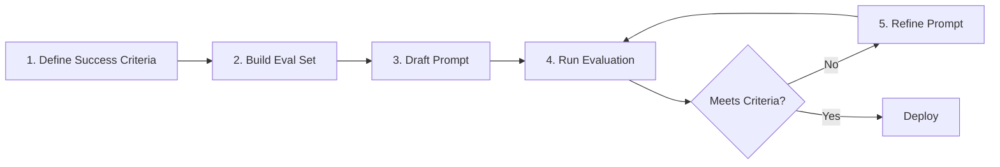

:::note
New to LLMs/prompts? Read [Getting Started with AI](getting-started.md) first.
:::

## What Is Prompt Engineering

Prompt engineering addresses **"how to question/instruct a model to get the desired output."** The same model produces vastly different quality depending on the prompt.

Per Anthropic's official guide, prompt engineering is an *"empirical science"* — the most important thing is **defining evaluation criteria → iterative testing**. It's not about finding a "good prompt" but improving through measurable metrics.

## Core Principles

Common principles emphasized by Microsoft, Google, and Anthropic guides:

- **Clear, specific instructions** — Vague requests produce vague answers.
- **Provide context** — Give background information the model doesn't have.
- **Assign a role** — Persona setting like "You are a legal expert."
- **Specify output format** — JSON, list, paragraph, etc.
- **Provide examples** — Input/output examples improve quality (Few-shot).
- **Iterate with evaluation** — Measure quality on representative cases, then refine.

Sources:
- [Microsoft — Prompt engineering techniques](https://learn.microsoft.com/azure/cognitive-services/openai/concepts/prompt-engineering)
- [Google Cloud — Prompting strategies](https://cloud.google.com/vertex-ai/generative-ai/docs/learn/prompts/prompt-design-strategies)
- [Anthropic — Prompt engineering overview](https://docs.anthropic.com/claude/docs/prompt-engineering)

## Key Patterns

### Zero-shot

Direct instruction without examples. Suitable for simple tasks but quality drops on complex ones.

### Few-shot (One-shot, Multi-shot)

Show desired patterns via examples first. The LLM mimics the format.

```
Classify each sentence as positive/neutral/negative.

Sentence: "The service was excellent."
Answer: Positive

Sentence: "Delivery arrived on schedule."
Answer: Neutral

Sentence: "The product arrived damaged."
Answer:
```

Sources:
- [Google Cloud — Give examples (few-shot prompting)](https://cloud.google.com/vertex-ai/generative-ai/docs/learn/prompts/few-shot-examples)
- [Anthropic — Use examples (multishot prompting)](https://docs.anthropic.com/en/docs/build-with-claude/prompt-engineering/multishot-prompting)

### Chain-of-Thought (CoT)

Guide the model to reason step by step. Dramatically improves accuracy on math, logic, and complex classification.

```
Solve this step by step.

Problem: A store has 23 apples. 20 were sold. Then 6 new ones arrived. How many are there now?

Steps:
1.
```

Latest models (Claude Fable 5, GPT-5.5, Gemini 3.5 Pro) sometimes perform CoT internally, but explicit "Think step by step" instructions remain effective.

Sources:
- [Microsoft — Chain of thought prompting](https://learn.microsoft.com/en-us/dotnet/ai/conceptual/chain-of-thought-prompting)
- [Anthropic — Let Claude think (CoT)](https://docs.anthropic.com/en/docs/build-with-claude/prompt-engineering/chain-of-thought)

### Role Assignment (System Prompt / Persona)

Assign a role to shape tone, expertise, and response scope. Most APIs support a separate system prompt.

### Structured Output

Specify desired format (JSON, XML) explicitly. Some vendors natively support **Structured Outputs**:
- [Microsoft Foundry Structured Outputs](https://learn.microsoft.com/azure/ai-services/openai/how-to/structured-outputs)
- [Vertex AI Controlled Generation](https://cloud.google.com/vertex-ai/generative-ai/docs/multimodal/control-generated-output)

### ReAct (Reasoning + Acting)

The LLM alternates "think → tool call → observe → next thought" in a loop. Foundational pattern for agent implementations.

Sources:
- [Yao et al., 2022 — ReAct](https://arxiv.org/abs/2210.03629)
- [AWS — Tool Use with Bedrock](https://docs.aws.amazon.com/bedrock/latest/userguide/tool-use.html)
- [Anthropic — Tool use](https://docs.anthropic.com/en/docs/agents-and-tools/tool-use/overview)

## Vendor-Specific Best Practices

| Vendor | Key Recommendation | Reference |
| --- | --- | --- |
| **AWS Bedrock (Claude)** | Structure with XML tags (`<context>...</context>`), clear instructions first | [Claude best practices](https://docs.anthropic.com/en/docs/build-with-claude/prompt-engineering/claude-4-best-practices) |
| **Microsoft Foundry (GPT)** | Fix role via system prompt, provide format examples | [Azure prompt engineering guide](https://learn.microsoft.com/azure/ai-services/openai/concepts/prompt-engineering) |
| **Google Cloud (Gemini)** | Clear instructions, explicit constraints, iterative experimentation | [Vertex AI Prompt strategies](https://cloud.google.com/vertex-ai/generative-ai/docs/learn/prompts/prompt-design-strategies) |
| **OCI (Cohere)** | Preamble for persona, precise JSON schema for tool use | [Cohere Prompt Engineering](https://docs.cohere.com/docs/prompt-engineering) |

## Prompt Improvement Loop



A "good prompt" is never completed in one shot. Build an **eval set** of 20–50 representative questions and compare evaluation scores on each prompt change.

## Common Mistakes

- **Too many instructions in one prompt** — 5+ directives are easily missed by models.
- **Demanding complex formats without examples** — Few-shot examples are far more effective.
- **Testing only representative questions** — Quality can collapse on edge cases.
- **Not re-evaluating prompts on model upgrades** — Same prompt may produce different output across model versions.

## References

### AWS
- [Bedrock Prompt Engineering Guidelines](https://docs.aws.amazon.com/bedrock/latest/userguide/prompt-engineering-guidelines.html)

### Azure
- [Microsoft Foundry — Prompt engineering techniques](https://learn.microsoft.com/azure/ai-services/openai/concepts/prompt-engineering)

### Google Cloud
- [Vertex AI — Prompting strategies](https://cloud.google.com/vertex-ai/generative-ai/docs/learn/prompts/prompt-design-strategies)

### Standards & Community
- [Anthropic — Prompt engineering overview](https://docs.anthropic.com/claude/docs/prompt-engineering)
- [Wei et al., 2022 — Chain-of-Thought Prompting](https://arxiv.org/abs/2201.11903)
- [Yao et al., 2022 — ReAct](https://arxiv.org/abs/2210.03629)
- [Brown et al., 2020 — GPT-3 (Few-shot learning)](https://arxiv.org/abs/2005.14165)
