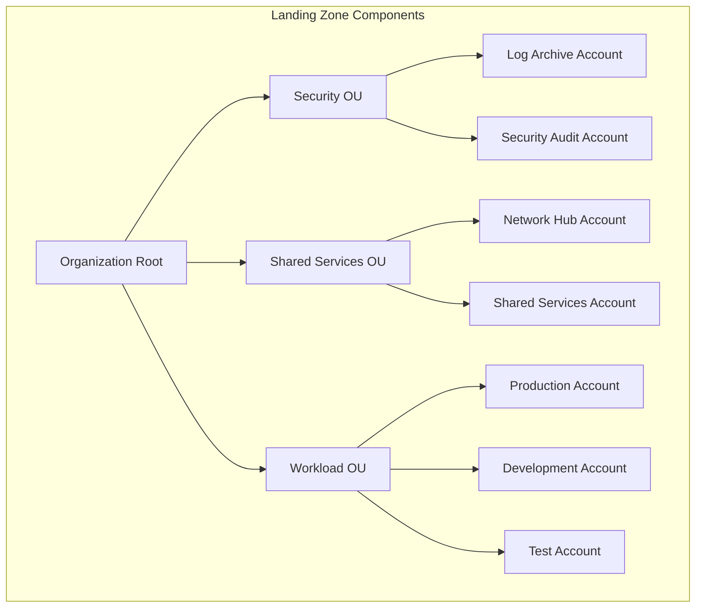

> Last reviewed: July 2026

## What Is a Landing Zone

A landing zone is the foundational setup for operating a multi-account cloud environment securely and consistently. It generally includes the following elements:

:::note
For the basic concepts of accounts/organizations, billing structure, and quota management, see [Accounts and Organizations](../../about-cloud/accounts-and-organizations/). This document is an **implementation guide** built on top of that.
:::

- **Network**: standardized VPC/VNet structure, hub-and-spoke topology, connectivity policies
- **Security**: security boundaries between accounts, encryption policies, threat detection
- **Logging**: centralized log collection, audit trails, compliance evidence
- **Guardrails**: preventive/detective policies applying consistent governance across the organization

A landing zone lets you provision new workload accounts quickly and safely, while automatically applying your organization's security and compliance requirements.

:::note
A landing zone is not a single product — it's an operational foundation that combines account structure, network, security, logging, and policy design.
:::

## Comparing Major CSP Landing Zones

| Item | AWS | Azure | Google Cloud | OCI |
| --- | --- | --- | --- | --- |
| Service name | [AWS Control Tower](https://aws.amazon.com/controltower/) | [Azure Landing Zone](https://learn.microsoft.com/en-us/azure/cloud-adoption-framework/ready/landing-zone/) | [Google Cloud Foundation Toolkit](https://cloud.google.com/foundation-toolkit) | [OCI Landing Zone](https://docs.oracle.com/en/solutions/cis-oci-benchmark/) |
| Account structure | AWS Organizations + OU | Management Group + Subscription | Organization + Folder + Project | Tenancy + Compartment |
| Guardrails | Controls (preventive/detective/proactive) | Azure Policy + Deployment Stacks | Organization Policy | CIS Benchmark-based policies |
| Default network structure | VPC + Transit Gateway | Hub-Spoke VNet + Azure Firewall | Shared VPC + Cloud Interconnect | Hub-Spoke VCN + DRG |
| IaC support | AWS CloudFormation (built-in) | Bicep / Terraform modules | Terraform modules | Terraform modules |
| Logging | AWS CloudTrail + Config | Activity Log + Defender for Cloud | Cloud Audit Logs + Security Command Center | Audit + Cloud Guard |

## Design Checklist

When designing a landing zone, first work out the following items.

- **Organization structure** — decide the criteria for dividing accounts, subscriptions, projects, and compartments.
- **Environment separation** — separate production, development, test, security, and shared-services accounts.
- **Network boundaries** — decide the hub-and-spoke design, internet entry points, and on-premises connectivity method.
- **Identity integration** — standardize your in-house IdP, SSO, MFA, and how admin privileges are granted.
- **Logging and audit** — collect audit logs from all accounts into a central repository.
- **Guardrails** — automatically apply policies such as restricted regions, blocking public storage, and enforced encryption.

## Adoption Sequence

| Stage | Description |
| --- | --- |
| 1 | First build a minimal account structure and a central log repository. |
| 2 | Template network, security, and IAM standards as IaC. |
| 3 | Automate the procedure for creating new workload accounts. |
| 4 | Operate policy violation detection and an exception approval process. |

:::caution
Trying to build a landing zone perfectly all at once can delay adoption. It's more realistic to start with centralized logging, admin privilege control, and essential security guardrails, then expand iteratively.
:::

## Multi-Account VPC Separation Patterns

VPC design is a core element of a landing zone. Separate VPCs per workload to create security boundaries, and place shared services in a central VPC.

### Separation by Workload

| Separation Criteria | Example | Reason |
| --- | --- | --- |
| By environment | dev / staging / prod VPC | Production isolation, mistake prevention |
| By team/service | Team A VPC / Team B VPC | Security boundaries, independent operation |
| By regulation | PCI VPC / general VPC | Minimizing compliance scope |

### Shared Services VPC

A pattern where logging, security tools, DNS, proxies, and similar services are placed in a central VPC and accessed from other VPCs.

### Vendor Implementations

| Vendor | Account/project separation | VPC sharing | Hub connectivity |
| --- | --- | --- | --- |
| AWS | Organizations + OU | Subnet sharing via RAM | Transit Gateway |
| Azure | Separation by subscription | Hub-Spoke VNet | Virtual WAN |
| Google Cloud | Shared VPC (host + service projects) | Subnet sharing from the host project | VPC Peering / NCC |
| OCI | Compartment separation | — | DRG hub |

### CIDR Planning

Allocate CIDR blocks in advance to prevent IP range conflicts between accounts/projects.

- Reserve a `/8` or `/10` range for the entire organization, and distribute `/16`–`/20` units per account/environment
- If CIDR ranges overlap during VPC peering/Transit Gateway connections, routing becomes impossible
- Allocate generously to account for future growth (adding subnets, creating new accounts)

For detailed network design, see [VPC and Subnets](../../networking/vpc-subnet/).

## Landing Zone Adoption Checklist

- [ ] Have you completed the organization structure design (OU/folder/compartment)?
- [ ] Have you decided on an environment separation strategy (production/staging/development/security/shared services)?
- [ ] Have you decided on a network topology (hub-and-spoke, centralized egress)?
- [ ] Have you defined guardrails (preventive/detective policies)?
- [ ] Have you configured a central logging account (CloudTrail/Activity Log aggregation)?
- [ ] Have you separated a security audit account?
- [ ] Have you integrated an identity provider (IdP) (SSO/SAML)?
- [ ] Have you defined a cost allocation tagging policy?
- [ ] Have you set up an automated pipeline for provisioning new accounts (IaC)?
- [ ] Have you documented a break-glass (emergency access) procedure?

## Common Mistakes

- **Creating VPCs without a CIDR plan** — later, VPC peering/Transit Gateway connections become impossible to route due to IP range conflicts
- **Creating workload accounts before central logging is in place** — audit logs end up scattered across accounts, making integrated investigation impossible during a security incident
- **Deploying accounts without guardrails** — developers accidentally create public S3 buckets or provision resources in restricted regions

## Related Documents

> 📄 [IAM Practical Design and Security Operations](../../security/iam/)

> 📄 [VPC and Subnets](../../networking/vpc-subnet/)

> 📄 [FinOps](../../governance/finops/)

## 2025-2026 Landing Zone Evolution

### Modularization: The Controls-Only Model

**AWS Control Tower Landing Zone 4.0** (November 2025) moved away from a "single enforced blueprint" approach toward a modular model where you **apply only the controls and choose the rest.**

| Before | After LZ 4.0 |
| --- | --- |
| Setting up Control Tower created a fixed OU/account structure | Controls can be applied while keeping your existing organizational structure |
| All service integrations were provided as a package | Service integrations (Config, CloudTrail, etc.) can be enabled selectively |
| Difficult to customize in large organizations | Can run alongside existing IaC pipelines |

Azure's Cloud Adoption Framework (CAF) also continues to expand its modular landing zone architecture, and Google Cloud Foundation Toolkit supports similar selective application based on Terraform modules.

### Sovereign Landing Zone

As data sovereignty requirements intensify, landing zones have emerged that keep not just data storage but also **processing within the jurisdiction.**

| Vendor | Solution | Key Features | Timing |
| --- | --- | --- | --- |
| Microsoft | [Cloud for Sovereignty — SLZ + Sovereign Public Cloud](https://learn.microsoft.com/en-us/industry/sovereignty/slz-overview) | Data residency guardrails, confidential computing, EU Data Boundary, Data Guardian, IaC policies | 2025-2026 |
| Google Cloud | [Sovereign Cloud Controls](https://cloud.google.com/blog/products/identity-security/delivering-a-secure-open-sovereign-digital-world) | In-jurisdiction processing, key management, access transparency | 2025-2026 |
| AWS | [Sovereign Controls (Control Tower + Nitro)](https://aws.amazon.com/compliance/digital-sovereignty/) | Region-restriction guardrails, Nitro confidential computing, data residency policies | Existing (ongoing enhancement) |
| OCI | EU Sovereign Cloud | Physically isolated EU-only infrastructure | Existing |

:::note
A sovereign landing zone is not simply "deploying to an EU region." It restricts data processing (compute), key management, and administrative (personnel) access to within the jurisdiction. In November 2025, the ESAs (EBA, EIOPA, ESMA) designated AWS, Azure, and GCP as **Critical ICT Third-Party Providers**, and sovereign requirements are expected to intensify further in the financial and public sectors as a result.
:::

### EU Regulatory Linkage

| Regulation | Impact on Landing Zone |
| --- | --- |
| **DORA** (effective 2025.01.17) | Requires financial institutions to manage ICT third-party risk → cloud vendors must be managed as critical ICT providers, exit strategy required |
| **NIS2** | Strengthens security obligations for critical infrastructure operators → requires landing-zone-level governance evidence |
| **EU AI Act** (general application 2026.08) | Data governance requirements for high-risk AI systems → landing zone must include data classification/access control per AI workload |

## References

### AWS

- [AWS Control Tower documentation](https://docs.aws.amazon.com/controltower/)
- [AWS Organizations documentation](https://docs.aws.amazon.com/organizations/)

### Azure

- [Azure Landing Zone architecture](https://learn.microsoft.com/en-us/azure/cloud-adoption-framework/ready/landing-zone/)
- [Cloud Adoption Framework](https://learn.microsoft.com/en-us/azure/cloud-adoption-framework/)

### Google Cloud

- [Foundation Toolkit documentation](https://cloud.google.com/foundation-toolkit)
- [Security Foundation Blueprint](https://cloud.google.com/architecture/security-foundations)

### OCI

- [OCI Landing Zone documentation](https://docs.oracle.com/en/solutions/cis-oci-benchmark/)
- [CIS OCI Benchmark](https://docs.oracle.com/en/solutions/cis-oci-benchmark/)
