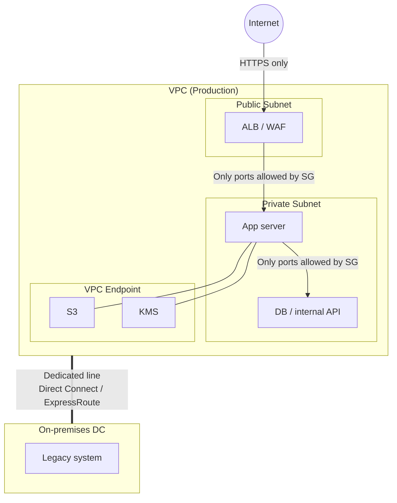

> Last reviewed: May 2026

## Overview

:::note
This document covers the **concepts and cloud patterns** of physical and logical isolation. For country- and jurisdiction-specific regulatory layers, see:
- Korea finance/public network segregation, N2SF, CSAP: [Network Segregation and Isolation (Korea)](../../korea/security/network-isolation/)
- US federal/defense isolation: [US overview](../../us/) · [FedRAMP](../../us/fedramp/) · [ITAR/EAR](../../us/itar/)
- EU financial ICT and sovereignty: [EU overview](../../eu/) · [DORA](../../eu/dora/)
- Japan: [Japan overview](../../japan/)
- Singapore: [Singapore overview](../../singapore/)
:::

**Network Segregation** is a control that separates the business network from the internet network so that external threats cannot reach internal systems. Because it blocks malware infiltration, remote intrusion, and data exfiltration at the network boundary, regulated markets in many countries — finance, public sector, healthcare — have long adopted it as a core security requirement. Korea, in particular, stands out for having built its public and financial sector security policy around network segregation for decades — for details on Korea's regulations (Electronic Financial Supervisory Regulation, CSAP, N2SF) and recent easing trends, see [Network Segregation and Isolation (Korea)](../../korea/security/network-isolation/).

In a modern environment where connections between systems have become unavoidable — API integration, SaaS usage, remote work — the meaning of "segregation" and how it is implemented are evolving together.

On-premises, this was implemented by physically separating network equipment. In the cloud, the same security goal can be achieved through **logical isolation**, though some regulatory requirements still mandate physical separation.

:::caution
Network segregation is **one layer** of security, not the whole of it. Even in a physically segregated network, insider threats, malware introduced via USB, and vulnerabilities exposed by delayed patching can still occur. Network segregation should be paired with [Zero Trust](../../security/zero-trust/) and [Security Posture Management](../../security/security-posture/).
:::

## What Segregation Really Means — Separation or Controlled Connection?

The original purpose of network segregation is that **no data movement path exists between the two networks at all**. In reality, however, organizations often introduce solutions that reconnect segregated networks for the sake of operational convenience.

| Solution | What it does | In essence |
| --- | --- | --- |
| VDI (virtual desktop) | Remotely displays the business network screen on an internet-network endpoint | Screen transmission path = a connection |
| Inter-network file transfer systems | Inspects a file and forwards it to the network on the other side | Data movement path = a connection |
| Clipboard/USB control solutions | Allows copy-paste and removable media in a limited, controlled way | A restricted data path = a connection |

The moment such a solution is introduced, it is no longer "network segregation" — it becomes **controlled inter-network access**. As long as a path exists, so does the possibility of data exfiltration or malware infiltration through that path.

:::caution
The assumption that "we did network segregation, so we're safe" is dangerous. If even one inter-network connectivity solution exists, the security level of that path becomes the ceiling for the entire system's security. Segregation itself is not the goal — the goal is that **protected data cannot move without authorization**.
:::

### Implications from a Cloud Perspective

Cloud logical isolation (VPC, private subnets, security groups) is, from the start, a model that **explicitly designs "controlled connections."** It defines in code which traffic can go where, logs all communication, and detects policy violations in real time.

Comparing this against the combination of on-premises physical network segregation plus VDI/inter-network connectivity solutions:

| Aspect | Physical segregation + inter-network connectivity solutions | Cloud logical isolation |
| --- | --- | --- |
| Boundary definition | Implicit separation via physical equipment, with exceptions created by add-on solutions | Explicit definition in code (Security Group, NACL, IAM) |
| Visibility | Depends on inter-network connectivity solution logs | End-to-end logging (VPC Flow Logs, CloudTrail, etc.) |
| Policy changes | Equipment configuration changes, days to weeks | Code change + deployment, minutes |
| Drift detection | Manual inspection | Automated detection (Config Rules, Policy, CSPM) |
| Audit trail | Separate logs per solution | Unified audit logging |

The key question is not the "separation vs. connection" dichotomy, but rather: **how explicitly are the allowed paths defined, is everything else blocked, and can violations be detected in real time?**

## Physical vs. Logical Network Segregation

| Aspect | Physical segregation | Logical segregation |
| --- | --- | --- |
| **Method** | Uses separate network equipment, circuits, and endpoints | Separated on shared infrastructure through virtualization, encryption, and access control |
| **Security level** | Complete blocking at the network level | Boundary breach possible if misconfigured |
| **Cost** | High, due to redundant equipment and circuits | Relatively low |
| **Flexibility** | Weeks to months to change | Adjustable within minutes via policy changes |
| **Patching/updates** | Requires manual transfer within the closed network → delays | Can be automated through a controlled path |
| **Regulatory application** | Highest-sensitivity tiers (country-specific top classification, critical financial systems, etc.) | Most cloud workloads |

### Side-by-Side Operational Comparison

| Aspect | On-premises (physical segregation) | Cloud (logical isolation) | Trade-off |
| --- | --- | --- | --- |
| **Isolation method** | Physical separation of cables and equipment | SDN(VPC)-based logical separation | Physical is intuitive but hard to change. Logical is flexible but carries misconfiguration risk |
| **Perimeter security** | Hardware firewall | Security Group + NACL | Hardware has stable performance. SG/NACL enable automation and code-based management |
| **Visibility** | Physical ports, packet capture | VPC Flow Logs, real-time monitoring | Physical requires specialized equipment. Cloud provides it by default but incurs logging cost |
| **Disaster recovery** | Equipment replacement (hours to days) | Multi-AZ automatic failover (seconds to minutes) | Cloud is fast but vendor-dependent. Physical allows self-control |
| **Change management** | Equipment configuration changes, work request forms | Code changes + CI/CD deployment | Physical has a clear approval process. Cloud is fast but requires separate governance |
| **Audit trail** | Individual logs collected per device | Unified audit log (CloudTrail, etc.) | Physical makes log consolidation difficult. Cloud provides it integrated by default, but retention policy still needs to be set |

Both approaches have trade-offs, and the appropriate choice depends on the sensitivity of the workload and regulatory requirements. Many organizations adopt a hybrid approach — keeping physical separation for critical systems while expanding logical isolation to less sensitive workloads.

### Practical Limitations of Physical Network Segregation

Physical network segregation does not guarantee "absolute safety."

- **Patch delays**: closed networks have no internet access, so applying security patches can be delayed by weeks to months, leaving known vulnerabilities exposed during that period.
- **Insider threats**: physical separation blocks external attacks but does not prevent data exfiltration by a user with legitimate internal access.
- **Operational complexity**: dual endpoints, inter-network file transfer systems, and separate authentication systems create significant operational overhead.
- **DR constraints**: setting up remote disaster recovery is difficult in a closed-network environment.

## Implementing Network Isolation in the Cloud

Because the cloud is built on software-defined networking (SDN), strong isolation can be achieved without physical equipment.

### Implementation Patterns by Isolation Level

| Isolation level | Implementation | Suitable for |
| --- | --- | --- |
| **VPC/VNet separation** | Independent VPC per workload, blocked routing | General environment separation (dev/prod) |
| **Private subnets** | Subnets with no internet gateway, allowing only NAT egress | Systems that don't need external exposure, such as databases and internal APIs |
| **Private service connectivity** | Restricts access to managed services to the vendor's internal network | Storage, databases, etc. accessed without routing through the internet |
| **Dedicated line** | A dedicated physical network connection that doesn't traverse the internet | On-premises ↔ cloud communication |
| **Air-gap** | A cloud environment completely disconnected from the internet | The highest regulatory tier |

### Air-Gapped/Dedicated Environments by Vendor

For cases requiring a cloud environment completely isolated from the internet, each vendor offers the following options. Note, however, that certification status in the target country's regulated market must be verified separately.

| Vendor | Service | Description |
| --- | --- | --- |
| AWS | Outposts | Installs AWS infrastructure in the customer's data center. Local processing |
| AWS | Snow Family (Snowball Edge) | Provides compute/storage in a fully offline environment |
| Azure | Azure Stack Hub / HCI | Runs Azure services in the customer's data center. Connected/disconnected modes |
| Azure | Azure Government (isolated regions) | Physically separated regions dedicated to the US government |
| Google Cloud | Google Distributed Cloud (GDC) Air-gapped | Runs Google Cloud services in a fully offline environment |
| OCI | Dedicated Region | Installs a full OCI region in the customer's data center. Complete isolation |
| OCI | Roving Edge Infrastructure | Mobile compute for offline environments |

### A Common Architecture Pattern for Regulated Markets

Most financial/public sector workloads don't require going as far as air-gapping, and instead meet regulatory requirements with the following pattern.

**Core principles:**

- Minimize internet exposure — place only load balancers/WAF in the Public Subnet
- Access managed services via VPC Endpoint — bypass NAT Gateway/internet routing
- Use a dedicated line for on-premises connectivity — treat VPN only as a backup path
- Encrypt all communication — TLS 1.2+ required

## Mapping Regulatory Requirements

Network segregation and isolation policy in regulated markets worldwide is evolving from a one-size-fits-all approach — "segregate all systems to the same level" — toward **tiered security based on data classification**. The underlying policy question is shifting from the binary "segregated or not" to "what level of control is required."

| Regulation/standard | Requirement | Cloud approach |
| --- | --- | --- |
| **PCI DSS** (card payments, global) | Network isolation of the CDE (Cardholder Data Environment) | Dedicated VPC + firewall + logging |
| **Country-specific public sector/financial regulations** | Physical/logical segregation requirements and tier systems vary by country | Detailed mapping provided in the relevant country document |

Country-specific regulatory details are covered in the relevant country document.

- **Korea** — Electronic Financial Supervisory Regulation, CSAP High/Medium/Low tiers, ISMS-P, N2SF (National Network Security Framework) C/S/O classification: [Network Segregation and Isolation (Korea)](../../korea/security/network-isolation/)
- **United States** — FedRAMP, ITAR/EAR: [US overview](../../us/)
- **EU** — DORA, data sovereignty: [EU overview](../../eu/)
- **Japan** — ISMAP, Government Cloud: [Japan overview](../../japan/)
- **Singapore** — MTCS, PDPA: [Singapore overview](../../singapore/)

:::note
Regardless of the regulatory framework, most organizations don't have all systems at the same tier. The key is classifying systems by tier and applying a proportional isolation level to each. Rather than "everything at the highest tier" or "everything public," a mixed configuration is the realistic outcome.
:::

## Anti-Patterns

| Anti-pattern | Problem | Correct approach |
| --- | --- | --- |
| Configuring every subnet as Public | Exposes all resources to the internet | Default to Private Subnet; use Public only for LB/bastion |
| Allowing 0.0.0.0/0 inbound on a Security Group | Effectively no firewall at all | Apply least privilege — allow only the necessary ports/sources |
| Allowing all outbound traffic via NAT Gateway | Creates a data exfiltration path | Prefer VPC Endpoint; restrict outbound as well |
| Segregating networks without internal monitoring | Cannot detect internal lateral movement | VPC Flow Logs + anomaly detection + Network Policy |
| Neglecting patching after physical segregation | Long-term exposure to known vulnerabilities | Establish a controlled patch path, run regular vulnerability scans |

### Preventive Guardrails — Stopping Mistakes Before They Become Incidents

On-premises, mistakes (a bad firewall rule, an open port) are often discovered after the fact through auditing. In the cloud, you can automate **preventive controls that block the mistake itself.**

| Guardrail | Behavior | Vendor examples |
| --- | --- | --- |
| **Block risky actions at the organization-policy level** | Prevent resource creation outside specific regions, block public access | AWS SCP, Azure Policy, Google Cloud Organization Policy |
| **Automatic detection/remediation of configuration changes** | Immediately alert on or auto-remediate resources violating rules | AWS Config Rules, Azure Policy (remediation), Google Cloud Security Command Center |
| **Real-time monitoring of network changes** | Immediate alerts on Security Group changes, new internet routes | CloudTrail + EventBridge, Azure Monitor, Google Cloud Cloud Audit Logs |

However, guardrails **only work once configured.** Most are disabled by default, and it is the organization's responsibility to define and maintain policies that match its security requirements.

## Common Mistakes

- **Opening 0.0.0.0/0 inbound on a Security Group "temporarily" and leaving it** — forgetting to remove it after testing, effectively leaving no firewall in place
- **Segregating networks without internal monitoring** — focusing only on blocking external access, failing to detect internal lateral movement
- **Allowing all outbound traffic via NAT Gateway** — not using a VPC Endpoint, creating a data exfiltration path and incurring unnecessary cost

## Checklist

- [ ] Have you established a VPC/subnet separation strategy based on workload classification?
- [ ] Have you minimized internet exposure of resources (minimized the Public Subnet)?
- [ ] Do you access managed services via VPC Endpoint / Private Link?
- [ ] Do you use a dedicated line for on-premises connectivity (VPN as backup only)?
- [ ] Have you applied least privilege to Security Groups / NACLs?
- [ ] Have you enabled VPC Flow Logs and configured anomaly detection?
- [ ] Are you also restricting outbound traffic (to prevent data exfiltration)?
- [ ] Have you chosen an isolation level appropriate to your regulatory requirements (logical vs. physical)?
- [ ] Do you have a patching path established even in a closed-network environment?

## Related Documents

> 📄 [Zero Trust](../../security/zero-trust/)

> 📄 [VPC and Subnets](../../networking/vpc-subnet/)

> 📄 [Compliance](../../governance/compliance/)

## References

### Regulations/Standards

- [PCI DSS v4.0 (PCI SSC)](https://www.pcisecuritystandards.org/)
- For links to Korea's regulations (Electronic Financial Supervisory Regulation, CSAP, N2SF), see [Network Segregation and Isolation (Korea)](../../korea/security/network-isolation/)

### AWS

- [VPC security best practices](https://docs.aws.amazon.com/ko_kr/vpc/latest/userguide/vpc-security-best-practices.html)
- [AWS PrivateLink documentation](https://docs.aws.amazon.com/ko_kr/vpc/latest/privatelink/)
- [AWS Outposts documentation](https://docs.aws.amazon.com/ko_kr/outposts/)

### Azure

- [Azure network security best practices](https://learn.microsoft.com/ko-kr/azure/security/fundamentals/network-best-practices)
- [Azure Private Link documentation](https://learn.microsoft.com/ko-kr/azure/private-link/)
- [Azure Stack Hub documentation](https://learn.microsoft.com/ko-kr/azure-stack/operator/)

### Google Cloud

- [VPC security best practices](https://cloud.google.com/architecture/framework/security/network-security)
- [Private Google Access documentation](https://cloud.google.com/vpc/docs/private-google-access)
- [Google Distributed Cloud documentation](https://cloud.google.com/distributed-cloud/hosted/docs)

### OCI

- [OCI network security best practices](https://docs.oracle.com/en-us/iaas/Content/Security/Reference/networking_security.htm)
- [OCI Dedicated Region documentation](https://docs.oracle.com/en-us/iaas/Content/dedicated-region/home.htm)
