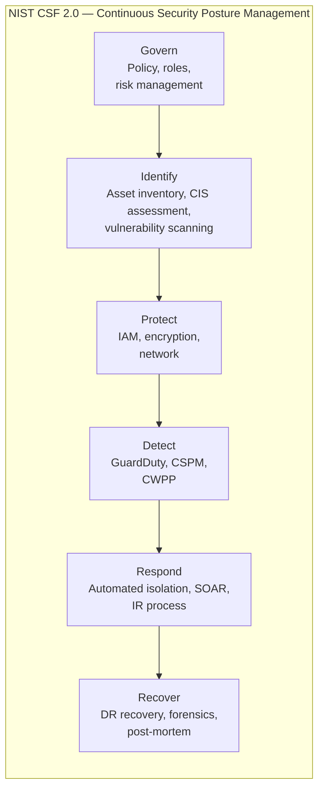

> Last reviewed: August 2026

## Overview

Because resources in cloud environments are created and changed rapidly, you need a framework to **continuously assess security status and detect and respond to threats**. This is collectively referred to as **Security Posture Management**.

:::note
For pre-deployment security validation, see [DevSecOps](../../devops/devsecops/); for OS/runtime patching, see [Patch and Vulnerability Management](../../devops/patch-and-vulnerability/).
:::

Key areas:

| Area | Role | Examples |
| --- | --- | --- |
| **CSPM** (Cloud Security Posture Management) | Detects cloud configuration errors | S3 public exposure, missing encryption, excessive IAM permissions |
| **CWPP** (Cloud Workload Protection Platform) | Runtime protection for workloads (VMs, containers, serverless) | Malware detection, file integrity monitoring, runtime vulnerabilities |
| **Threat Detection** | Identifies abnormal activity and signs of attack | Unauthorized API calls, cryptocurrency mining, data exfiltration attempts |
| **SIEM/SOAR** | Collects, analyzes, and automatically responds to security events | Log correlation analysis, automated isolation, ticket creation |

## Vendor Security Posture Services

| Area | AWS | Azure | Google Cloud | OCI |
| --- | --- | --- | --- | --- |
| **CSPM** | [Security Hub](https://docs.aws.amazon.com/securityhub/latest/userguide/what-is-securityhub.html) | [Defender for Cloud (CSPM)](https://learn.microsoft.com/azure/defender-for-cloud/concept-cloud-security-posture-management) | [Security Command Center Enterprise](https://cloud.google.com/security-command-center/docs) — the CSPM component of the Google Unified Security portfolio. Integrates Mandiant threat intelligence | [Cloud Guard](https://docs.oracle.com/en-us/iaas/cloud-guard/home.htm) |
| **CWPP** | [GuardDuty Runtime Monitoring](https://docs.aws.amazon.com/guardduty/latest/ug/runtime-monitoring.html) + [Inspector](https://docs.aws.amazon.com/inspector/latest/user/what-is-inspector.html) | [Defender for Servers/Containers](https://learn.microsoft.com/azure/defender-for-cloud/defender-for-servers-introduction) | [SCC Premium (VM Threat Detection)](https://cloud.google.com/security-command-center/docs/concepts-vm-threat-detection-overview) | [Cloud Guard (Threat Detector)](https://docs.oracle.com/en-us/iaas/cloud-guard/using/detect-recipes.htm) |
| **Threat detection** | [GuardDuty](https://docs.aws.amazon.com/guardduty/latest/ug/what-is-guardduty.html) | [Defender for Cloud + Sentinel](https://learn.microsoft.com/azure/sentinel/overview) | [SCC Event Threat Detection](https://cloud.google.com/security-command-center/docs/concepts-event-threat-detection-overview) | [Cloud Guard (Activity Detector)](https://docs.oracle.com/en-us/iaas/cloud-guard/using/detect-recipes.htm) |
| **SIEM/SOAR** | [Security Lake](https://docs.aws.amazon.com/security-lake/latest/userguide/what-is-security-lake.html) + third party | [Microsoft Sentinel](https://learn.microsoft.com/azure/sentinel/) | [Chronicle SIEM](https://cloud.google.com/chronicle/docs) | [OCI Logging Analytics](https://docs.oracle.com/en-us/iaas/logging-analytics/home.htm) (log analysis) + third-party SIEM |
| **Cost** | GuardDuty pay-as-you-go, Security Hub billed per check | Billed per Defender plan | SCC Standard free / Premium & Enterprise billed | Cloud Guard free |

## CIS Benchmarks

### What Is a CIS Benchmark

[CIS (Center for Internet Security)](https://www.cisecurity.org/cis-benchmarks) Benchmarks are **secure configuration baselines** for OSes, cloud platforms, databases, containers, and more. They are the most widely used security configuration standard in the industry, forming a basic framework for audits and compliance.

Key benchmarks:

| Target | Example benchmarks |
| --- | --- |
| Cloud accounts | CIS AWS Foundations, CIS Azure Foundations, CIS Google Cloud Foundations, CIS OCI Foundations |
| OS | CIS Amazon Linux 2023, CIS Ubuntu, CIS Windows Server |
| Containers | CIS Docker, CIS Kubernetes |
| Databases | CIS Oracle Database, CIS PostgreSQL, CIS MySQL |

### Automated CIS Assessment by Vendor

| Vendor | Service | CIS support |
| --- | --- | --- |
| AWS | Security Hub | Automated assessment against CIS AWS Foundations Benchmark v1.4/v3.0. Score dashboard |
| Azure | Defender for Cloud | Compliance dashboard based on CIS Azure Foundations. Automatically generates recommendations |
| Google Cloud | Security Command Center | Scans based on CIS Google Cloud Foundations. Security Health Analytics |
| OCI | Cloud Guard | Ships with detector recipes based on CIS OCI Foundations Benchmark |

### Why CIS Reports Matter

- **Audit response** — provides evidence of "meeting the security configuration baseline" for internal/external audits
- **Baseline setting** — guarantees a minimum security level when creating new accounts/projects
- **Continuous monitoring** — automatically detects configuration drift (unintended changes)
- **Executive reporting** — communicates current status quantitatively through a security score
- **Compliance mapping** — CIS items are mapped to ISO 27001, SOC 2, and [ISMS-P](../../governance/compliance/) control items

### CIS Operational Best Practices

- **Regular scans** — automated scans at least once a week. Environments that change frequently should use real-time monitoring
- **Exception management** — document non-compliant items with a valid business justification, along with compensating controls
- **Score targets** — set a minimum compliance rate as organizational policy (e.g., 100% Critical, 95%+ High)
- **Automated remediation** — automatically fix items where possible (e.g., automatically block public S3 buckets)
- **Trend tracking** — track monthly score trends to understand whether the security posture is improving or worsening

## Threat Detection Details

AWS GuardDuty detection types

Detects threats by analyzing VPC Flow Logs, DNS logs, CloudTrail, S3 data events, EKS audit logs, and Lambda network activity.

| Category | Examples |
| --- | --- |
| Unauthorized access | Console login from an unusual region, API calls from a known malicious IP |
| Cryptocurrency mining | Detects mining pool communication from EC2/EKS |
| Data exfiltration | Abnormally large downloads from an S3 bucket, data exfiltration via DNS |
| Privilege escalation | Abnormal API call patterns following an IAM policy change |

Azure Defender + Sentinel

Defender for Cloud detects threats per workload, while Sentinel collects and correlates logs as a SIEM. Sentinel's SOAR (automated response) capability enables automated isolation, alerting, and ticket creation through playbooks.

Google Cloud Security Command Center

Event Threat Detection analyzes Cloud Audit Logs and VPC Flow Logs to detect threats. Integrating with Chronicle SIEM enables large-scale log analysis and threat hunting.

OCI Cloud Guard

Consists of a **Detector** and a **Responder**. When configuration issues or activity anomalies are detected, it automatically executes response actions (disabling a resource, adding a tag, sending an alert, etc.). Included by default at no additional cost.

## Auto-Remediation

A pattern where, after a threat or configuration error is detected, it is automatically corrected without human intervention.

| Vendor | Automated response approach |
| --- | --- |
| AWS | Security Hub → EventBridge → Lambda/Step Functions (custom remediation) |
| AWS | GuardDuty → EventBridge → Lambda (automated isolation, SG changes) |
| Azure | Defender recommendations → Logic Apps / Azure Functions (automated remediation) |
| Azure | Sentinel Playbook (SOAR) → automated isolation, account disabling |
| Google Cloud | SCC Finding → Cloud Functions / Workflows (automated remediation) |
| OCI | Cloud Guard Responder → automated actions (stop resource, add tag, send alert) |

### Design Principles for Auto-Remediation

- **Phased rollout** — start with alerts only, then move to automated remediation once stable
- **Whitelisting** — pre-register intended exceptions (e.g., public access in a dev environment)
- **Reversibility** — automated remediation actions must be reversible
- **Parallel alerting** — notify the responsible party whenever an automated remediation runs (for after-the-fact verification)
- **Test environment first** — validate automated response rules in non-production before applying them to production

## Security Posture Operations Framework

This framework maps to the six functions of the [NIST Cybersecurity Framework 2.0](https://www.nist.gov/cyberframework).

## Common Mistakes

- **Applying auto-remediation to production without validation** — false positives cause automated isolation of legitimate resources, resulting in service outages. Validate in non-production first
- **Leaving CIS Benchmark non-compliant items unaddressed without documentation** — even when there's a valid business reason, failing to manage the exception leads to audit findings
- **Enabling CSPM alerts without defining a response process** — alerts pile up with no one handling them, causing real threats to be missed

## Checklist

- [ ] Is CSPM (Security Hub, Defender for Cloud, SCC, Cloud Guard) enabled, and is automated CIS Benchmark assessment performed?
- [ ] Are automated response rules validated in non-production before being applied to production?
- [ ] Are secure score targets set, with monthly trends tracked?

## References

### AWS

- [AWS Security Hub Documentation](https://docs.aws.amazon.com/securityhub/latest/userguide/what-is-securityhub.html)
- [Amazon GuardDuty Documentation](https://docs.aws.amazon.com/guardduty/latest/ug/what-is-guardduty.html)

### Azure

- [Microsoft Defender for Cloud Documentation](https://learn.microsoft.com/azure/defender-for-cloud/)
- [Microsoft Sentinel Documentation](https://learn.microsoft.com/azure/sentinel/)

### Google Cloud

- [Google Cloud Security Command Center Documentation](https://cloud.google.com/security-command-center/docs)
- [Google Cloud Chronicle SIEM](https://cloud.google.com/chronicle/docs)

### OCI

- [OCI Cloud Guard Documentation](https://docs.oracle.com/en-us/iaas/cloud-guard/home.htm)

### Standards and community

- [CIS Benchmarks](https://www.cisecurity.org/cis-benchmarks)
- [NIST Cybersecurity Framework](https://www.nist.gov/cyberframework)
