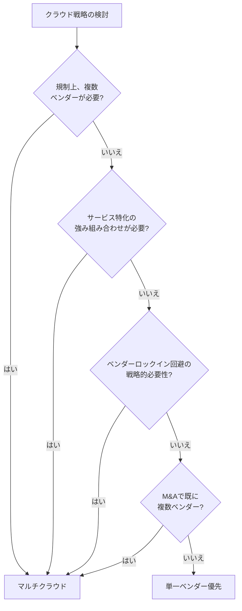

> 文書基準: 2026年5月

## なぜ意思決定フレームワークが必要なのか

「どのクラウドが最も良いか」という問いに**正解はありません。** 組織の状況、ワークロードの特性、チームの力量によって最適な選択は変わります。

誤ったアプローチ:

- 価格表だけを比較する
- 業界のトレンドやマーケティング中心の決定
- 一度選定した後、再検討せずに維持する
- すべてのワークロードに同一ベンダーを強制する

正しいアプローチは、**意思決定基準を明確にし、主要ワークロードごとに再評価すること**です。

## 主要な意思決定要因

### 1. データ重力（Data Gravity）

大容量データが存在する場所へ、コンピューティングが追随する傾向です。

- データが既に特定のクラウドにある場合、そのクラウドに追加ワークロードを置く方が有利です。
- イグレスコストのため、クラウド間のデータ移動はますます困難になります（[マルチクラウドコネクティビティ](../../networking/multicloud-connectivity/)を参照）。

### 2. ユーザーとの地理的近接性

- サービス対象地域にリージョンを持つベンダーを優先（レイテンシ最小化）
- グローバルサービスはエッジネットワークとリージョンカバレッジを検討
- DR時は近接リージョンまで考慮（[リージョンとアベイラビリティゾーン](../../about-cloud/regions-and-zones/)を参照）

### 3. 規制および法令遵守

- 公共部門の調達: 国別のクラウドセキュリティ認証要件を確認 (例: 韓国CSAP、米国FedRAMP、日本ISMAP)
- 金融: 各国の金融監督規定および業界標準を確認
- 個人情報: GDPR(EU)、APPI(日本)、PDPA(シンガポール)などデータレジデンシー要件
- 詳細は[コンプライアンス](../../governance/compliance/)および国別ガイドを参照

### 4. チームの力量とエコシステム

- 既存のMicrosoftスタック（AD、Office 365）があれば、Azureが自然な選択です。
- チームがAWSに慣れていれば、初期の生産性が高くなります。
- 主要サービスの公式な現地語ドキュメントとコミュニティサポートも考慮します。

### 5. ベンダー別の強み領域

各ベンダーはそれぞれ異なる強みを持っています。詳細な比較は[ベンダー比較](../../about-cloud/compare-clouds/)を参照してください。

| 領域 | 一般的な強み |
| --- | --- |
| ポートフォリオの多様性 | AWS |
| エンタープライズ/Microsoft統合 | Azure |
| AI/ML、データ分析 | Google Cloud |
| Oracle DB、イグレスコスト | OCI |

### 6. コスト構造

- オンデマンド vs 契約価格
- イグレスコスト（特にマルチクラウド環境で重要）
- アジア・欧州リージョンの価格は米国リージョンに比べて10〜30%高いのが一般的
- マネージドサービスのプレミアム
- 詳細は[コスト構造を理解する](../../about-cloud/pricing-model/)を参照

### 7. 撤退コスト（Exit Cost）

長期的にベンダーを変更できるオプションのコストです。[出口戦略](../../governance/exit-strategy/)を参照してください。

## 意思決定マトリックスの例

複数の要因を加重方式で評価します。以下は**サンプルテンプレート**であり、実際の加重値とスコアは組織の状況に合わせて調整する必要があります。

| 要因 | 加重値 | AWS | Azure | Google Cloud | OCI |
| --- | --- | --- | --- | --- | --- |
| チームの力量/経験 | 20% | ? | ? | ? | ? |
| データ重力 | 15% | ? | ? | ? | ? |
| コスト（ベースライン） | 15% | ? | ? | ? | ? |
| 規制遵守 | 15% | ? | ? | ? | ? |
| 強みサービスの適合性 | 15% | ? | ? | ? | ? |
| エコシステム/統合 | 10% | ? | ? | ? | ? |
| 撤退コスト | 10% | ? | ? | ? | ? |

各セルは1〜5点で評価し、（加重値 × 点数）の合計で順位を付けます。

## ワークロード別配置戦略

すべてのワークロードを同じベンダーに置く代わりに、ワークロードの特性に応じて配置を変えることができます。

### 代表的なワークロードの種類と評価軸

| ワークロードの種類 | 主要要因 | 可能な選択肢 |
| --- | --- | --- |
| **コア運用システム** | 安定性、チームの力量、サポートSLA | 組織の主力ベンダー |
| **AI/ML学習** | GPUの可用性、MLツール、価格 | Google Cloud、AWS |
| **AI/ML推論** | レイテンシ、モデルホスティングコスト | ユーザー近傍のリージョン |
| **データ分析** | ウェアハウス機能、BI統合 | Google Cloud BigQuery、Azure Synapse |
| **Microsoftワークロード** | Entra ID統合、ライセンス特典 | Azure |
| **Oracle DB** | ライセンス、性能最適化 | OCI |
| **DRサイト** | リージョンの多様性、コスト | 主力ベンダーと異なる地域/ベンダー |
| **開発/テスト** | コスト、迅速なプロビジョニング | Always Free提供ベンダーを検討 |

## マルチクラウド vs 単一ベンダーの意思決定

マルチクラウドを選択する明確な理由がなければ、単一ベンダーの方がシンプルです。

マルチクラウドのコスト（運用の複雑性、チーム力量の分散、統合ガバナンス、イグレス）はかなりのものです。詳細は[マルチクラウドを理解する](../../about-cloud/why-multicloud/)を参照してください。

## アンチパターン

実務でよく発生する誤った意思決定パターンです。

### 1. 価格表だけを見て選定

- カタログ価格はオンデマンド基準であり、実際のコストは契約/スポット/無料枠/サポートプランによって変わります。
- イグレスコスト、管理ツールのコスト、運用人員のコストを見落としがちです。
- TCO（Total Cost of Ownership）に基づく評価が必要です。

### 2. 一度配置した後、再評価をしない

- クラウドサービスと価格は毎年大きく変化します。
- ワークロードも成長過程で初期の選択が合わなくなります。
- 年1回、主要ワークロードの配置の妥当性を再検討することが望ましいです。

### 3. 「他社がやっているから」

- カンファレンスやブログのトレンドに従って導入すると、コストと複雑さが増すだけです。
- 「なぜ自社の組織に必要なのか」にまず答える必要があります。

### 4. チームの力量を無視

- 最高の技術であっても、チームが使いこなせなければ障害対応の速度が落ちます。
- 新規導入時は教育/採用計画を併せて立てます。

### 5. 強みだけを見て弱みを無視

- すべてのベンダーには弱みがあります: 現地語ドキュメントの不足、特定サービスの未対応、サポート対応速度など。
- 導入前に、その弱みが自社の組織にとって致命的かどうかを確認します。

## 検証段階

意思決定前に実際に確認できる段階:

1. **PoC（Proof of Concept）** — コアワークロードの1つを実環境に展開
2. **コストシミュレーション** — ベンダーの価格計算機で予想コストを見積もる（限界はある）
3. **ベンチマーク** — 同一ワークロードの性能/応答時間を測定
4. **サポート品質評価** — 実際のチケット対応速度、現地語サポートのレベル
5. **チームアンケート** — 実際に使用するエンジニアの意見を収集

## よくある間違い

- **「価格が最も安いベンダーを選べばよい」** — カタログ価格はオンデマンド基準であり、イグレス・サポートプラン・運用人員コストを含めたTCOで比較する必要があります。
- **「一度決めたら変える必要はない」** — クラウドサービスと価格は毎年変化します。年1回以上、ワークロード配置の妥当性を再検討する必要があります。
- **「すべてのワークロードに同じベンダーを使うべきだ」** — ワークロードの特性によって最適なベンダーは異なる場合があります。ただし、分散の複雑さのコストも併せて考慮してください。

## チェックリスト

- [ ] 意思決定マトリックスに加重値と評価基準を組織の状況に合わせて定義したか？
- [ ] コアワークロードについて、最低1つのベンダーでPoCを実施したか？
- [ ] チームの力量（既存の経験、教育計画）をベンダー選定基準に含めたか？

## 参考資料

### AWS

- [AWS Well-Architected Framework](https://aws.amazon.com/architecture/well-architected/)

### Azure

- [Microsoft Cloud Adoption Framework](https://learn.microsoft.com/azure/cloud-adoption-framework/)

### Google Cloud

- [Google Cloud Adoption Framework](https://cloud.google.com/adoption-framework)

### OCI

- [Oracle Cloud Adoption Framework](https://docs.oracle.com/en-us/iaas/Content/cloud-adoption-framework/home.htm)

### 標準およびコミュニティ

- [Gartner Magic Quadrant for Cloud Infrastructure](https://www.gartner.com/reviews/market/cloud-infrastructure-and-platform-services)
- [CNCF Annual Survey](https://www.cncf.io/reports/)
- [FinOps Foundation](https://www.finops.org/)
