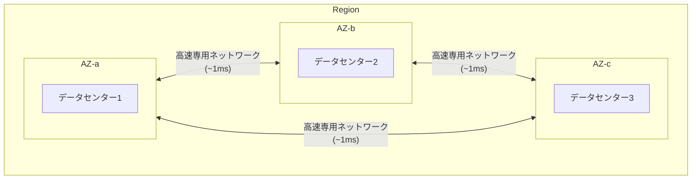

> 文書基準: 2026年5月

## 概要

自社の電算センターを1つの都市のIDC一箇所だけに置いている場合、その建物で火災や停電が発生すると、サービス全体が停止してしまいます。互いに異なる都市にIDCを置いて二重化すれば、一方に障害が発生してももう一方でサービスを維持できます。

クラウドの**リージョン**と**可用性ゾーン**は、まさにこの二重化の概念をベンダーが大規模に実装したものです。リージョンを選択することは単に「サーバーの場所」を選ぶことではなく、レイテンシ、データ主権、災害復旧戦略までも決定することを意味します。

### リージョン (Region)

**リージョン**は地理的に分離されたデータセンターのクラスターです。各リージョンは独立した電力、冷却、ネットワークを備えており、他のリージョンとは物理的に数十~数千km離れています。オンプレミスに例えると、互いに異なる都市に位置するデータセンターに相当します。

### 可用性ゾーン (Availability Zone)

**可用性ゾーン**（AZ）は、1つのリージョン内にある独立したデータセンター（またはデータセンターのグループ）です。同じリージョン内のAZ同士は高速専用ネットワークで接続されているためレイテンシが非常に低い（通常1ms以内）一方、各AZは独立した電力・冷却システムを備えているため、1つのAZに障害が発生しても他のAZには影響しません。

オンプレミスに例えると、同じ都市内にあるものの互いに異なる建物に位置するサーバールームに似ています。

### エッジロケーション (Edge Location)

**エッジロケーション**は、リージョンよりもユーザーに近い位置に配置された小規模インフラです。主にCDNやDNSサービスに使用され、静的コンテンツをキャッシュしてユーザーに高速に配信します。

## ベンダー別比較

| 概念 | AWS | Azure | Google Cloud | OCI |
| --- | --- | --- | --- | --- |
| **リージョン** | Region | Region | Region | Region |
| **可用性ゾーン** | Availability Zone | Availability Zone | Zone | Fault Domain / AD |
| **リージョン範囲** | リージョン別に独立 | Geography → Region | **グローバルVPC** | Realm → Region |
| **リージョンあたり最小AZ数** | 3つ | 3つ | 3つ | 3 Fault Domain |
| **主要大陸カバレッジ** | 北米、南米、欧州、アジア、オセアニア、中東、アフリカ | 北米、南米、欧州、アジア、オセアニア、中東、アフリカ | 北米、南米、欧州、アジア、オセアニア、中東 | 北米、南米、欧州、アジア、オセアニア、中東 |

### ベンダー別特徴

#### AWS

| 項目 | 内容 |
| --- | --- |
| 階層構造 | Region → Availability Zone (AZ) |
| VPC範囲 | リージョン単位 |
| Local Zone | 特定都市に超低遅延インフラを配置 |
| Sovereign Cloud | 欧州データ主権専用リージョン（EU運用人員、EU内データ保管）。[AWS European Sovereign Cloud](https://aws.amazon.com/sovereign-cloud/)（Brandenburg、€7.8B投資） |

#### Azure

| 項目 | 内容 |
| --- | --- |
| 階層構造 | Geography → Region → Availability Zone |
| VNet範囲 | リージョン単位 |
| リージョンペア (Region Pair) | 同じGeography内の2つのリージョンがペアとして指定される。プラットフォームの更新が同時には適用されない |
| リージョンペアの例 | 同じ国内で in-country DR が可能なペアがある（例: Australia East–Southeast）。国別の現況は各国ガイドを参照 |

### Google Cloud

| 項目 | 内容 |
| --- | --- |
| 階層構造 | Region → Zone |
| VPC範囲 | **グローバル** — 1つのVPCに複数リージョンのサブネットを配置可能 |
| Multi-regionストレージ | 別途設定なしで複数リージョンに自動レプリケーション |
| Assured Workloads | 規制対象ワークロードを特定リージョンに隔離 |

#### OCI

| 項目 | 内容 |
| --- | --- |
| 階層構造 | Realm → Region → Availability Domain (AD) → Fault Domain |
| VCN範囲 | リージョン単位。サブネットはリージョンまたはAD単位で配置可能 |
| 大型リージョン | 3つのAD（物理的に分離されたデータセンター） |
| 小型リージョン | 1つのAD + 3 Fault Domain（論理的な障害隔離） |

## リージョン選定時の考慮事項

- **レイテンシ** — ユーザーに近いリージョンを選択します。対象ユーザーと同じ国・圏域のリージョンがあれば、それが最善であることが多いです。
- **サービス可用性** — すべてのサービスがすべてのリージョンにあるわけではありません。特にAI/ML、最新サービスは特定のリージョンでのみ提供されます。
- **コスト** — 同じサービスでもリージョンによって価格が異なります。米国リージョンが通常最も安価です。
- **コンプライアンス** — 規制によって特定の国にデータを保存する必要がある場合があります。

:::caution
**すべてのサービスがすべてのリージョンで提供されるわけではありません。** 特に新規AI/MLサービスは特定のリージョンでのみ先行リリースされます。アーキテクチャ設計の前に、希望するサービスが選択したリージョンで提供されているか必ず確認してください。
:::

## 障害ドメインと可用性設計

リージョンとAZを理解したら、ワークロードをどのレベルで分散配置するかを決定する必要があります。

| 分散レベル | 障害対応 | 適したワークロード |
| --- | --- | --- |
| **単一AZ** | AZ障害時に停止 | 開発/テスト |
| **マルチAZ** | AZ障害でもサービス維持 | プロダクション基本 |
| **マルチリージョン** | リージョン全体の障害でも維持 | ミッションクリティカル |

:::note
マルチAZまでは**高可用性（HA）**設計として、マルチリージョンからは**災害復旧（DR）**設計としてアプローチします。DR戦略のタイプ（Backup & Restore ~ Active-Active）、RPO/RTOの定義、ベンダー別DRサービスについては[災害復旧 (DR)](../../governance/dr/)を参照してください。
:::

## 国・規制別のリージョン

リージョン選定はレイテンシだけでなく、**データがどこに保存されるか**の問題でもあります。国別のローカルリージョンコード、in-country DR、個人情報の国外移転要件は、各国ガイドを参照してください。

- [韓国](../../korea/) — ソウル・釜山・春川リージョン、CSAP、個人情報保護法
- [米国](../../us/) — FedRAMP、データレジデンシー
- [EU](../../eu/) — GDPR、ソブリンクラウド
- [日本](../../japan/) — ISMAP、ガバメントクラウド
- [シンガポール](../../singapore/) — MTCS、PDPA

### データ主権

多くの法域では、個人情報の国外移転時に同意または法的根拠を求めます。クラウドベンダーを選択する際は、**対象ユーザーの管轄**におけるリージョンの有無とデータ保存場所を確認してください。

各CSPはリージョン制限をポリシーとして強制できます。

- **AWS** — SCP（Service Control Policy）により特定リージョン以外でのリソース作成をブロック
- **Azure** — Azure Policyにより許可リージョンを制限
- **Google Cloud** — Organization Policyによりリソース作成可能リージョンを制限
- **OCI** — Compartment Policyによりリージョンを制限

### ソブリンクラウド (Sovereign Cloud)

データ主権要件が強化される中、パブリッククラウドと物理的・論理的に分離された**ソブリンリージョン**が拡大しています。

| ベンダー | ソブリンオプション | 主な特徴 |
| --- | --- | --- |
| AWS | [European Sovereign Cloud](https://aws.amazon.com/sovereign-cloud/) | EU専用インフラ・人員・ガバナンス。Brandenburg開設（€7.8B投資） |
| Azure | [Cloud for Sovereignty](https://learn.microsoft.com/industry/sovereignty/) / Data Guardian | ソブリンランディングゾーン（SLZ）、EU Data Boundary、機密コンピューティング |
| Google Cloud | [Sovereign Controls](https://cloud.google.com/blog/products/identity-security/delivering-a-secure-open-sovereign-digital-world) + パートナー（S3NS、T-Systems） | 管轄権内での鍵管理、アクセス透明性、GDC（分散クラウド） |
| OCI | [EU Sovereign Cloud](https://www.oracle.com/cloud/eu-sovereign-cloud/) | EU Realm独立運用。EU法人・人員のみアクセス可能 |

:::note
ソブリンランディングゾーンのガードレール設計とベンダー別実装の詳細は[ランディングゾーン — ソブリンランディングゾーン](../../governance/landing-zone/#소버린-랜딩존-sovereign-landing-zone)を参照してください。
:::

## よくある間違い

- **「リージョンはとにかく近いところを選べばよい」** — レイテンシ以外にも、サービス可用性、コスト、コンプライアンス要件を併せて考慮する必要があります。
- **「可用性ゾーンは1つで十分」** — 単一AZ配置では、AZ障害時にサービス全体が停止します。プロダクションは必ずマルチAZで構成してください。
- **「すべてのサービスがすべてのリージョンにある」** — 特にAI/ML、最新サービスは特定のリージョンでのみ提供されます。アーキテクチャ設計の前にサービス可用性を確認してください。

## チェックリスト

- [ ] 対象ユーザーの所在地と規制要件を基準にリージョンを選定したか?
- [ ] プロダクションワークロードをマルチAZで配置し、単一AZ障害に備えたか?
- [ ] 使用するサービスが選択したリージョンで提供されているか、ベンダーの公式ページで確認したか?

## 参考資料

### AWS

- [AWSリージョンおよびアベイラビリティーゾーン](https://docs.aws.amazon.com/ko_kr/AWSEC2/latest/UserGuide/using-regions-availability-zones.html)
- [AWS Local Zones](https://aws.amazon.com/about-aws/global-infrastructure/localzones/)
- [AWS European Sovereign Cloud](https://aws.amazon.com/sovereign-cloud/)

### Azure

- [Azureのリージョンと可用性ゾーン](https://learn.microsoft.com/ko-kr/azure/reliability/availability-zones-overview)
- [Azureリージョンペア (Region Pairs)](https://learn.microsoft.com/ko-kr/azure/reliability/cross-region-replication-azure)

### Google Cloud

- [Google Cloudのロケーション](https://cloud.google.com/about/locations)
- [Assured Workloads](https://cloud.google.com/assured-workloads/docs)

### OCI

- [OCIリージョンおよび可用性ドメイン](https://docs.oracle.com/en-us/iaas/Content/General/Concepts/regions.htm)
- [OCI Public Cloud Regions](https://www.oracle.com/cloud/public-cloud-regions/)
