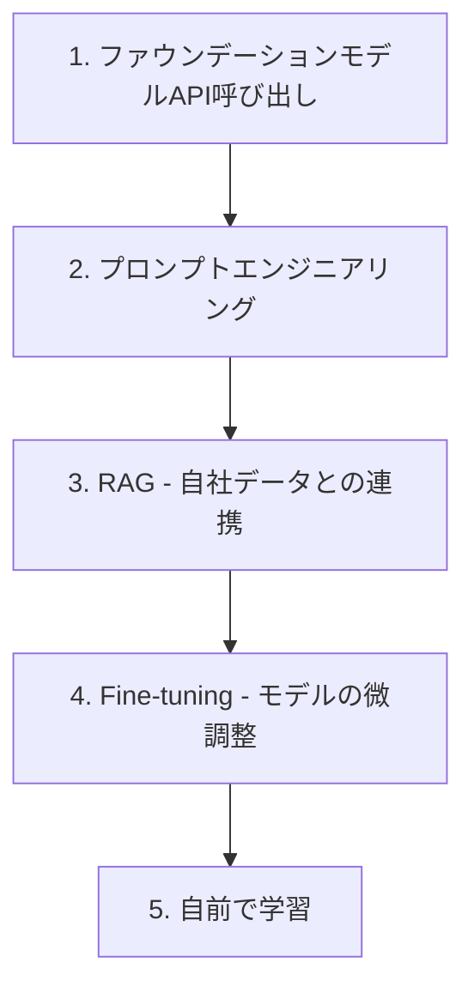

> 文書基準: 2026年7月

## AIの全体像

「AI」は単一の技術ではありません。数十年かけて発展してきた複数の技術の総称であり、各世代は前世代を置き換えるのではなく**共存**します。

| 世代 | 中核技術 | できること | クラウドサービス |
| --- | --- | --- | --- |
| **従来型ML** | 回帰、分類、クラスタリング、ツリー | 構造化データの予測・分類(離脱予測、異常検知、レコメンド) | SageMaker AI、Azure ML、Vertex AI、OCI Data Science |
| **ディープラーニング** | CNN、RNN、Transformer | 非構造化データ処理(画像認識、音声、翻訳) | GPUインスタンス + MLプラットフォーム |
| **生成AI** | ファウンデーションモデル(LLM、マルチモーダル) | テキスト/画像/コード/音声の生成 | Bedrock、Microsoft Foundry、Gemini |
| **エージェンティックAI** | LLM + ツール呼び出し + 自律実行 | 目標を与えると自ら計画・実行・検証 | AgentCore、Foundry Agents、Gemini Agent Platform |

:::note
**今始めるなら:** ほとんどのエンタープライズAI導入は**生成AI**(FM API呼び出し)から始まります。従来型MLはすでにデータパイプラインがある組織で、ディープラーニングは画像/音声など特化ワークロードで依然として活発です。本文書は生成AIの開始に焦点を当てつつ、従来型ML/ディープラーニングが必要な場合についても案内します。
:::

### どのAIが必要か判断する

| 解決したい問題 | 適した手法 | 文書 |
| --- | --- | --- |
| 構造化データの予測(売上、離脱、異常検知) | 従来型ML | [AIプラットフォーム — MLプラットフォーム](../../ai/ai-ml/#ml-플랫폼) |
| 画像/映像の分類、物体検出 | ディープラーニング(Computer Vision) | [AIプラットフォーム — MLプラットフォーム](../../ai/ai-ml/#ml-플랫폼) |
| 自然言語対話、文書要約、コード生成 | 生成AI(FM API) | 本文書のこの先を参照 |
| マルチステップ自動化、ツール呼び出し、自律作業 | エージェント | [AIエージェント](../../ai/agents/) |
| 業務支援(全社員向けAIツール) | Desktop Agent | [AIエージェント](../../ai/agents/) |

---

## なぜクラウドでAIを使うのか

AIモデルを自前で作るには、数百億ウォン規模のGPU、数千万件の学習データ、数か月の学習時間が必要です。ほとんどの組織はこのプロセスを自ら行わず、**クラウドベンダーが提供する用意されたAIサービス**を利用します。

たとえるなら、電気を自分で発電せず電力会社から受電するのと同じです。私たちは「どう電気を作るか」ではなく「電気で何をするか」に集中します。

## 最初に理解すべき3つの概念

### 1. ファウンデーションモデル (Foundation Model)

大量のデータですでに学習済みの汎用AIモデルです。代表的なものに**LLM**(Large Language Model、大規模言語モデル)があります。GPT(OpenAI)、Claude(Anthropic)、Gemini(Google)、Nova(Amazon)といった名前がこれに該当します。

- 自分で学習させる必要はなく、APIを呼び出して使用します。
- 「質問すれば答えてくれる賢いアシスタント」と考えるとよいでしょう。

### 2. プロンプト (Prompt)

モデルに送る入力メッセージです。「韓国の首都を教えて」のように自然言語で記述します。どう尋ねるかによって回答品質が大きく変わります。

### 3. トークン (Token)

モデルがテキストを処理する単位です。おおよそ単語1つが1~2トークンです。ほとんどのAPIは**入出力トークン数で課金**されます。

## 生成AI活用のステップ

ここから先は、最も多く選ばれる**生成AI(FM API)**の導入順序を扱います。従来型MLパイプライン(学習→デプロイ→モニタリング)については[AIプラットフォームとモデル比較 — MLパイプライン](../../ai/ai-ml/#ml-파이프라인과-mlops)を参照してください。

生成AIを導入する際は、通常この順序でアプローチします。下に行くほどコストと複雑度が増します。

### ステップ1: API呼び出し

最も簡単な出発点です。Amazon Bedrock、Microsoft Foundry、Gemini Enterprise、OCI Enterprise AIのいずれかのAPIに質問を送り、答えを受け取ります。ベンダー別サービス比較は[AIプラットフォームとモデル比較](../../ai/ai-ml/)を参照してください。

**利用例:**
- ユーザーの質問に答えるチャットボット
- 文書要約
- 翻訳

### ステップ2: プロンプトエンジニアリング

同じAPIでも、どう尋ねるかによって答えが大きく変わります。たとえば「あなたは法律の専門家です。以下の契約書からリスク要素を5つ見つけてください」のように役割と指示を明確に与えると品質が向上します。設計技法の詳細は[プロンプトエンジニアリング](../../ai/prompt-engineering/)を参照してください。

**コードを書かずに可能な改善方法です。**

### ステップ3: RAG (Retrieval Augmented Generation)

ファウンデーションモデルは一般知識には長けていますが、**自社データは知りません**。RAGは自社文書を検索して関連部分をプロンプトに含めた上でモデルに渡す技術です。

たとえ: 「試験時間中に持ち込みありで答えを書かせる」ようなものです。

**利用例:**
- 社内文書ベースのチャットボット
- 製品FAQの自動応答
- 法律/医療文書の照会

RAGは[ベクトルストア](../../ai/vector-store/)と共に動作します。実装パターンの詳細は[RAG高度パターン](../../ai/rag-patterns/)を参照してください。

### ステップ4: Fine-tuning

自社データでモデルを微調整します。特定業務に最適化できますが、コストと時間が大きく増加します。

**利用例:**
- 特定業界の専門用語の理解
- 自社固有の言い回し/スタイルの反映
- 特定形式の出力の強制

### ステップ5: 自前で学習

ほとんどの組織には不要です。Google、OpenAI、Anthropicのような企業が行っていることです。

モデルの運用・評価・コスト追跡は[LLMOps](../../ai/llmops/)を、AIセキュリティとガードレールは[AIセキュリティ](../../security/ai-security/)を参照してください。

## いつどの方法を使うか

| 状況 | 推奨方法 |
| --- | --- |
| 素早くプロトタイプを作りたい | ステップ1(API呼び出し) |
| APIは使っているが品質が物足りない | ステップ2(プロンプトエンジニアリング) |
| 自社文書を参照させて答えさせたい | ステップ3(RAG) |
| 汎用モデルがよく知らない専門ドメインである | ステップ4(Fine-tuning) |
| モデル自体が存在しない新しい問題である | ステップ5(自前で学習) |

:::note
**現実的なアドバイス:** ほとんどの業務はステップ3(RAG)までで十分です。Fine-tuningは構築・運用コストが大きいため、まずRAGで試し、限界が明確になった場合にのみ検討してください。
:::

## なぜAIモデルを自前で作らないのか

| 項目 | 自前学習 | クラウドAPI |
| --- | --- | --- |
| **初期コスト** | 数百億ウォン規模のGPU | API呼び出しあたり数ウォン~数百ウォン |
| **所要時間** | 数か月~数年 | 数分(API連携) |
| **データ** | 数兆トークンの学習データが必要 | モデルがすでに学習済み |
| **専門人材** | MLエンジニア、研究者多数 | 一般の開発者で対応可能 |
| **アップデート** | 再学習が必要 | ベンダーが自動アップデート |
| **効果** | 最先端が可能 | ほとんどの業務に十分 |

## よくある間違い

- **プロンプトエンジニアリングを飛ばしていきなりFine-tuning** — プロンプト改善だけで品質が十分向上する場合が多いにもかかわらず、コストと時間のかかるFine-tuningから試みる
- **トークンコストを考慮せずに設計** — 長いシステムプロンプトを毎リクエスト送信したり、不要に長い文書をコンテキストに含めてコストが急増する
- **RAGなしでモデルの内部知識のみに依存** — ファウンデーションモデルは学習時点以降の情報や社内データを知らないため、ハルシネーション(Hallucination)が発生する

## チェックリスト

- [ ] API呼び出し → プロンプトエンジニアリング → RAG → Fine-tuningの順に段階的にアプローチしているか
- [ ] トークン使用量とコストをモニタリングし、予算上限を設定したか
- [ ] 社内データに基づく回答が必要な場合、RAGパイプラインを構成したか

## 参考資料

### AWS

- [Amazon Bedrock 紹介](https://aws.amazon.com/ko/bedrock/)
- [Amazon Nova 2 モデルガイド](https://docs.aws.amazon.com/bedrock/latest/userguide/model-parameters-nova.html)

### Azure

- [Microsoft Foundry 公式文書](https://learn.microsoft.com/azure/ai-studio/)
- [Microsoft Foundry Portal](https://ai.azure.com/)

### Google Cloud

- [Gemini Enterprise Agent Platform 文書](https://cloud.google.com/vertex-ai/docs)
- [Gemini モデル公式サイト](https://deepmind.google/technologies/gemini/)

### OCI

- [OCI Enterprise AI 概要](https://www.oracle.com/kr/artificial-intelligence/generative-ai/generative-ai-service/)
- [Oracle AI Database (ベクトル検索)](https://www.oracle.com/database/ai-vector-search/)

### 入門資料

- [AWS — What is Generative AI?](https://aws.amazon.com/what-is/generative-ai/)
- [Microsoft — What is Generative AI?](https://azure.microsoft.com/en-us/solutions/ai/generative-ai)
- [Google Cloud — Gen AI Overview](https://cloud.google.com/ai/generative-ai)
- [Oracle — What Is Generative AI?](https://www.oracle.com/artificial-intelligence/generative-ai/what-is-generative-ai/)

### 用語集

- [CloudPick 用語集](../../glossary/) — AI/ML関連用語を含む
