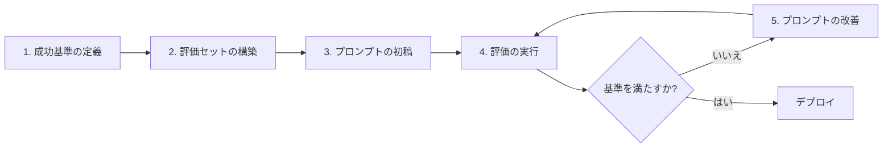

> 文書基準: 2026年8月

:::note
LLM/プロンプトが初めての方は、まず[AI入門](../../ai/getting-started/)をお読みください。
:::

## プロンプトエンジニアリングとは

プロンプトエンジニアリングは「**モデルにどのように質問・指示すれば望む答えが得られるか**」を扱います。同じモデルでもプロンプト次第で出力品質が大きく変わります。

Anthropicの公式文書によると、プロンプトエンジニアリングは*「経験科学(empirical science)」*であり、最も重要なのは**評価基準の定義 → 反復テスト**です。単に「良いプロンプト」を探すのではなく、測定可能な指標で改善していくプロセスです — [Anthropic Prompt Engineering Guide](https://docs.anthropic.com/claude/docs/prompt-engineering)

## 基本原則

Microsoft、Google、Anthropicの公式ガイドが共通して強調する原則です。

- **明確で具体的な指示** — 曖昧な要求は曖昧な答えを生みます。
- **文脈の提供** — モデルが知らない背景情報を先に提供します。
- **役割の付与** — 「あなたは法律の専門家です」のようなペルソナ設定。
- **出力形式の明示** — JSON、リスト、段落など望む形式を指定します。
- **例の提示** — 入出力の例を示すと品質が向上します(Few-shot)。
- **反復評価** — 代表的な事例で品質を測定してから改善します。

出典:
- [Microsoft — Prompt engineering techniques](https://learn.microsoft.com/azure/cognitive-services/openai/concepts/prompt-engineering)
- [Google Cloud — Prompting strategies](https://cloud.google.com/vertex-ai/generative-ai/docs/learn/prompts/prompt-design-strategies)
- [Anthropic — Prompt engineering overview](https://docs.anthropic.com/claude/docs/prompt-engineering)

## 主要パターン

### Zero-shot

例を示さずにそのまま指示します。

```
以下の文章の感情を分析してください: 「今日の会議は退屈でした。」
```

単純な作業には適していますが、複雑な作業では品質が落ちます。

### Few-shot (One-shot, Multi-shot)

望むパターンを例として先に示す方式です。LLMは例を見て似た形式で答えます。

```
次の文章を肯定/中立/否定に分類してください。

文章: 「サービスが本当に素晴らしかったです。」
答え: 肯定

文章: 「配送は予定どおり届きました。」
答え: 中立

文章: 「商品が破損して届きました。」
答え:
```

**出典:**
- [Google Cloud — Give examples (few-shot prompting)](https://cloud.google.com/vertex-ai/generative-ai/docs/learn/prompts/few-shot-examples)
- [Anthropic — Use examples (multishot prompting)](https://docs.anthropic.com/en/docs/build-with-claude/prompt-engineering/multishot-prompting)

### Chain-of-Thought (CoT)

モデルが段階的に推論するように誘導します。数学、論理推論、複雑な分類作業で精度が大きく向上します。

```
問題を段階的に解いてください。

問題: 店にリンゴが23個あり、20個売れました。そして新たに6個入荷しました。今何個ありますか?

手順:
1.
```

最新のフロンティアモデル(Claude・GPT・Gemini系列など)は内部的にCoTを自動で行うこともありますが、「**段階的に説明してください(Think step by step)**」のような明示的な指示は依然として効果があります。

**出典:**
- [Microsoft — Chain of thought prompting](https://learn.microsoft.com/en-us/dotnet/ai/conceptual/chain-of-thought-prompting)
- [Anthropic — Let Claude think (CoT)](https://docs.anthropic.com/en/docs/build-with-claude/prompt-engineering/chain-of-thought)
- 論文: [Wei et al., 2022 — Chain-of-Thought Prompting Elicits Reasoning in Large Language Models](https://arxiv.org/abs/2201.11903)

### 役割の付与 (System Prompt / Persona)

モデルに役割を指定します。モデルのトーン、専門性、応答範囲が変わります。

```
あなたは韓国の法律専門家です。一般の人が理解できるようわかりやすく説明しつつ、
法律用語は正確に使用してください。

質問: 契約書に「甲」と「乙」という表現が出てきますが、どういう意味ですか?
```

ほとんどのAPIでは、システムプロンプト(System Prompt)を別途指定できます([Anthropicガイド](https://docs.anthropic.com/en/docs/build-with-claude/prompt-engineering/system-prompts))。

### 出力形式の強制

構造化された出力(JSON、XMLなど)を望む場合は形式を明示します。

```
以下のレビューから情報をJSONで抽出してください。

スキーマ:
{
  "product": "商品名",
  "rating": 1-5の整数,
  "sentiment": "肯定" | "中立" | "否定"
}

レビュー: 「このイヤホン本当にいいです!音質が優れていてバッテリーも長持ちします。星5つです。」
```

一部のベンダーは**構造化された出力(Structured Output)**をネイティブでサポートしています。
- [Microsoft Foundry Structured Outputs](https://learn.microsoft.com/azure/ai-services/openai/how-to/structured-outputs)
- [Vertex AI Controlled Generation](https://cloud.google.com/vertex-ai/generative-ai/docs/multimodal/control-generated-output)

### ReAct (Reasoning + Acting)

LLMが「思考 → 道具呼び出し → 観察 → 次の思考」を繰り返しながらツールを使用するパターンです。エージェント実装の基本パターンとして広く使われています。

```
使用可能なツール:
- search(query): ウェブ検索
- calculate(expression): 計算

質問: 2024年オリンピック開催地とソウルの間の距離は?

Thought: まず2024年オリンピック開催地を調べる必要がある。
Action: search("2024 Olympics host city")
Observation: パリ
Thought: パリとソウルの距離を計算する必要がある。
Action: search("distance Paris Seoul")
Observation: 約8,957 km
Answer: 2024年オリンピック開催地はパリであり、ソウルとの距離は約8,957 kmです。
```

**出典:**
- 論文: [Yao et al., 2022 — ReAct: Synergizing Reasoning and Acting in Language Models](https://arxiv.org/abs/2210.03629)
- [AWS — Using Tools (Function Calling) with Bedrock](https://docs.aws.amazon.com/bedrock/latest/userguide/tool-use.html)
- [Anthropic — Tool use](https://docs.anthropic.com/en/docs/agents-and-tools/tool-use/overview)

## ベンダー別推奨実践事項

各ベンダーが自社モデルに対して推奨する実践方法は少しずつ異なります。

| ベンダー | 特徴的な推奨事項 | 参考 |
| --- | --- | --- |
| **AWS Bedrock (Claude)** | XMLタグで構造化(`<context>...</context>`)、明確な指示を先頭に配置 | [Claude Fable 5 best practices](https://docs.anthropic.com/en/docs/build-with-claude/prompt-engineering/claude-4-best-practices) |
| **Microsoft Foundry(GPTシリーズ)** | システムプロンプトで役割を固定、形式の例を提示 | [Azureプロンプトエンジニアリングガイド](https://learn.microsoft.com/azure/ai-services/openai/concepts/prompt-engineering) |
| **Google Cloud Vertex AI (Gemini)** | 明確な指示、制約条件の明示、反復実験 | [Vertex AI Prompt strategies](https://cloud.google.com/vertex-ai/generative-ai/docs/learn/prompts/prompt-design-strategies) |
| **OCI Enterprise AI (Cohere)** | Preamble(システム指示)でペルソナ設定、ツール使用時は正確なJSONスキーマ | [Cohere Prompt Engineering](https://docs.cohere.com/docs/prompt-engineering) |

## プロンプト改善の反復ループ

Anthropic公式ガイドが強調するワークフローです。



「良いプロンプト」は一度で完成しません。代表的な質問20~50個で**評価セット(eval set)**を作り、プロンプト変更時に評価スコアで比較するのが実務標準です。

## よくある間違い

- **多すぎる指示を1つのプロンプトに詰め込む** — 5つ以上の指示はモデルが見落としやすくなります。
- **例を示さずに複雑な形式を要求する** — Few-shotの例の方がはるかに効果的です。
- **代表的な質問だけをテストする** — エッジケースで品質が崩れることがあります。
- **モデルのアップグレード時にプロンプトの再検討を怠る** — モデルバージョンによって同じプロンプトでも出力が変わることがあります。

## 参考資料

### AWS

- [AWS — Bedrock Prompt Engineering Guidelines](https://docs.aws.amazon.com/bedrock/latest/userguide/prompt-engineering-guidelines.html)

### Azure

- [Microsoft Foundry — Prompt engineering techniques](https://learn.microsoft.com/azure/ai-services/openai/concepts/prompt-engineering)
- [Microsoft — Generative AI for Beginners](https://learn.microsoft.com/shows/generative-ai-for-beginners/)

### Google Cloud

- [Google Cloud Vertex AI — Prompting strategies](https://cloud.google.com/vertex-ai/generative-ai/docs/learn/prompts/prompt-design-strategies)

### 標準とコミュニティ

- [Anthropic Claude — Prompt engineering overview](https://docs.anthropic.com/claude/docs/prompt-engineering)
- [Cohere — Prompt engineering](https://docs.cohere.com/docs/prompt-engineering)
- [Wei et al., 2022 — Chain-of-Thought Prompting](https://arxiv.org/abs/2201.11903)
- [Yao et al., 2022 — ReAct](https://arxiv.org/abs/2210.03629)
- [Brown et al., 2020 — GPT-3 (Few-shot learning)](https://arxiv.org/abs/2005.14165)
- [Anthropic — Interactive Prompt Engineering Tutorial](https://github.com/anthropics/prompt-eng-interactive-tutorial)
