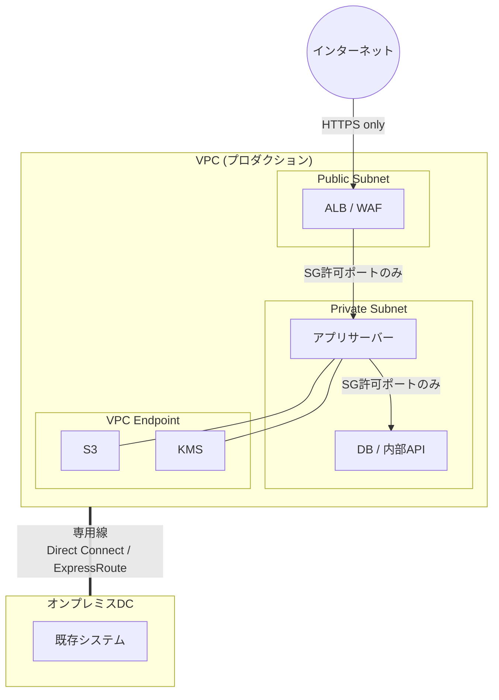

> 文書基準: 2026年8月

## 概要

:::note
本ドキュメントは物理的・論理的隔離の**概念とクラウドパターン**を扱います。国・管轄区域別の規制レイヤーについては、以下を参照してください。
- 韓国の金融・公共の網分離・N2SF・CSAP: [網分離とネットワーク隔離 (韓国)](../../korea/security/network-isolation/)
- 米国連邦/防衛産業における隔離の文脈: [米国概要](../../us/index/) · [FedRAMP](../../us/fedramp/) · [ITAR/EAR](../../us/itar/)
- EU金融ICT・主権: [EU概要](../../eu/index/) · [DORA](../../eu/dora/)
:::

**網分離**(Network Segregation)は、韓国の公共・金融部門がセキュリティポリシーの基盤として長年採用してきた統制方式です。業務網とインターネット網を分離することで、外部の脅威が内部システムに到達しないようにします。インターネット経由のマルウェア流入、リモート侵入、データ漏洩をネットワーク境界で根本的に遮断するという点で、長らく合理的な選択でした。

金融業界(電子金融監督規程)、公共機関(国家情報保安基本指針)、医療(個人情報保護法)など、韓国の規制市場において中核的なセキュリティ要件として適用されています。ただし、API連携、SaaS活用、リモートワークなどシステム間の接続が不可避となった現代の環境では、「分離」の意味と実装方式もともに進化しています。

オンプレミスでは、ネットワーク機器を物理的に分離することで実装していました。クラウドでは同じセキュリティ目標を**論理的隔離**によって達成でき、一部の規制要件では依然として物理的分離が求められます。

:::caution
網分離はセキュリティの**1つのレイヤー**であり、すべてではありません。物理的に分離された網でも、内部者の脅威、USBを介したマルウェア流入、パッチ適用の遅延による脆弱性露出は発生します。網分離と併せて[ゼロトラスト](../../security/zero-trust/)、[セキュリティ態勢管理](../../security/security-posture/)を並行して実施する必要があります。
:::

## 網分離の意味 — 分離か、統制された接続か

網分離の本来の目的は、**2つのネットワークの間にデータ移動経路そのものが存在しないこと**です。しかし現実には、業務上の利便性のために、分離された網を再び接続するソリューションを導入するケースが多く見られます。

| ソリューション | 行うこと | 本質 |
| --- | --- | --- |
| VDI (仮想デスクトップ) | インターネット網端末から業務網の画面をリモート表示 | 画面転送経路＝接続 |
| 網間データ転送システム | ファイルを検査した後、反対側の網へ転送 | データ移動経路＝接続 |
| クリップボード/USB統制ソリューション | コピー・貼り付け、リムーバブルメディアを制限付きで許可 | 制限されたデータ経路＝接続 |

これらのソリューションを導入した瞬間、それは「網分離」ではなく**網間アクセス統制**になります。経路が存在する限り、その経路を通じたデータ漏洩・マルウェア流入の可能性も存在します。

:::caution
「網分離をしたから安全だ」という前提は危険です。網連携ソリューションが1つでも存在すれば、その経路のセキュリティレベルがそのまま全体のセキュリティレベルの上限となります。分離すること自体が目的ではなく、**保護対象データが許可なく移動できないこと**が目的です。
:::

### クラウドの観点からの示唆

クラウドの論理的隔離(VPC、Private Subnet、Security Group)は、最初から**「統制された接続」を明示的に設計する**モデルです。どのトラフィックがどこへ行けるかをコードで定義し、すべての通信をロギングし、ポリシー違反をリアルタイムで検知します。

オンプレミスの物理的網分離＋VDI/網連携ソリューションの組み合わせと比較すると:

| 観点 | 物理的網分離＋網連携ソリューション | クラウド論理的隔離 |
| --- | --- | --- |
| 境界定義 | 物理機器による暗黙的分離、ソリューションによる例外生成 | コードによる明示的定義 (Security Group、NACL、IAM) |
| 可視性 | 網連携ソリューションのログに依存 | VPC Flow Logs、CloudTrailなど全区間ロギング |
| ポリシー変更 | 機器設定変更、数日〜数週間 | コード変更＋デプロイ、数分 |
| ドリフト検知 | 手動点検 | 自動検知 (Config Rules、Policy、CSPM) |
| 監査証跡 | ソリューションごとの個別ログ | 統合監査ログ |

重要なのは「分離か接続か」の二分法ではなく、**許可された経路をどれだけ明示的に定義し、それ以外のすべてを遮断し、違反をリアルタイムで検知できるか**です。

## 物理的網分離 vs 論理的網分離

| 区分 | 物理的網分離 | 論理的網分離 |
| --- | --- | --- |
| **方式** | 別個のネットワーク機器・回線・端末を使用 | 同一インフラ内で仮想化・暗号化・アクセス統制により分離 |
| **セキュリティレベル** | ネットワークレベルで完全遮断 | 設定ミス時に境界突破の可能性 |
| **コスト** | 機器・回線の二重化により高い | 相対的に低い |
| **柔軟性** | 変更に数週間〜数ヶ月 | ポリシー変更で数分以内に調整 |
| **パッチ/更新** | 閉域網内への手動搬入が必要 → 遅延が発生 | 統制された経路で自動化可能 |
| **規制適用** | CSAP上等級、一部の金融基幹システム | CSAP中/下等級、大半のクラウドワークロード |

### 運用観点での1対1比較

| 区分 | オンプレミス (物理的網分離) | クラウド (論理的隔離) | トレードオフ |
| --- | --- | --- | --- |
| **隔離方式** | ケーブル・機器の物理分離 | SDN(VPC)ベースの論理的分離 | 物理的は直感的だが変更が困難。論理的は柔軟だが設定ミスのリスク |
| **境界セキュリティ** | ハードウェアファイアウォール | Security Group + NACL | ハードウェアは性能が安定。SG/NACLは自動化・コード管理が可能 |
| **可視性** | 物理ポート・パケットキャプチャ | VPC Flow Logs、リアルタイムモニタリング | 物理的は専用機器が必要。クラウドは標準提供されるがログコストが発生 |
| **障害復旧** | 機器交換 (数時間〜数日) | Multi-AZ自動フェイルオーバー (数秒〜数分) | クラウドは高速だがベンダー依存。物理的は自主統制が可能 |
| **変更管理** | 機器設定変更、作業申請書 | コード変更＋CI/CDデプロイ | 物理的は承認体系が明確。クラウドは迅速だがガバナンスを別途整備する必要 |
| **監査証跡** | 機器ごとの個別ログ収集 | 統合監査ログ (CloudTrailなど) | 物理的はログ統合が困難。クラウドは標準で統合されるが保存ポリシーの設定が必要 |

両方式にはそれぞれ長所と短所があり、ワークロードの機密度と規制要件によって適した方式が異なります。多くの組織では、中核システムは物理的分離を維持しつつ、機密度の低いワークロードから論理的隔離へと拡張するハイブリッドアプローチを採用しています。

### 物理的網分離の現実的な限界

物理的網分離は「絶対安全」を保証するものではありません。

- **パッチ適用の遅延**: 閉域網はインターネットアクセスができないため、セキュリティパッチの適用が数週間〜数ヶ月遅延します。この期間、既知の脆弱性にさらされます。
- **内部者の脅威**: 物理的分離は外部からの攻撃を遮断しますが、内部権限を持つユーザーによるデータ漏洩は防げません。
- **運用の複雑性**: 二重端末、網間データ転送システム、別個の認証体系など運用負担が大きくなります。
- **DRの制約**: 閉域網環境では遠隔地DRの構成が困難です。

## クラウドにおけるネットワーク隔離の実装

クラウドはソフトウェア定義ネットワーク(SDN)を基盤としているため、物理機器なしでも強力な隔離を実装できます。

### 隔離レベル別の実装パターン

| 隔離レベル | 実装方法 | 適したケース |
| --- | --- | --- |
| **VPC/VNet分離** | ワークロードごとの独立VPC、ルーティング遮断 | 一般的な環境分離 (dev/prod) |
| **プライベートサブネット** | インターネットゲートウェイのないサブネット、NAT経由のみ許可 | DB、内部APIなど外部公開が不要なシステム |
| **プライベートサービス接続** | マネージドサービスへのアクセスをベンダー内部ネットワークに限定 | ストレージ、DBなどへのアクセス時にインターネットを迂回 |
| **専用線** | インターネットを経由しない物理専用ネットワーク接続 | オンプレミス↔クラウド間の通信 |
| **エアギャップ** | インターネットと完全に遮断されたクラウド環境 | 最高水準の規制 |

### ベンダー別エアギャップ/専用環境

インターネットと完全に分離されたクラウド環境が必要な場合、各ベンダーは以下のオプションを提供しています。ただし、韓国の公共部門におけるCSAP認証の有無は別途確認する必要があります。

| ベンダー | サービス | 説明 |
| --- | --- | --- |
| AWS | Outposts | 顧客のデータセンターにAWSインフラを設置。ローカル処理 |
| AWS | Snow Family (Snowball Edge) | 完全オフライン環境でコンピューティング/ストレージを提供 |
| Azure | Azure Stack Hub / HCI | 顧客DCでAzureサービスを運用。接続/非接続モード |
| Azure | Azure Government (隔離リージョン) | 米国政府専用の物理的分離リージョン |
| Google Cloud | Google Distributed Cloud (GDC) Air-gapped | 完全オフライン環境でGoogle Cloudサービスを運用 |
| OCI | Dedicated Region | 顧客DCにOCI全体のリージョンを設置。完全隔離 |
| OCI | Roving Edge Infrastructure | オフライン環境向けの可搬型コンピューティング |

### 一般的な規制市場のアーキテクチャパターン

大半の金融/公共ワークロードはエアギャップまでは必要とせず、以下のパターンで規制要件を満たします。

**核心原則:**

- インターネット露出の最小化 — Public Subnetにはロードバランサー/WAFのみ配置
- マネージドサービスへのアクセスはVPC Endpoint経由 — NAT Gateway/インターネットを迂回
- オンプレミス接続は専用線 — VPNはバックアップ経路としてのみ使用
- すべての通信を暗号化 — TLS 1.2+必須

## 規制要件マッピング

韓国の網分離政策は、「すべてのシステムを同一水準で分離」する画一的アプローチから、**データ等級に応じた差等セキュリティ**へと精緻化が進んでいます。CSAPは上・中・下の3等級制で、システムの機密度に応じて異なる隔離水準を要求します。

**N2SF(国家網セキュリティ体系) 1.0**は2025年9月にNCSC(国家サイバー安全保障センター)によって正式公開され、従来の網分離中心の政策を等級別の差等セキュリティへ転換するフレームワークです。

- **等級分類**: C等級(機密 — 国家安全保障・国防・外交)、S等級(センシティブ — 個人情報・内部検討資料)、O等級(公開)
- **セキュリティ統制**: 6つの大領域(権限 / 認証 / 分離・隔離 / 統制 / データ / 情報資産)、280項目余り
- **適用手順**: 準備 → C/S/O等級分類 → 脅威識別 → セキュリティ対策の策定 → 妥当性評価・調整 (5段階)
- **情報サービスモデル**: 生成AI活用、クラウド協業、無線業務環境、モバイル連携など11種のシナリオ別セキュリティ設計フレームを提示

これは、「分離するかどうか」の二分法から「どの水準の統制が必要か」へと、政策上の問いそのものが変化したことを意味します。

| 規制/基準 | 要求事項 | クラウド対応 |
| --- | --- | --- |
| **電子金融監督規程** (韓国・金融) | 電算室の網分離、内部網/DMZ/外部網の区分 | VPC分離＋Private Subnet＋専用線 |
| **CSAP上等級** (韓国・公共) | 物理的網分離 | 公共専用インフラの活用 |
| **CSAP中等級** (韓国・公共) | 論理的網分離＋アクセス統制強化 | 国内CSPまたはグローバルCSP (中等級認証取得時) |
| **ISMS-P** (韓国・全産業) | ネットワーク分離、アクセス統制、暗号化 | Security Group + NACL + VPC Endpoint + TLS |
| **N2SF 1.0 (国家網セキュリティ体系)** (韓国) | C/S/O等級別の差等セキュリティ、280項目余りのセキュリティ統制項目 | 等級別VPC分離＋等級間通信統制＋6大領域マッピング |
| **PCI DSS** (カード決済) | CDE(カードデータ環境)のネットワーク隔離 | 専用VPC＋ファイアウォール＋ロギング |

### 自組織はどこから始めるか

規制要件によって出発点が異なります。

| 自組織の状況 | 最初のステップ | 目標構成 |
| --- | --- | --- |
| **CSAP上等級 (物理的分離必須)** | 公共専用インフラの活用 | グローバルCSPは現時点で上等級未認証 |
| **CSAP中等級 (論理的分離)** | 国内CSPまたはグローバルCSP (中等級認証取得時) | VPC隔離＋Private Link＋専用線 |
| **CSAP下等級 / ISMS-P** | グローバルCSPのパブリッククラウド | 標準的なクラウドセキュリティのベストプラクティスを適用 |
| **N2SF C等級 (機密)** | 公共専用インフラまたはエアギャップ環境 | インターネット完全遮断、国内人員による運用 |
| **N2SF S等級 (センシティブ)** | VPC隔離＋専用線＋アクセス統制強化 | CSAP中等級と同等の水準 |
| **N2SF O等級 (公開)** | パブリッククラウドの基本セキュリティ | 最小セキュリティ要件を充足 |

:::note
大半の組織では、すべてのシステムが同じ等級ではありません。システムごとに等級を分類し、等級に見合った隔離水準を差等適用することがN2SFの核心です。「すべて上等級」や「すべてパブリック」ではなく、混合構成が現実的です。
:::

## アンチパターン

| アンチパターン | 問題 | 正しいアプローチ |
| --- | --- | --- |
| すべてのサブネットをPublicで構成 | すべてのリソースがインターネットに露出 | Private Subnetを基本とし、PublicはLB/Bastionのみ |
| Security Groupに0.0.0.0/0のインバウンドを許可 | 事実上ファイアウォールが存在しない状態 | 最小権限の原則、必要なポート/送信元のみ許可 |
| NAT Gatewayですべてのアウトバウンドを許可 | データ流出経路が存在 | VPC Endpointを優先、アウトバウンドも制限 |
| 網分離のみで内部モニタリングなし | 内部の横移動を検知できない | VPC Flow Logs + 異常検知 + Network Policy |
| 物理的網分離後にパッチを放置 | 既知の脆弱性への長期露出 | 統制されたパッチ経路の確保、定期的な脆弱性スキャン |

### 予防的ガードレール — ミスが事故に拡大する前に

オンプレミスでは、ミス(誤ったファイアウォールルール、ポート開放)を事後の監査で発見するケースが多く見られます。クラウドでは**ミス自体を遮断する予防的統制**を自動化できます。

| ガードレール | 動作 | ベンダー例 |
| --- | --- | --- |
| **組織ポリシーによる危険行為の根本遮断** | 特定リージョン外でのリソース作成禁止、パブリックアクセス遮断 | AWS SCP、Azure Policy、Google Cloud Organization Policy |
| **設定変更時の自動検知・復旧** | ルール違反リソースを即座に通知、または自動修正 | AWS Config Rules、Azure Policy (remediation)、Google Cloud Security Command Center |
| **ネットワーク変更のリアルタイム監視** | Security Group変更、新しいインターネット経路作成時に即座に通知 | CloudTrail + EventBridge、Azure Monitor、Google Cloud Cloud Audit Logs |

ただし、ガードレールは**設定してこそ機能します。** デフォルトの状態では大半が無効化されており、組織のセキュリティ要件に合わせてポリシーを定義・維持することはユーザーの責任です。

## よくある間違い

- **Security Groupに0.0.0.0/0のインバウンドを「一時的に」開けたまま放置** — テスト後に削除せず、事実上ファイアウォールが存在しない状態で運用される
- **網分離のみで内部モニタリングを行わない** — 外部遮断のみに注力し、内部の横移動(Lateral Movement)を検知できない
- **NAT Gatewayですべてのアウトバウンドを許可** — VPC Endpointを使用せず、データ流出経路が存在し不要なコストも発生

## チェックリスト

- [ ] ワークロードの等級に応じてVPC/サブネット分離戦略を策定したか
- [ ] インターネット露出が必要なリソースを最小化したか (Public Subnetの最小化)
- [ ] マネージドサービスへのアクセスにVPC Endpoint / Private Linkを使用しているか
- [ ] オンプレミス接続に専用線を使用しているか (VPNはバックアップのみ)
- [ ] Security Group / NACLに最小権限の原則を適用したか
- [ ] VPC Flow Logsを有効化し、異常検知を構成したか
- [ ] アウトバウンドトラフィックも制限しているか (データ流出防止)
- [ ] 規制要件に見合った隔離水準を選択したか (論理的 vs 物理的)
- [ ] 閉域網環境でもパッチ適用経路を確保しているか

## 関連ドキュメント

> 📄 [ゼロトラスト](../../security/zero-trust/)

> 📄 [VPCとサブネット](../../networking/vpc-subnet/)

> 📄 [コンプライアンス](../../governance/compliance/)

## 参考資料

### 規制/標準

- [電子金融監督規程 (金融委員会)](https://www.law.go.kr/행정규칙/전자금융감독규정)
- [CSAP クラウドセキュリティ認証 (KISA)](https://isms.kisa.or.kr/main/csap/intro/)
- [N2SF 国家網セキュリティ体系 1.0 セキュリティガイドライン (国家サイバー安全保障センター資料室)](https://www.ncsc.go.kr)
- [国家情報院、N2SFセキュリティガイドライン正式版を公開 (2025年9月30日)](https://www.digitaltoday.co.kr/news/articleView.html?idxno=537182)
- [PCI DSS v4.0 (PCI SSC)](https://www.pcisecuritystandards.org/)

### AWS

- [VPC セキュリティベストプラクティス](https://docs.aws.amazon.com/ko_kr/vpc/latest/userguide/vpc-security-best-practices.html)
- [AWS PrivateLink ドキュメント](https://docs.aws.amazon.com/ko_kr/vpc/latest/privatelink/)
- [AWS Outposts ドキュメント](https://docs.aws.amazon.com/ko_kr/outposts/)

### Azure

- [Azure ネットワークセキュリティベストプラクティス](https://learn.microsoft.com/ko-kr/azure/security/fundamentals/network-best-practices)
- [Azure Private Link ドキュメント](https://learn.microsoft.com/ko-kr/azure/private-link/)
- [Azure Stack Hub ドキュメント](https://learn.microsoft.com/ko-kr/azure-stack/operator/)

### Google Cloud

- [VPC セキュリティベストプラクティス](https://cloud.google.com/architecture/framework/security/network-security)
- [Private Google Access ドキュメント](https://cloud.google.com/vpc/docs/private-google-access)
- [Google Distributed Cloud ドキュメント](https://cloud.google.com/distributed-cloud/hosted/docs)

### OCI

- [OCI ネットワークセキュリティベストプラクティス](https://docs.oracle.com/en-us/iaas/Content/Security/Reference/networking_security.htm)
- [OCI Dedicated Region ドキュメント](https://docs.oracle.com/en-us/iaas/Content/dedicated-region/home.htm)
