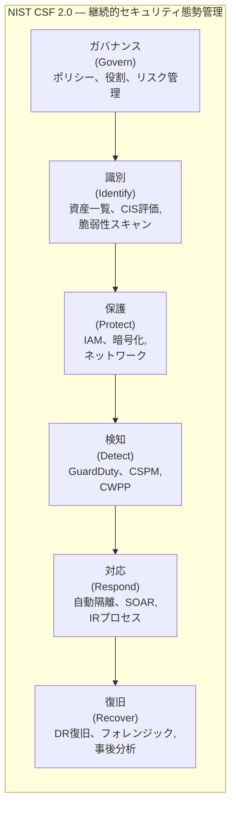

> 文書基準: 2026年8月

## 概要

クラウド環境はリソースが迅速に作成・変更されるため、**継続的にセキュリティ状態を評価し、脅威を検知・対応する**体系が必要です。これを総称して**セキュリティ態勢管理** (Security Posture Management)と呼びます。

:::note
デプロイ前のセキュリティ検証は[DevSecOps](../../devops/devsecops/)を、OS/ランタイムパッチは[パッチ管理と脆弱性対応](../../devops/patch-and-vulnerability/)を参照してください。
:::

主な領域:

| 領域 | 役割 | 例 |
| --- | --- | --- |
| **CSPM** (Cloud Security Posture Management) | クラウド構成ミスの検知 | S3のパブリック露出、暗号化未適用、過剰なIAM権限 |
| **CWPP** (Cloud Workload Protection Platform) | ワークロード(VM、コンテナ、サーバーレス)のランタイム保護 | マルウェア検知、ファイル整合性モニタリング、ランタイム脆弱性 |
| **脅威検知** (Threat Detection) | 異常な活動・攻撃の兆候の識別 | 不正なAPI呼び出し、暗号資産マイニング、データ流出の試み |
| **SIEM/SOAR** | セキュリティイベントの収集・分析・自動対応 | ログ相関分析、自動隔離、チケット生成 |

## ベンダー別セキュリティ態勢サービス

| 領域 | AWS | Azure | Google Cloud | OCI |
| --- | --- | --- | --- | --- |
| **CSPM** | [Security Hub](https://docs.aws.amazon.com/securityhub/latest/userguide/what-is-securityhub.html) | [Defender for Cloud (CSPM)](https://learn.microsoft.com/azure/defender-for-cloud/concept-cloud-security-posture-management) | [Security Command Center Enterprise](https://cloud.google.com/security-command-center/docs) — Google Unified SecurityポートフォリオのCSPM構成要素。Mandiant脅威インテリジェンス統合 | [Cloud Guard](https://docs.oracle.com/en-us/iaas/cloud-guard/home.htm) |
| **CWPP** | [GuardDuty Runtime Monitoring](https://docs.aws.amazon.com/guardduty/latest/ug/runtime-monitoring.html) + [Inspector](https://docs.aws.amazon.com/inspector/latest/user/what-is-inspector.html) | [Defender for Servers/Containers](https://learn.microsoft.com/azure/defender-for-cloud/defender-for-servers-introduction) | [SCC Premium (VM Threat Detection)](https://cloud.google.com/security-command-center/docs/concepts-vm-threat-detection-overview) | [Cloud Guard (Threat Detector)](https://docs.oracle.com/en-us/iaas/cloud-guard/using/detect-recipes.htm) |
| **脅威検知** | [GuardDuty](https://docs.aws.amazon.com/guardduty/latest/ug/what-is-guardduty.html) | [Defender for Cloud + Sentinel](https://learn.microsoft.com/azure/sentinel/overview) | [SCC Event Threat Detection](https://cloud.google.com/security-command-center/docs/concepts-event-threat-detection-overview) | [Cloud Guard (Activity Detector)](https://docs.oracle.com/en-us/iaas/cloud-guard/using/detect-recipes.htm) |
| **SIEM/SOAR** | [Security Lake](https://docs.aws.amazon.com/security-lake/latest/userguide/what-is-security-lake.html) + サードパーティ | [Microsoft Sentinel](https://learn.microsoft.com/azure/sentinel/) | [Chronicle SIEM](https://cloud.google.com/chronicle/docs) | [OCI Logging Analytics](https://docs.oracle.com/en-us/iaas/logging-analytics/home.htm) (ログ分析) + サードパーティSIEM |
| **コスト** | GuardDuty従量課金、Security Hubは検査ごとに課金 | Defenderはプラン別課金 | SCC Standardは無料 / Premium・Enterpriseは課金 | Cloud Guardは無料 |

## CIS Benchmarks

### CIS Benchmarkとは

[CIS (Center for Internet Security)](https://www.cisecurity.org/cis-benchmarks) Benchmarksは、OS、クラウドプラットフォーム、データベース、コンテナなどに対する**セキュリティ構成のベースライン**です。業界で最も広く使用されているセキュリティ構成標準であり、監査およびコンプライアンスの基本フレームワークです。

主なベンチマーク:

| 対象 | ベンチマーク例 |
| --- | --- |
| クラウドアカウント | CIS AWS Foundations、CIS Azure Foundations、CIS Google Cloud Foundations、CIS OCI Foundations |
| OS | CIS Amazon Linux 2023、CIS Ubuntu、CIS Windows Server |
| コンテナ | CIS Docker、CIS Kubernetes |
| データベース | CIS Oracle Database、CIS PostgreSQL、CIS MySQL |

### ベンダー別CIS自動評価

| ベンダー | サービス | CIS対応 |
| --- | --- | --- |
| AWS | Security Hub | CIS AWS Foundations Benchmark v1.4/v3.0の自動評価。スコアダッシュボード |
| Azure | Defender for Cloud | CIS Azure Foundationsベースのコンプライアンスダッシュボード。推奨事項の自動生成 |
| Google Cloud | Security Command Center | CIS Google Cloud Foundationsベースのスキャン。Security Health Analytics |
| OCI | Cloud Guard | CIS OCI Foundations BenchmarkベースのDetectorレシピを標準提供 |

### CISレポートの重要性

- **監査対応** — 内部・外部監査時に「セキュリティ構成基準を満たしている」ことを証明
- **ベースライン設定** — 新規アカウント/プロジェクト作成時に最小セキュリティレベルを保証
- **継続的モニタリング** — 構成ドリフト(意図しない変更)を自動検知
- **経営層への報告** — セキュリティスコア(Score)で現状を定量的に伝達
- **コンプライアンスマッピング** — CIS項目がISO 27001、SOC 2、[ISMS-P](../../governance/compliance/)の統制項目とマッピングされている

### CIS運用のベストプラクティス

- **定期スキャン** — 最低週1回の自動スキャン。変更が頻繁な環境ではリアルタイムモニタリング
- **例外管理** — ビジネス上の理由による非準拠項目は、文書化＋代替統制の明記
- **スコア目標** — 組織ポリシーで最低準拠率を設定 (例: Critical 100%、High 95%以上)
- **自動是正** — 可能な項目は自動修正 (例: パブリックS3バケットの自動遮断)
- **トレンド追跡** — 月次のスコア推移を追跡し、セキュリティ態勢の改善/悪化を把握

## 脅威検知の詳細

AWS GuardDutyの検知タイプ

VPC Flow Logs、DNSログ、CloudTrail、S3データイベント、EKS監査ログ、Lambdaネットワーク活動を分析して脅威を検知します。

| カテゴリ | 例 |
| --- | --- |
| 不正アクセス | 異常な地域からのコンソールログイン、既知の悪性IPからのAPI呼び出し |
| 暗号資産マイニング | EC2/EKSでのマイニングプール通信の検知 |
| データ流出 | S3バケットからの異常な大量ダウンロード、DNSを通じたデータ流出 |
| 権限昇格 | IAMポリシー変更後の異常なAPI呼び出しパターン |

Azure Defender + Sentinel

Defender for Cloudがワークロードごとの脅威を検知し、SentinelがSIEMとしてログを収集・相関分析します。SentinelのSOAR(自動対応)機能により、Playbookを通じた自動隔離、通知、チケット生成が可能です。

Google Cloud Security Command Center

Event Threat DetectionがCloud Audit Logs、VPC Flow Logsを分析して脅威を検知します。Chronicle SIEMと連携すると、大規模なログ分析と脅威ハンティングが可能になります。

OCI Cloud Guard

**Detector** (検知)と**Responder** (対応)で構成されます。構成上の問題や活動の異常を検知すると、自動的に対応アクション(リソース無効化、タグ追加、通知など)を実行します。標準提供され、追加コストはありません。

## 自動対応 (Auto-Remediation)

脅威や構成ミスを検知した後、人の介入なしに自動で是正するパターンです。

| ベンダー | 自動対応方式 |
| --- | --- |
| AWS | Security Hub → EventBridge → Lambda/Step Functions (カスタム是正) |
| AWS | GuardDuty → EventBridge → Lambda (自動隔離、SG変更) |
| Azure | Defender推奨事項 → Logic Apps / Azure Functions (自動是正) |
| Azure | Sentinel Playbook (SOAR) → 自動隔離、アカウント無効化 |
| Google Cloud | SCC Finding → Cloud Functions / Workflows (自動是正) |
| OCI | Cloud Guard Responder → 自動アクション (リソース停止、タグ追加、通知) |

### 自動対応の設計原則

- **段階的適用** — 最初は通知のみとし、安定化後に自動是正へ移行
- **ホワイトリスト** — 意図された例外(開発環境のパブリックアクセスなど)は事前登録
- **ロールバック可能** — 自動是正アクションは元に戻せる必要がある
- **通知の併用** — 自動是正実行時に担当者へ通知 (事後確認)
- **テスト環境を優先** — 自動対応ルールを非プロダクションでまず検証

## セキュリティ態勢運用フレームワーク

このフレームワークは、[NIST Cybersecurity Framework 2.0](https://www.nist.gov/cyberframework)の6つの機能に対応します。

## よくある間違い

- **自動対応を検証なしでプロダクションに適用** — 誤検知により正常なリソースが自動隔離され、サービス障害が発生。まず非プロダクションで検証すべき
- **CIS Benchmark非準拠項目を文書化せずに放置** — ビジネス上の理由があっても例外管理を行わず、監査時に指摘される
- **CSPMの通知を有効化したまま対応プロセスを定義しない** — 通知だけが溜まり誰も対処せず、実際の脅威を見逃す

## チェックリスト

- [ ] CSPM(Security Hub、Defender for Cloud、SCC、Cloud Guard)を有効化し、CIS Benchmarkの自動評価を実施しているか
- [ ] 自動対応ルールを非プロダクションでまず検証してからプロダクションに適用しているか
- [ ] セキュリティスコア(Secure Score)の目標を設定し、月次推移を追跡しているか

## 参考資料

### AWS

- [AWS Security Hub ドキュメント](https://docs.aws.amazon.com/securityhub/latest/userguide/what-is-securityhub.html)
- [Amazon GuardDuty ドキュメント](https://docs.aws.amazon.com/guardduty/latest/ug/what-is-guardduty.html)

### Azure

- [Microsoft Defender for Cloud ドキュメント](https://learn.microsoft.com/azure/defender-for-cloud/)
- [Microsoft Sentinel ドキュメント](https://learn.microsoft.com/azure/sentinel/)

### Google Cloud

- [Google Cloud Security Command Center ドキュメント](https://cloud.google.com/security-command-center/docs)
- [Google Cloud Chronicle SIEM](https://cloud.google.com/chronicle/docs)

### OCI

- [OCI Cloud Guard ドキュメント](https://docs.oracle.com/en-us/iaas/cloud-guard/home.htm)

### 標準とコミュニティ

- [CIS Benchmarks](https://www.cisecurity.org/cis-benchmarks)
- [NIST Cybersecurity Framework](https://www.nist.gov/cyberframework)
