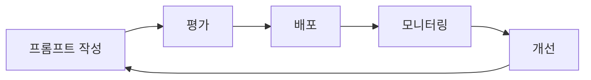

# LLMOps

> 문서 기준: 2026년 6월 | 이 문서는 변동이 빠른 영역으로 분기별 리뷰 대상입니다.

## 개요

[AI 플랫폼과 모델 비교](ai-ml.md)에서 모델을 선택하고, [RAG 고급 패턴](rag-patterns.md)으로 파이프라인을 구축한 뒤에는 **프로덕션에서 지속적으로 품질을 유지하고 개선**해야 합니다. 이를 LLMOps라 합니다.

:::note
모델 선택은 [AI 플랫폼과 모델 비교](ai-ml.md)를, RAG 파이프라인 구축은 [RAG 고급 패턴](rag-patterns.md)을, AI 보안은 [AI 보안](../security/ai-security.md)을 참고하세요.
:::

## 평가 (Evaluation)

### 오프라인 평가

배포 전에 품질을 검증합니다.

| 평가 유형 | 방법 | 도구 |
| --- | --- | --- |
| **Golden Set** | 정답이 있는 테스트 세트로 정확도 측정 | 자체 구축 + 자동 채점 |
| **LLM-as-Judge** | 다른 LLM이 응답 품질을 평가 | Bedrock Evaluations, Vertex AI Eval |
| **Human Review** | 사람이 샘플을 검토 | 라벨링 도구 (Label Studio 등) |
| **회귀 테스트** | 프롬프트/모델 변경 후 기존 품질 유지 확인 | CI 파이프라인에 통합 |

### RAG 평가 지표

| 지표 | 측정 대상 | 의미 |
| --- | --- | --- |
| **Retrieval Precision** | 검색된 문서 중 관련 문서 비율 | 불필요한 문서가 섞이지 않는가 |
| **Retrieval Recall** | 관련 문서 중 실제 검색된 비율 | 필요한 문서를 놓치지 않는가 |
| **Faithfulness** | 응답이 검색된 문서에 근거하는가 | 환각(Hallucination) 여부 |
| **Answer Relevance** | 응답이 질문에 적절한가 | 질문과 무관한 답변 여부 |

### 벤더별 평가 도구

| 벤더 | 서비스 | 특징 |
| --- | --- | --- |
| AWS | [Bedrock Evaluations](https://docs.aws.amazon.com/bedrock/latest/userguide/evaluation.html) | 자동 평가 + 사람 평가. 모델 비교 |
| Azure | [Azure AI Evaluation SDK](https://learn.microsoft.com/azure/ai-studio/how-to/evaluate-generative-ai-app) | Python SDK 기반. CI/CD 통합 |
| Google Cloud | [Vertex AI Evaluation Service](https://cloud.google.com/vertex-ai/generative-ai/docs/models/evaluation-overview) | 자동 지표 + 사람 평가 |
| 벤더 중립 | [Ragas](https://docs.ragas.io/), [DeepEval](https://docs.confident-ai.com/) | 오픈소스 RAG 평가 프레임워크 |

## 프롬프트/모델 버전 관리

| 관리 대상 | 방법 | 도구 |
| --- | --- | --- |
| **프롬프트 버전** | Git으로 프롬프트 템플릿 관리. 변경 시 평가 자동 실행 | Git + CI |
| **모델 버전** | 모델 ID/버전을 코드에 고정. 업그레이드 시 A/B 테스트 | Bedrock Model ID, Azure Deployment |
| **배포 전략** | Canary (10% 트래픽으로 새 버전 검증) → 전체 전환 | 라우팅 설정 |
| **롤백** | 이전 프롬프트/모델 버전으로 즉시 복귀 | 배포 파이프라인 |

## 운영 지표 (모니터링)

| 지표 | 의미 | 알림 기준 예시 |
| --- | --- | --- |
| **Latency (p50/p99)** | 응답 시간 | p99 > 5초 |
| **Token Usage** | 입출력 토큰 소비량 | 일 평균 대비 200% 초과 |
| **Error Rate** | API 오류 비율 | > 1% |
| **Cache Hit Rate** | 프롬프트 캐싱 적중률 | < 50% (기대 대비 낮음) |
| **Cost per Request** | 요청당 비용 | 예산 초과 |
| **Fallback Rate** | 주 모델 실패 → 대체 모델 전환 비율 | > 5% |

벤더별 모니터링:
- AWS: CloudWatch + Bedrock 메트릭 (InvocationLatency, InputTokenCount, OutputTokenCount)
- Azure: Azure Monitor + AI Studio 메트릭
- Google Cloud: Cloud Monitoring + Vertex AI 메트릭

### LLM Observability 플랫폼

벤더 네이티브 모니터링 외에, LLM 워크로드에 특화된 전문 Observability 도구가 있습니다. 프롬프트 트레이싱, RAG 품질 분석, 비용 추적, 평가 자동화를 통합 제공합니다.

| 제품 | 유형 | 주요 기능 | 참고 |
| --- | --- | --- | --- |
| [Arize AI](https://arize.com/) | 상용 | 트레이싱, 평가, 드리프트 탐지, RAG 분석, 가드레일 모니터링 | [Phoenix](https://github.com/Arize-ai/phoenix) (오픈소스 버전) |
| [LangSmith](https://smith.langchain.com/) | 상용 (LangChain) | LangChain/LangGraph 네이티브 트레이싱·평가, 프롬프트 허브 | LangChain 생태계 사용 시 자연스러운 선택 |
| [Langfuse](https://langfuse.com/) | 오픈소스 | 셀프호스팅 가능, 프롬프트 관리·트레이싱·비용 추적 | 벤더 종속 없이 자체 운영 가능 |
| [Weights & Biases (Weave)](https://wandb.ai/site/weave) | 상용 | 실험 추적 + LLM 트레이싱 + 평가 | ML 실험 관리와 통합 |

**선택 기준:**

- 벤더 네이티브(CloudWatch/Azure Monitor)로 기본 메트릭은 충분하지만, **프롬프트 단위 트레이싱**과 **RAG 파이프라인 디버깅**에는 전문 도구가 필요
- LangChain 기반이면 LangSmith, 프레임워크 비종속이면 Arize/Langfuse
- 데이터 주권이 중요하면 Langfuse(셀프호스팅) 또는 Arize Phoenix(오픈소스)

### 에이전트 관측 (Agent Observability)

AI 에이전트는 단일 LLM 호출과 달리 **멀티스텝 트라젝토리**(계획→도구 호출→결과 관찰→반복)를 가지므로, 추적해야 할 지표가 다릅니다.

| 지표 | 설명 | 왜 중요한가 |
| --- | --- | --- |
| **도구 호출 성공률** | 올바른 도구를 올바른 파라미터로 호출한 비율 | 가장 빠른 드리프트 신호 |
| **트라젝토리 길이** | 태스크 완료까지 스텝 수, 재시도 횟수 | 루프/비효율 탐지 |
| **스텝별 지연** | 각 단계(모델 추론, 도구 실행)의 P50/P99 | 병목 식별 |
| **세션당 비용** | 토큰(모델별) + 도구 호출 비용 합산 | 예산 초과 조기 경고 |
| **태스크 완료율** | 목표 달성 여부 (성공/실패/타임아웃) | 핵심 비즈니스 메트릭 |
| **드리프트** | 임베딩/클러스터 변화, 모델 버전 교체 후 행동 변화 | 품질 저하 조기 탐지 |
| **온라인 평가 점수** | 프로덕션 트래픽 샘플링 + LLM-as-Judge | 지속적 품질 보증 |

**에이전트 관측에 강한 도구:**

| 도구 | 에이전트 특화 기능 |
| --- | --- |
| [LangSmith](https://www.langchain.com/langsmith) | LangGraph 트라젝토리 리플레이, 도구 선택 분석, 온라인 평가 |
| [Datadog LLM Observability](https://docs.datadoghq.com/llm_observability/) | 에이전트 결정 그래프, 루프 탐지, APM/인프라와 상관 분석 |
| [Braintrust](https://www.braintrust.dev/) | 트레이스→평가 데이터셋→CI 게이트 자동화, Topics 클러스터링 |
| [Arize AX](https://arize.com/) | 지속적 평가, 트라젝토리 정확도, 드리프트 탐지 |
| [Galileo](https://www.galileo.ai/) | Luna 평가기(저비용/저지연), 도구 선택 품질, 실패 클러스터링 |
| [AgentCore Observability](https://docs.aws.amazon.com/bedrock-agentcore/latest/devguide/observability-get-started.html) (AWS) | CloudWatch + OTEL 자동 계측, 세션/도구/메모리 메트릭 |
| [Azure Foundry Monitoring](https://learn.microsoft.com/en-us/azure/foundry/concepts/monitoring) (Azure) | OTEL 기반 멀티에이전트 트레이싱, 지속적 평가, Azure Monitor 연동 |
| [Vertex AI Tracing](https://cloud.google.com/vertex-ai/generative-ai/docs/observability) (Google) | Cloud Trace 연동, ADK 트레이싱, 모델+도구 타임라인 |
| [Langfuse](https://langfuse.com/) (오픈소스) | 셀프호스팅, 프레임워크 비종속 트레이싱, 비용 추적, 프롬프트 관리 |
| [Phoenix](https://github.com/Arize-ai/phoenix) (오픈소스) | OpenInference 기반, 셀프호스팅, 트레이스+평가+드리프트 |

:::note
**OTEL(OpenTelemetry) GenAI 시맨틱 컨벤션**이 에이전트 관측의 표준 계층으로 자리 잡고 있습니다. 프레임워크·벤더와 무관하게 트레이스를 내보내려면 OTEL 기반 계측(OpenLLMetry 등)을 선택하세요.
:::

## 운영 패턴

| 패턴 | 설명 |
| --- | --- |
| **모델 Fallback** | 주 모델 장애/지연 시 대체 모델로 자동 전환 (예: Claude Fable 5 → GPT-5.5 → Gemini 3.5 Pro) |
| **Rate Limit 대응** | 벤더 Rate Limit 도달 시 큐잉 또는 대체 프로바이더로 라우팅 |
| **Budget Guardrail** | 일/월 비용 상한 설정. 초과 시 요청 거부 또는 저렴한 모델로 전환 |
| **PII 마스킹** | 프롬프트/응답 로그에서 개인정보 자동 마스킹 후 저장 |

## 자주 하는 실수

- **평가 없이 프롬프트/모델을 변경하고 배포** — 회귀 테스트를 하지 않아 기존에 잘 동작하던 응답 품질이 갑자기 저하됨
- **프롬프트/응답 로그에 PII를 그대로 저장** — 마스킹 없이 로그를 저장하여 개인정보보호법 위반 및 데이터 유출 위험
- **모델 Fallback 전략 없이 단일 모델에 의존** — 벤더 Rate Limit이나 장애 시 서비스 전체가 중단됨

## 체크리스트

- [ ] 프롬프트/모델 변경 시 Golden Set 기반 회귀 테스트를 CI 파이프라인에서 자동 실행하는가
- [ ] 프롬프트/응답 로그에 PII 마스킹을 적용하고 있는가
- [ ] 주 모델 장애 시 대체 모델로 자동 전환하는 Fallback 전략을 구성했는가

## 참고하기

### AWS

- [AWS Bedrock Evaluations 문서](https://docs.aws.amazon.com/bedrock/latest/userguide/evaluation.html)

### Azure

- [Azure AI Evaluation SDK](https://learn.microsoft.com/azure/ai-studio/how-to/evaluate-generative-ai-app)

### Google Cloud

- [Vertex AI Evaluation Service](https://cloud.google.com/vertex-ai/generative-ai/docs/models/evaluation-overview)
- [Google SRE Book — Monitoring Distributed Systems](https://sre.google/sre-book/monitoring-distributed-systems/)

### 표준 및 커뮤니티

- [Ragas — RAG 평가 프레임워크](https://docs.ragas.io/)
