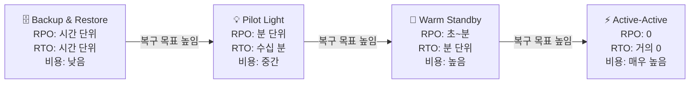

> 문서 기준: 2026년 5월

## DR이란

**재해복구** (Disaster Recovery)는 자연재해, 하드웨어 장애, 인적 오류 등으로 인해 서비스가 중단되었을 때, 사전에 정의된 목표 시간 내에 서비스를 복구하는 계획과 프로세스입니다.

## 재해의 정의

DR 계획을 세우려면 먼저 "무엇을 재해로 볼 것인가"를 정의해야 합니다. 재해는 단일 리소스 장애와는 다른 차원의 사건입니다.

### 재해 유형

| 분류 | 예시 | 영향 범위 |
| --- | --- | --- |
| **자연재해** | 지진, 홍수, 태풍, 화재, 정전 | 단일 또는 복수 데이터센터, 리전 |
| **하드웨어/인프라 장애** | 전원 공급 장치 고장, 네트워크 백본 단절, 스토리지 클러스터 손상 | 단일 AZ ~ 리전 |
| **소프트웨어/플랫폼 장애** | 클라우드 벤더의 리전 단위 서비스 장애, 배포 실패 | 단일 서비스 ~ 리전 |
| **인적 오류** | 실수로 인한 삭제, 잘못된 변경, 구성 오류 | 단일 리소스 ~ 전체 계정 |
| **보안 사고** | 랜섬웨어, 데이터 유출, 크리덴셜 탈취 | 데이터, 계정, 리전 |
| **외부 공급망 문제** | 외부 API/서비스 중단, SaaS 벤더 장애 | 해당 의존성 범위 |

### 재해 수준 분류

장애 범위에 따라 재해 수준을 구분하여 대응 전략을 차등 적용합니다.

| 수준 | 정의 | 대응 방안 |
| --- | --- | --- |
| **로컬 장애** | 단일 서버, 단일 리소스 장애 | 오토스케일링, 헬스 체크 기반 자동 복구 |
| **AZ 장애** | 단일 가용영역 전체 중단 | 멀티 AZ 배포, AZ 간 자동 페일오버 |
| **리전 장애** | 전체 리전 중단 (드물지만 발생) | 크로스 리전 복제, 리전 간 DR |
| **벤더 장애** | 클라우드 벤더 전체 장애 | 멀티클라우드 DR (비용/복잡도 높음) |

:::note
**핵심:** AZ 장애까지는 고가용성(HA) 설계로, 리전 장애 이상은 DR 설계로 대응하는 것이 일반적입니다. 모든 장애를 DR로 해결하려 하면 비용이 과도해지고, 반대로 DR 없이 HA만 구성하면 리전 장애 시 복구 불가능합니다.
:::

### 재해와 고가용성의 차이

**고가용성** (High Availability, HA)은 개별 장애가 발생해도 서비스가 중단되지 않도록 하는 설계입니다. **DR**은 HA로 막을 수 없는 규모의 장애(리전 단위 재해)에 대비한 복구 전략입니다.

| 관점 | 고가용성 (HA) | 재해복구 (DR) |
| --- | --- | --- |
| **목표** | 중단 없는 서비스 유지 | 재해 후 서비스 복구 |
| **대상 장애** | AZ 이내 장애 | 리전 단위 이상 장애 |
| **구현** | 멀티 AZ, 로드밸런서, 자동 페일오버 | 크로스 리전 복제, DR 사이트 |
| **비용** | 상대적으로 낮음 | 높음 (이중 인프라) |

## 핵심 지표: RPO와 RTO

| 지표 | 정의 | 비즈니스 의미 |
| --- | --- | --- |
| **RPO** (Recovery Point Objective) | 복구 시 허용 가능한 최대 데이터 손실 시간 | "최대 몇 분/시간 전 데이터까지 잃어도 되는가?" |
| **RTO** (Recovery Time Objective) | 장애 발생 후 서비스 복구까지 허용 가능한 최대 시간 | "최대 몇 분/시간 안에 서비스가 돌아와야 하는가?" |

RPO와 RTO는 비즈니스 요구사항에서 도출됩니다. 기술팀이 임의로 정하는 것이 아니라, 비즈니스 영향 분석(BIA)을 통해 결정합니다.

## 비즈니스 목표와의 얼라인먼트

### 비즈니스 영향 분석 (BIA)

DR 목표를 설정하기 전에 다음을 먼저 정의해야 합니다:

1. **핵심 비즈니스 프로세스 식별** — 어떤 시스템이 중단되면 매출/고객에 직접 영향을 주는가?
2. **중단 비용 산정** — 시간당/분당 중단 비용은 얼마인가? (매출 손실, 위약금, 평판 손상)
3. **RPO/RTO 도출** — 중단 비용과 DR 구축 비용의 균형점에서 목표를 설정
4. **티어 분류** — 모든 시스템에 동일한 DR 수준을 적용하면 비용이 과도. 중요도별 티어 분류

| 티어 | RPO | RTO | DR 전략 | 예시 |
| --- | --- | --- | --- | --- |
| **Tier 1** (미션 크리티컬) | 0 (데이터 손실 불가) | 수 분 | Active-Active / Hot Standby | 결제 시스템, 거래 플랫폼 |
| **Tier 2** (비즈니스 크리티컬) | 수 분~1시간 | 1~4시간 | Warm Standby | 주문 관리, CRM |
| **Tier 3** (일반 업무) | 수 시간~24시간 | 24시간 | Pilot Light / Backup & Restore | 내부 도구, 개발 환경 |

## DR 전략 유형

| 전략 | RPO | RTO | 비용 | 설명 |
| --- | --- | --- | --- | --- |
| **Backup & Restore** | 시간 단위 | 시간 단위 | 낮음 | 정기 백업 후 장애 시 복원. 가장 저렴하지만 가장 느림 |
| **Pilot Light** | 분 단위 | 수십 분 | 중간 | 핵심 인프라만 최소 규모로 상시 가동. 장애 시 스케일업 |
| **Warm Standby** | 초~분 | 분 단위 | 높음 | 축소된 규모의 전체 환경을 상시 가동. 장애 시 스케일업 |
| **Active-Active** | 0 | 거의 0 | 매우 높음 | 두 리전에서 동시에 트래픽 처리. 장애 시 자동 페일오버 |

## 전략별 구현 — 벤더 서비스 매핑

위 전략을 실제로 구현할 때 사용하는 벤더 서비스입니다.

### Backup & Restore 구현

데이터를 다른 리전에 복제해두고, 장애 시 해당 리전에서 인프라를 새로 생성하여 복원합니다.

| 역할 | AWS | Azure | Google Cloud | OCI |
| --- | --- | --- | --- | --- |
| 스토리지 복제 | S3 Cross-Region Replication | Geo-Redundant Storage (GRS) | Multi-region Storage | Cross-Region Copy |
| DB 백업 복제 | RDS 자동 백업 크로스 리전 복사 | Azure SQL Geo-Backup | Cloud SQL 크로스 리전 백업 | Data Guard (Standby) |
| 인프라 재생성 | CloudFormation / Terraform | ARM / Bicep / Terraform | Terraform | Resource Manager / Terraform |

### Pilot Light ~ Warm Standby 구현

DR 리전에 핵심 인프라를 최소/축소 규모로 상시 가동하고, 장애 시 스케일업합니다.

| 역할 | AWS | Azure | Google Cloud | OCI |
| --- | --- | --- | --- | --- |
| DR 오케스트레이션 | Elastic Disaster Recovery (DRS) | Azure Site Recovery | — (아키텍처 패턴으로 구성) | Full Stack DR |
| DB 실시간 복제 | RDS Cross-Region Read Replica, Aurora Global DB | Azure SQL Geo-Replication | Cloud SQL Cross-Region Replica | Data Guard (Active) |
| 트래픽 전환 | Route 53 Failover | Traffic Manager / Front Door | Cloud DNS + Global LB | DNS Traffic Management |

### Active-Active 구현

두 리전에서 동시에 트래픽을 처리하며, 한쪽 장애 시 나머지가 전체를 흡수합니다.

| 역할 | AWS | Azure | Google Cloud | OCI |
| --- | --- | --- | --- | --- |
| 글로벌 라우팅 | Route 53 + Global Accelerator | Front Door | Global HTTP(S) LB | DNS Traffic Management |
| 글로벌 DB | Aurora Global Database, DynamoDB Global Tables | Cosmos DB (Multi-region Write) | Spanner | Autonomous DB (Cross-Region) |
| 상태 동기화 | ElastiCache Global Datastore | Azure Cache Geo-Replication | Memorystore Cross-Region | — |

## DR 테스트

DR 계획은 테스트하지 않으면 의미가 없습니다. 실제 장애 시 계획대로 동작하는지 정기적으로 검증해야 합니다.

### 테스트 유형

| 유형 | 설명 | 빈도 |
| --- | --- | --- |
| **Tabletop Exercise** | 시나리오 기반 토론. 실제 시스템 변경 없음 | 분기별 |
| **Walkthrough Test** | 복구 절차를 단계별로 실행하되, 프로덕션 영향 없이 | 반기별 |
| **Simulation Test** | 실제 페일오버를 수행하되, 제한된 범위에서 | 연 1회 |
| **Full Interruption Test** | 프로덕션 리전을 실제로 중단하고 DR 리전으로 전환 | 연 1회 (선택) |

### 테스트 시 확인 사항

- 실제 RTO가 목표 RTO 이내인가?
- 실제 RPO가 목표 RPO 이내인가? (데이터 손실량 확인)
- 페일백(원래 리전으로 복귀) 절차가 동작하는가?
- 런북/자동화 스크립트가 최신 상태인가?
- 담당자가 절차를 숙지하고 있는가?

:::note
DR 계획은 **반드시 정기적으로 테스트**해야 합니다. 실제 장애가 날 때 처음으로 복구 절차를 실행하면 RTO를 달성할 수 없습니다. 최소 연 1회 Simulation Test 또는 Walkthrough Test를 수행하고 런북을 최신 상태로 유지하세요.
:::

### Chaos Engineering과의 관계

DR 테스트를 넘어, 일상적으로 장애를 주입하여 시스템의 복원력을 검증하는 것이 Chaos Engineering입니다.

| 벤더 | 도구 |
| --- | --- |
| AWS | [AWS Fault Injection Service](https://docs.aws.amazon.com/fis/) |
| Azure | [Azure Chaos Studio](https://learn.microsoft.com/en-us/azure/chaos-studio/) |
| Google Cloud | — (3rd party: Gremlin, LitmusChaos) |
| OCI | — (3rd party: Gremlin, LitmusChaos) |

## 한국 리전 기준 DR 구성

| 벤더 | 프라이머리 (한국) | 세컨더리 후보 | 지연 시간 | 비고 |
| --- | --- | --- | --- | --- |
| AWS | `ap-northeast-2` (서울) | `ap-northeast-1` (도쿄), `ap-northeast-3` (오사카) | 약 30~50ms | 국외 이전 |
| Azure | `koreacentral` (서울) | `koreasouth` (부산) | 약 5ms | **국내 DR 가능** |
| Azure | `koreacentral` (서울) | `japaneast` (도쿄) | 약 30ms | 국외 이전 |
| Google Cloud | `asia-northeast3` (서울) | `asia-northeast1` (도쿄), `asia-northeast2` (오사카) | 약 30~50ms | 국외 이전 |
| OCI | `ap-seoul-1` (서울) | `ap-chuncheon-1` (춘천) | 약 5ms | **국내 DR 가능** |
| OCI | `ap-seoul-1` (서울) | `ap-tokyo-1` (도쿄) | 약 30ms | 국외 이전 |

:::caution
국외 리전을 DR 대상으로 사용할 경우, 개인정보보호법·신용정보법에 따른 데이터 국외 이전 요건을 충족해야 합니다. 데이터 주권이 엄격한 워크로드는 위 표에서 국내 DR이 가능한 벤더를 우선 검토하세요.
:::

## 자주 하는 실수

- **DR 계획을 세우고 한 번도 테스트하지 않음** — 실제 장애 시 런북이 오래되어 절차가 동작하지 않고 RTO를 달성할 수 없음
- **모든 시스템에 동일한 DR 전략 적용** — 비용을 고려하지 않고 전부 Active-Active로 설계하거나, 전부 Backup & Restore로 방치
- **국외 DR 리전 사용 시 데이터 주권 미검토** — 개인정보보호법/신용정보법의 국외 이전 요건을 확인하지 않아 규제 위반

## 체크리스트

- [ ] 워크로드별 RPO/RTO를 비즈니스 영향 분석(BIA)에 기반하여 정의했는가
- [ ] DR 테스트(최소 Walkthrough)를 연 1회 이상 수행하고 런북을 최신 상태로 유지하는가
- [ ] 국외 DR 리전 사용 시 데이터 국외 이전 법적 요건을 충족했는가

## 기존 문서와의 연계

> 📄 [리전과 가용영역](../../about-cloud/regions-and-zones/)

> 📄 [백업과 복구](../../storage/backup/)

> 📄 [Well-Architected Framework](../../about-cloud/well-architected/)

## 참고하기

### AWS

- [AWS Disaster Recovery 백서](https://docs.aws.amazon.com/whitepapers/latest/disaster-recovery-workloads-on-aws/disaster-recovery-workloads-on-aws.html)
- [AWS Elastic Disaster Recovery](https://docs.aws.amazon.com/drs/)
- [AWS Fault Injection Service](https://docs.aws.amazon.com/fis/)

### Azure

- [Azure Site Recovery 문서](https://learn.microsoft.com/en-us/azure/site-recovery/)
- [Azure 비즈니스 연속성](https://learn.microsoft.com/en-us/azure/reliability/business-continuity-management-program)
- [Azure Chaos Studio](https://learn.microsoft.com/en-us/azure/chaos-studio/)

### Google Cloud

- [Google Cloud DR 계획 가이드](https://cloud.google.com/architecture/dr-scenarios-planning-guide)
- [Google Cloud 재해복구 아키텍처](https://cloud.google.com/architecture/disaster-recovery)

### OCI

- [OCI Full Stack DR](https://docs.oracle.com/en-us/iaas/disaster-recovery/index.html)
- [OCI 비즈니스 연속성 가이드](https://docs.oracle.com/en-us/iaas/disaster-recovery/index.html)
